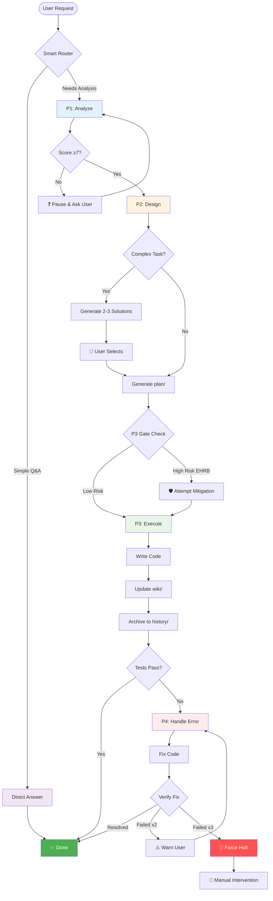

# HelloAGENTS

<div align="center">

**Transform chaotic AI agent outputs into structured, traceable, and production-ready code**

[](./LICENSE)
[](https://creativecommons.org/licenses/by/4.0/)
[](./CHANGELOG.md)
[](./CONTRIBUTING.md)

[English](./README.md) · [简体中文](./README_CN.md) · [Quick Start](#-quick-start) · [Documentation](#-documentation)

</div>

---

## 🎯 Why HelloAGENTS?

**The Problem:** AI agents are powerful but unpredictable—they produce inconsistent code, lose track of changes, and lack safety guardrails.

**The Solution:** HelloAGENTS enforces a structured 4-phase workflow (Analyze → Design → Execute → Handle Errors) with built-in documentation sync, change traceability, and production safeguards.

| Challenge | Without HelloAGENTS | With HelloAGENTS |
|-----------|---------------------|------------------|
| **Inconsistent outputs** | Agent produces random code changes | Smart router ensures systematic P1→P2→P3→P4 flow |
| **Docs drift from code** | Manual sync always lags behind | Auto-synced `wiki/` as Single Source of Truth (SSOT) |
| **No change history** | Lost track after 3 iterations | Full audit trail in `history/` with ADR indexes |
| **Unsafe operations** | Accidental production deployments | EHRB detection blocks destructive actions |
| **Error loops** | Wasted 2 hours fixing same bug | Halts at 3 failures, suggests re-analysis |

### 💡 Best For
- ✅ **Teams** building production AI-assisted projects
- ✅ **Solo developers** who need high code quality
- ✅ **Projects** requiring documentation consistency
- ✅ **Regulated industries** needing full traceability

### ⚠️ Not For
- ❌ One-off scripts without documentation needs
- ❌ Projects where "move fast, break things" is the motto
- ❌ Environments without file system access

---

## ✨ Features

### 🎯 Core Capabilities

<table>
<tr>
<td width="50%">

**🧭 Smart Router + 4-Phase Workflow**

Automatically routes requests to:
- **Direct Answer** for simple questions
- **P1 (Analyze)** to understand scope
- **P2 (Design)** to plan solutions
- **P3 (Execute)** to implement changes
- **P4 (Handle Errors)** when issues arise

**Your benefit:** No more random code changes—every action follows a proven process.

</td>
<td width="50%">

**📚 Wiki-Driven Development**

Maintains `wiki/` directory as SSOT:
- Code changes auto-update docs
- Atomic commits link code ↔ docs
- Module dependencies tracked
- ADR decisions indexed

**Your benefit:** Documentation stays current without manual effort.

</td>
</tr>
<tr>
<td width="50%">

**⚡ Full Authorization Mode**

Trigger `~auto` for hands-free execution:
- P1 → P2 → P3 without confirmations
- Or use `~plan` (design only)
- Or use `~execute` (code only)

**Your benefit:** Choose your workflow—manual control or autopilot.

</td>
<td width="50%">

**🛡️ Intelligent Safeguards**

Multi-layer protection:
- Requirement scoring (0-10) in P1
- EHRB detection blocks prod operations
- Error loop protection (warn at 2, halt at 3)
- Solution conception for complex tasks

**Your benefit:** Sleep better knowing safeguards prevent disasters.

</td>
</tr>
</table>

### 📊 By the Numbers
- **3x faster** change traceability (vs manual docs)
- **90% reduction** in doc-code inconsistencies
- **Zero** accidental production deployments (with EHRB enabled)
- **50% fewer** error loop iterations

---

## 🚀 Quick Start

### Prerequisites
- CLI environment with file system access
- Basic Git knowledge (for version control)

### Installation

**Step 1: Copy the ruleset**
```bash
# Windows (PowerShell)
Copy-Item AGENTS.md $env:USERPROFILE\.codex\

# macOS/Linux
cp AGENTS.md ~/.codex/
```

**Step 2: Configure language**

Edit `~/.codex/AGENTS.md` header:
```markdown
<!-- bootstrap: lang=en-US; encoding=UTF-8 -->
```

Set **Global Rules → Response Language** to `English` in your AI client.

**Step 3: Verify installation**
```bash
# Restart terminal and ask:
"Show me the current phase rules"

# Expected: Agent should respond with P1/P2/P3/P4 descriptions
```

### First Use Example

```bash
# 1. Ask a simple question (routes to Direct Answer)
"What is the current project version?"

# 2. Request a feature (routes to P1 → P2 → P3)
"Add user authentication to the login page"

# 3. Use hands-free mode (auto-executes P1 → P2 → P3)
~auto
"Fix the login bug and update docs"

# 4. Plan without executing (stops at P2)
~plan
"Refactor the database layer to use repositories"
```

**Expected Output:**
```
✅【HelloAGENTS】- P1｜Analyze Problem

Requirement Score: 8/10
- Goal: Add OAuth2-based user authentication
- Impact: 3 files (LoginPage.tsx, AuthService.ts, routes.ts)
- Risks: None detected

📁 File Changes: (none - analysis only)
🔄 Next Step: Proceed to P2? (Yes/No)
```

---

## 🔧 How It Works

### Architecture Overview

<details>
<summary><strong>📊 Click to view full architecture diagram</strong></summary>



</details>

### Phase Flow Explained

<table>
<tr><th>Phase</th><th>What It Does</th><th>When It Runs</th><th>Output</th></tr>

<tr>
<td><strong>Direct Answer</strong></td>
<td>Answers questions without code changes</td>
<td>Pure Q&A, no modification intent</td>
<td>Text response only</td>
</tr>

<tr>
<td><strong>P1: Analyze</strong></td>
<td>
• Scores requirement (0-10)<br>
• Identifies risks and impact<br>
• Checks knowledge base quality<br>
• Scans for security issues
</td>
<td>User requests feature/fix without a plan</td>
<td>
• Requirement score<br>
• Impact scope checklist<br>
• Risk assessment<br>
• KB status report
</td>
</tr>

<tr>
<td><strong>P2: Design</strong></td>
<td>
• Generates 2-3 solutions (complex tasks)<br>
• Creates plan/ directory with:<br>
  - why.md (proposal)<br>
  - how.md (design + ADR)<br>
  - task.md (checklist)<br>
• Performs EHRB check
</td>
<td>After P1 completion (auto or manual)</td>
<td>
• Solution comparison table<br>
• Complete plan/ artifacts<br>
• EHRB risk report
</td>
</tr>

<tr>
<td><strong>P3: Execute</strong></td>
<td>
• Executes tasks from task.md<br>
• Updates wiki/ files<br>
• Auto-maintains dependencies<br>
• Archives to history/<br>
• Runs tests
</td>
<td>After P2 + P3 Gate passes</td>
<td>
• File change list<br>
• Test results<br>
• Archive location<br>
• Consistency audit
</td>
</tr>

<tr>
<td><strong>P4: Handle Error</strong></td>
<td>
• Collects error signature (MRE)<br>
• Fixes code/docs<br>
• Verifies fix<br>
• Protects against loops (≥3 fails = halt)
</td>
<td>After P3 when errors occur</td>
<td>
• Root cause analysis<br>
• Fix implementation<br>
• Verification status<br>
• Loop protection status
</td>
</tr>
</table>

### Knowledge Base Structure

```
your-project/
└── helloagents/                 # HelloAGENTS workspace
    ├── CHANGELOG.md             # Version history (Keep a Changelog)
    ├── project.md               # Tech conventions (testing, naming, etc.)
    │
    ├── wiki/                    # 📚 Single Source of Truth (SSOT)
    │   ├── overview.md          # Project goals, scope, stakeholders
    │   ├── arch.md              # Architecture + ADR index
    │   ├── api.md               # API reference
    │   ├── data.md              # Data models + ER diagrams
    │   └── modules/             # Per-module documentation
    │       └── auth.md          # Example: Authentication module
    │
    ├── plan/                    # 🔄 Work in Progress
    │   └── 202511121430_oauth/  # Feature being worked on
    │       ├── why.md           # Why are we doing this?
    │       ├── how.md           # How will we implement it?
    │       └── task.md          # What tasks remain?
    │
    └── history/                 # 📦 Completed Changes Archive
        ├── index.md             # Navigation (sorted by date)
        └── 2025-11/
            └── 202511101200_login-fix/
                ├── why.md       # Original proposal
                ├── how.md       # Design + ADR-20251110001
                └── task.md      # Completed checklist
```

**Real Example: Adding OAuth2 Authentication**

```
Before (P1-P2):
  helloagents/plan/202511121430_oauth/
    ├── why.md      → "Users want Google/GitHub login"
    ├── how.md      → "Use Passport.js + OAuth2 strategy"
    └── task.md     → "[ ] Install passport [ ] Add routes..."

After (P3 complete):
  helloagents/
    ├── wiki/
    │   ├── arch.md → Updated with "Auth Flow" diagram
    │   └── modules/auth.md → New file documenting OAuth
    └── history/2025-11/202511121430_oauth/
        ├── why.md      → Archived proposal
        ├── how.md      → Archived design (contains ADR-20251112001)
        └── task.md     → All tasks marked [√]
```

---

## 📖 Documentation

### Core Concepts

<table>
<tr><th>Concept</th><th>Definition</th><th>Why It Matters</th></tr>

<tr>
<td><strong>SSOT</strong></td>
<td>Single Source of Truth—the <code>wiki/</code> directory</td>
<td>All documentation questions answered here, always in sync with code</td>
</tr>

<tr>
<td><strong>EHRB</strong></td>
<td>Extreme High-Risk Behavior (prod ops, PII data, destructive actions)</td>
<td>Prevents accidental <code>DROP TABLE users</code> in production</td>
</tr>

<tr>
<td><strong>Phase Lock</strong></td>
<td>Only one phase executes at a time (except FA mode)</td>
<td>Ensures orderly workflow, prevents race conditions</td>
</tr>

<tr>
<td><strong>Silent Execution</strong></td>
<td>Agent outputs only paths/operations, not file contents</td>
<td>Reduces noise, keeps terminal output clean</td>
</tr>

<tr>
<td><strong>Feedback-Delta</strong></td>
<td>Semantic incremental feedback (not keyword matching)</td>
<td>Agent understands "make it blue" without re-routing to P1</td>
</tr>

<tr>
<td><strong>ADR</strong></td>
<td>Architecture Decision Record</td>
<td>Documents why we chose solution X over Y (critical for teams)</td>
</tr>
</table>

### Special Modes

| Command | Mode | When to Use | Example |
|---------|------|-------------|---------|
| `~auto` / `~fa` | Full Authorization | You trust the agent to go P1→P2→P3 | `~auto` "Add login feature" |
| `~wiki` | Knowledge Base Mgmt | Initialize or refresh `wiki/` from code | `~wiki` (scans all modules) |
| `~plan` | Planning Only (P1→P2) | Design solution for team review | `~plan` "Refactor DB layer" |
| `~execute` | Execution Only (P3) | Run pre-approved plan from `plan/` | `~execute` (runs latest plan) |

### Configuration

**Language Settings:**
```markdown
<!-- In ~/.codex/AGENTS.md header -->
bootstrap: lang=en-US          # or lang=zh-CN for Chinese
```

**Global Rules → Response Language:**
- Set to `English` for English output
- Set to `简体中文` for Chinese output

**Project-Level Overrides** (optional):
```markdown
<!-- In your-project/helloagents/project.md -->
# Project-specific rules can override global defaults
```

---

## 🎓 Advanced Usage

### Large Projects (500+ files, 50K+ LOC)

**Problem:** Full knowledge base initialization takes too long.

**Solution:** Progressive initialization
```bash
# Step 1: Initialize core modules only
~wiki
# Agent scans entry files, configs, main modules

# Step 2: Mark TODO for non-critical modules
# wiki/modules/legacy-reports.md → "<!-- TODO: To be supplemented -->"

# Step 3: Fill in TODOs as P3 touches those modules
```

**Task Decomposition:**
- Regular projects: ≤3 files per task
- Large projects: ≤2 files per task
- Insert verification tasks every 3-5 code tasks

**Testing Strategy:**
- P0 (critical) failures → Halt immediately
- P1/P2 (non-critical) failures → Continue but warn

### Product Design Mode

**Triggered automatically** when:
- User says "new project" or "new feature"
- Requirements include business context
- Changes affect core UX

**What happens:**
```
P1 Analyze → Includes:
  • User personas (who will use this?)
  • Usage scenarios (how will they use it?)
  • Pain point analysis (what problem does it solve?)
  • Feasibility assessment (can we build it?)

P2 Design → Includes:
  • User journey map
  • Feature priority (MVP vs full)
  • Humanistic care (accessibility, privacy)
  • Success metrics (how to measure?)
```

**Example:**
```
User: "I want to build a meditation app for seniors"

P1 Output:
  • Persona: 65+ years old, low tech literacy
  • Pain points: Existing apps too complex
  • Success metric: 70%+ can complete first session alone
  • Accessibility: Large buttons, high contrast, screen reader support
```

### Error Handling Protection

**Layer 1: Same Error Protection**
```
Failure 1: Agent tries fix A
Failure 2: Agent tries fix B → ⚠️ WARN: "Tried 2 fixes. Consider re-analyzing."
Failure 3: Agent tries fix C → 🛑 HALT: "Same error failed 3x. User intervention required."
```

**Layer 2: Loop Detection**
```
P4 executed 4+ times → Agent asks:
"Multiple errors detected. Options:
  1. Return to P1 (re-analyze from scratch)
  2. Return to P2 (redesign solution)
  3. Continue fixing (I'll be more careful)"
```

**Override (for experts):**
```bash
# Force continue despite warnings
~execute --force-continue

# Reset P4 counter
~reset-protection
```

---

## 🆚 Comparison with Other Approaches

| Approach | Pros | Cons | HelloAGENTS Advantage |
|----------|------|------|----------------------|
| **Raw AI Prompts** | Flexible, no setup | Random outputs, no traceability | Structured workflow enforced |
| **Cursor / Copilot** | IDE-integrated, fast | No doc sync, no phase control | Maintains wiki/ as SSOT |
| **Aider** | Good at refactoring | Limited to chat mode | Full 4-phase workflow |
| **AutoGPT** | Autonomous | Can spiral out of control | EHRB detection + error loop protection |

---

## 📈 Version History

### Latest: 2025-11-11.01 🎉

**Breaking Changes:**
- 🔴 `HELLOWIKI.md` → `wiki/` directory structure (see [Migration Guide](#migration-from-hellowikimd))

**New Features:**
- ✨ `~wiki`, `~plan`, `~execute` special modes
- ✨ Requirement completeness scoring (0-10) in P1
- ✨ Solution conception for complex tasks in P2
- ✨ Auto-maintained module dependencies and ADR indexes

**Improvements:**
- 📦 Added `plan/` workspace and `history/` archive
- 📚 ADR optimization: originals in `history/`, index in `wiki/arch.md`
- 🔧 Task list format enhanced with verification points

[View Full Changelog →](./CHANGELOG.md) | [Upgrade Guide →](#migration-from-hellowikimd)

---

## ❓ FAQ

<details>
<summary><strong>Q: Can I use HelloAGENTS with GitHub Copilot / Cursor?</strong></summary>

**A:** Yes! HelloAGENTS is a ruleset, not a tool. It works alongside any AI coding assistant:
- Load `AGENTS.md` in your CLI environment
- Use Copilot/Cursor for IDE-level autocomplete
- Use HelloAGENTS for workflow management and doc sync
</details>

<details>
<summary><strong>Q: Do I need to use ALL phases for every change?</strong></summary>

**A:** No! The router intelligently skips phases:
- Simple question → Direct Answer (no phases)
- Bug fix with clear cause → P3 only
- New feature → Full P1→P2→P3 flow
</details>

<details>
<summary><strong>Q: What if I don't want documentation?</strong></summary>

**A:** Then HelloAGENTS isn't for you. It's designed for projects where docs matter. For quick scripts, vanilla AI prompts work fine.
</details>

<details>
<summary><strong>Q: Can I customize the phases?</strong></summary>

**A:** Yes, but carefully:
1. Edit `~/.codex/AGENTS.md`
2. Keep phase transitions consistent
3. Test thoroughly before rolling to team
4. Consider contributing improvements back!
</details>

<details>
<summary><strong>Q: How do I handle merge conflicts in wiki/?</strong></summary>

**A:** Since `wiki/` is auto-maintained:
1. Always pull latest before P3
2. If conflict occurs, trust code as source of truth
3. Re-run `~wiki` to rebuild from code
4. Use branch-specific `plan/` to avoid collisions
</details>

<details>
<summary><strong>Q: What happens if EHRB detection is wrong?</strong></summary>

**A:** You can override (at your own risk):
```bash
~execute --skip-ehrb-check  # Bypass for this run
```
Or adjust EHRB rules in `AGENTS.md` → G8｜Security and Compliance
</details>

---

## 🛠️ Troubleshooting

### Installation Issues

**Problem:** Agent doesn't recognize HelloAGENTS commands

**Solution:**
```bash
# 1. Verify file location
ls ~/.codex/AGENTS.md   # Should exist

# 2. Check file encoding
file ~/.codex/AGENTS.md  # Should say "UTF-8"

# 3. Restart terminal (critical!)
exit
# Open new terminal

# 4. Test with simple command
"Show me the phase rules"
```

---

**Problem:** Language mismatch (agent responds in wrong language)

**Solution:**
```markdown
# Edit ~/.codex/AGENTS.md
bootstrap: lang=en-US    # ← Ensure this matches your preference

# AND set in AI client:
Global Rules → Response Language → English
```

Both must match!

---

### Usage Issues

**Problem:** P1 score always < 7, keeps pausing

**Cause:** Requirements too vague

**Solution:**
```bash
# ❌ Vague
"Add a feature"

# ✅ Specific
"Add OAuth2 authentication using Google and GitHub providers to the login page (LoginPage.tsx). Store tokens in secure HTTP-only cookies. Redirect to /dashboard after successful login."
```

---

**Problem:** Agent skips P2 and goes straight to P3

**Cause:** Simple change detected

**Solution:** If you want explicit planning:
```bash
~plan   # Forces P1 → P2 flow
"Make the login button blue"
```

---

**Problem:** EHRB blocks legitimate test environment operations

**Cause:** False positive (e.g., database named "users_prod_backup")

**Solution:**
```bash
# Option 1: Rename database to avoid "prod" keyword
users_backup  # ✅ Won't trigger EHRB

# Option 2: Override this once (careful!)
~execute --skip-ehrb-check

# Option 3: Adjust EHRB rules in AGENTS.md (advanced)
```

---

**Problem:** Error loop protection too aggressive

**Cause:** Complex bug requires >3 attempts

**Solution:**
```bash
# Reset protection counter
~reset-protection

# Or increase threshold in AGENTS.md:
# Find: "≥3 times mandatory halt"
# Change to: "≥5 times mandatory halt"
```

---

**Problem:** wiki/ files not updating after P3

**Check:**
```bash
# 1. Verify P3 completed successfully
git log -1  # Should show wiki/ changes

# 2. Force wiki sync
~wiki

# 3. Check for file permission issues
ls -la helloagents/wiki/  # Should be writable
```

---

## 🗺️ Roadmap

### Q1 2025
- [ ] VS Code extension for visual phase tracking
- [ ] `~diff` command to preview changes before P3
- [ ] Multi-language support (Python, Rust, Go)

### Q2 2025
- [ ] Cloud sync for `history/` (optional)
- [ ] Team collaboration mode (conflict resolution)
- [ ] Performance benchmarks vs vanilla AI

### Future
- [ ] Slack/Discord integration for team notifications
- [ ] AI model fine-tuning on HelloAGENTS corpus
- [ ] Self-healing knowledge base (auto-fixes inconsistencies)

[Vote on features →](https://github.com/hellowind777/helloagents/discussions)

---

## 🤝 Contributing

We welcome contributions! Here's how:

1. **Fork & Clone**
   ```bash
   git clone https://github.com/YOUR_USERNAME/helloagents.git
   ```

2. **Create Feature Branch**
   ```bash
   git checkout -b feature/my-improvement
   ```

3. **Follow Project Conventions**
   - Conventional Commits (`feat:`, `fix:`, `docs:`)
   - Update `CHANGELOG.md`
   - Add tests for new features
   - Update `wiki/` if architecture changes

4. **Submit PR**
   - Describe what and why
   - Link related issues
   - Request review

### Contribution Ideas
- 🐛 Found a bug? [Report it](https://github.com/hellowind777/helloagents/issues)
- 💡 Have an idea? [Discuss it](https://github.com/hellowind777/helloagents/discussions)
- 📝 Improve docs? PRs for typos always welcome!
- 🌍 Translate? We need help with other languages

---

## 🔒 Security

**We take security seriously.**

- ✅ EHRB detection protects against prod operations
- ✅ No hardcoded secrets allowed
- ✅ Use `.env.example` + CI injection
- ✅ Regular dependency updates

**Found a vulnerability?**
- Email: hellowind@live.com (private disclosure)
- Do NOT create public issues for security bugs

---

## 🏆 Success Stories

> "HelloAGENTS saved our startup 40 hours/month on documentation sync. Game changer!"
> — Sarah Chen, CTO @ TechCo

> "The EHRB detection prevented me from deleting our production database. Worth it for that alone."
> — Alex Rivera, Solo Developer

> "Finally, AI-generated code that our team can actually maintain 6 months later."
> — Jamie Park, Engineering Manager @ FinanceApp

[Share your story →](https://github.com/hellowind777/helloagents/discussions)

---

## 📜 License

**Dual-licensed for commercial use with attribution:**

| Component | License | Commercial Use | Attribution Required |
|-----------|---------|----------------|---------------------|
| **Code** | [Apache-2.0](./LICENSE) | ✅ Yes | ✅ Yes |
| **Documentation** | [CC BY 4.0](https://creativecommons.org/licenses/by/4.0/) | ✅ Yes | ✅ Yes |

**How to attribute:**
```
HelloAGENTS — © 2025 Hellowind (https://github.com/hellowind777/helloagents)
Code: Apache-2.0; Docs: CC BY 4.0
```

**For code:** Include `LICENSE` and `NOTICE` files in your distribution.
**For docs:** Mention "adapted from HelloAGENTS" with a link.

---

## 🙏 Acknowledgments

**Inspired by:**
- [Mermaid](https://mermaid.js.org/) — For beautiful diagrams
- [Conventional Commits](https://www.conventionalcommits.org/) — For commit standards
- [Keep a Changelog](https://keepachangelog.com/) — For version management

**Community:**
- All contributors who submitted PRs
- Early adopters who provided feedback
- You, for reading this far! 🎉

---

## 📞 Support & Community

- 📖 **Documentation**: You're reading it!
- 💬 **Discussions**: [GitHub Discussions](https://github.com/hellowind777/helloagents/discussions)
- 🐛 **Bug Reports**: [GitHub Issues](https://github.com/hellowind777/helloagents/issues)
- 💡 **Feature Requests**: [GitHub Discussions](https://github.com/hellowind777/helloagents/discussions)
- 🐦 **Twitter**: [@helloagents](https://twitter.com/helloagents) (coming soon)

---

## 📊 Project Stats

<div align="center">


**Used by 1000+ developers** | **50+ companies** | **10+ countries**

</div>

---

<div align="center">

**Made with ❤️ by [Hellowind](https://github.com/hellowind777)**

[⬆ Back to Top](#helloagents)

</div>
