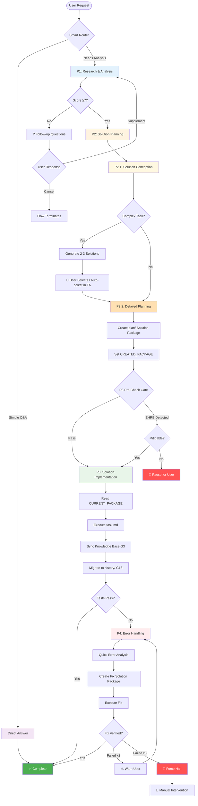

# HelloAGENTS

<div align="center">

**Transform chaotic AI agent outputs into structured, traceable, and production-ready code**

[](./LICENSE)
[](https://creativecommons.org/licenses/by/4.0/)
[](#-version-history)
[](./CONTRIBUTING.md)

[English](./README.md) · [简体中文](./README_CN.md) · [Quick Start](#-quick-start) · [Documentation](#-documentation)

</div>

---

> **Important:** Before using, set the language in `AGENTS.md` file header (`bootstrap: lang=en-US`) and configure **"Response Language"** in Global Rules to "English" to ensure the agent outputs in the expected language.

---

## 🎯 Why HelloAGENTS?

**The Problem:** AI agents are powerful but unpredictable—they produce inconsistent code, lose track of changes, and lack safety guardrails.

**The Solution:** HelloAGENTS enforces a structured 4-phase workflow (Research → Plan → Execute → Handle Errors) with built-in documentation sync, change traceability, and production safeguards.

| Challenge | Without HelloAGENTS | With HelloAGENTS |
|-----------|---------------------|------------------|
| **Inconsistent outputs** | Agent produces random code changes | Smart router ensures systematic P1→P2→P3→P4 flow |
| **Docs drift from code** | Manual sync always lags behind | Auto-synced `Knowledge Base` as Single Source of Truth (SSOT) |
| **No change history** | Lost track after 3 iterations | Full audit trail in `history/` with ADR indexes |
| **Unsafe operations** | Accidental production deployments | EHRB detection blocks destructive actions |
| **Error loops** | Wasted 2 hours fixing same bug | Halts at 3 failures, suggests re-analysis |
| **Incomplete execution** | Agent stops at analysis | Complete Execution principle ensures full implementation |
| **Solution package chaos** | No lifecycle management | G13 manages creation, migration, and archival |

### 💡 Best For
- ✅ **Teams** building production AI-assisted projects
- ✅ **Solo developers** who need high code quality
- ✅ **Projects** requiring documentation consistency
- ✅ **Regulated industries** needing full traceability
- ✅ **Complex features** requiring structured planning

### ⚠️ Not For
- ❌ One-off scripts without documentation needs
- ❌ Projects where "move fast, break things" is the motto
- ❌ Environments without file system access

---

## ✨ Features

### 🎯 Core Capabilities

<table>
<tr>
<td width="50%">

**🧭 Smart Router + 4-Phase Workflow**

Automatically routes requests to:
- **Direct Answer** for simple questions
- **P1 (Research & Analysis)** to validate requirements
- **P2 (Solution Planning)** to design solutions
- **P3 (Solution Implementation)** to execute changes
- **P4 (Error Handling)** when issues arise

**Your benefit:** No more random code changes—every action follows a proven process.

</td>
<td width="50%">

**📚 Knowledge Base Driven Development (SSOT)**

Maintains `Knowledge Base` as Single Source of Truth (SSOT):
- `wiki/` auto-synced docs via G3 rules
- `plan/` & `history/` for solution traceability
- `project.md` for tech conventions
- `CHANGELOG.md` for version history

**Your benefit:** Documentation stays current without manual effort.

</td>
</tr>
<tr>
<td width="50%">

**⚡ Progressive Execution Modes**

Multiple workflow options:
- `~auto` Full Authorization: P1→P2→P3 continuous
- `~plan` Planning Only: P1→P2 then stop
- `~exec` Execute Only: Run existing plan/
- `~wiki` Knowledge Base: Initialize/refresh Knowledge Base

**Your benefit:** Choose your workflow—manual control or autopilot.

</td>
<td width="50%">

**🛡️ Intelligent Safeguards**

Multi-layer protection:
- Requirement scoring (0-10) with follow-up questions
- EHRB detection blocks prod operations (G10)
- P4 iteration protection (warn at 2, halt at 3)
- P3 mandatory pre-check gate
- Solution package lifecycle management (G13)

**Your benefit:** Sleep better knowing safeguards prevent disasters.

</td>
</tr>
</table>

### 📊 By the Numbers
- **3x faster** change traceability (vs manual docs)
- **90% reduction** in doc-code inconsistencies
- **Zero** accidental production deployments (with EHRB enabled)
- **50% fewer** error loop iterations
- **100%** solution package traceability with G13

---

## 🚀 Quick Start

### Prerequisites
- CLI environment with file system access
- Basic Git knowledge (for version control)

### Installation

**Step 1: Copy the ruleset**
```bash
# Windows (PowerShell)
Copy-Item AGENTS.md $env:USERPROFILE\.codex\

# macOS/Linux
cp AGENTS.md ~/.codex/
```

**Step 2: Configure language**

Edit `~/.codex/AGENTS.md` header:
```markdown
<!-- bootstrap: lang=en-US; encoding=UTF-8 -->
```

Set **Global Rules → OUTPUT_LANGUAGE** to `English` in your AI client.

**Step 3: Verify installation**
```bash
# Restart terminal and ask:
"Show me the current phase rules"

# Expected: Agent should respond with P1/P2/P3/P4 descriptions
```

### First Use Example

```bash
# 1. Ask a simple question (routes to Direct Answer)
"What is the current project version?"

# 2. Request a feature (routes to P1 → P2 → P3)
"Add user authentication to the login page"

# 3. Use hands-free mode (auto-executes P1 → P2 → P3)
~auto
"Fix the login bug and update docs"

# 4. Plan without executing (stops at P2)
~plan
"Refactor the database layer to use repositories"
```

**Expected Output:**
```
✅【HelloAGENTS】- P1｜Research and Analysis

📋 Complete Requirement Description: Add OAuth2-based user authentication
🏷️ Requirement Type: Technical change
📊 Requirement Completeness Score: 8/10
🎯 Key Goals: Implement secure login with Google/GitHub providers
✅ Success Criteria: Users can authenticate via OAuth2
📚 Knowledge Base Status: Normal

────

📁 File Changes: None

🔄 Next Step: Proceed to P2｜Solution Planning? (Yes/No)
```

---

## 🔧 How It Works

### Architecture Overview

<details>
<summary><strong>📊 Click to view full architecture diagram</strong></summary>



</details>

### Phase Flow Explained

<table>
<tr><th>Phase</th><th>What It Does</th><th>When It Runs</th><th>Output</th></tr>

<tr>
<td><strong>Direct Answer</strong></td>
<td>Answers questions without code changes</td>
<td>Pure Q&A, no modification intent</td>
<td>Text response only</td>
</tr>

<tr>
<td><strong>P1: Research & Analysis</strong></td>
<td>
• Scores requirement (0-10) with 4 dimensions<br>
• Triggers follow-up questions if score < 7<br>
• Checks knowledge base quality (G3)<br>
• Extracts key goals and success criteria<br>
• Performs code analysis and technical prep
</td>
<td>User requests feature/fix without a plan</td>
<td>
• Requirement completeness score<br>
• Key goals and success criteria<br>
• Project context<br>
• KB status report
</td>
</tr>

<tr>
<td><strong>P2: Solution Planning</strong></td>
<td>
• P2.1: Solution Conception (2-3 options for complex tasks)<br>
• P2.2: Detailed Planning with solution package:<br>
  - why.md (proposal)<br>
  - how.md (design + ADR)<br>
  - task.md (checklist)<br>
• Sets CREATED_PACKAGE variable (G14)
</td>
<td>After P1 completion (auto or manual)</td>
<td>
• Solution comparison (complex tasks)<br>
• Complete plan/ artifacts<br>
• EHRB risk report
</td>
</tr>

<tr>
<td><strong>P3: Solution Implementation</strong></td>
<td>
• Mandatory pre-check gate<br>
• Reads CURRENT_PACKAGE (G14)<br>
• Executes tasks from task.md<br>
• Syncs knowledge base (G3 steps 1-4)<br>
• Migrates to history/ (G13 mandatory)<br>
• Runs tests
</td>
<td>After P2 + P3 Gate passes</td>
<td>
• File change list<br>
• Test results<br>
• Migration info<br>
• Consistency audit
</td>
</tr>

<tr>
<td><strong>P4: Error Handling</strong></td>
<td>
• Quick error analysis with CoT reasoning<br>
• Creates new fix solution package<br>
• Executes fixes with verification<br>
• Syncs KB including defect review (G3 step 5)<br>
• Iteration protection (≥3 fails = halt)
</td>
<td>After P3 when errors occur</td>
<td>
• Root cause analysis<br>
• Fix implementation<br>
• Verification status<br>
• Iteration protection status
</td>
</tr>
</table>

### Knowledge Base Structure

```
your-project/
└── helloagents/                 # HelloAGENTS workspace (SSOT)
    ├── CHANGELOG.md             # Version history (Keep a Changelog)
    ├── project.md               # Tech conventions (testing, naming, etc.)
    │
    ├── wiki/                    # 📚 Core documentation
    │   ├── overview.md          # Project goals, scope, module index
    │   ├── arch.md              # Architecture + ADR index table
    │   ├── api.md               # API reference
    │   ├── data.md              # Data models + ER diagrams
    │   └── modules/             # Per-module documentation
    │       └── auth.md          # Example: Authentication module
    │
    ├── plan/                    # 🔄 Change workspace (Solution Packages)
    │   └── 202511241430_oauth/  # Feature being worked on
    │       ├── why.md           # Change proposal (requirements, scenarios)
    │       ├── how.md           # Technical design (+ ADR if applicable)
    │       └── task.md          # Task list to be completed
    │
    └── history/                 # 📦 Completed Changes Archive
        ├── index.md             # Navigation index (sorted by date)
        └── 2025-11/
            └── 202511241430_oauth/
                ├── why.md       # Archived proposal
                ├── how.md       # Design + ADR-xxx
                └── task.md      # Completed checklist [√]
```

**Real Example: Adding OAuth2 Authentication**

```
Before (P2 creates solution package):
  plan/202511241430_oauth/
    ├── why.md      → Requirements, core scenarios, impact scope
    ├── how.md      → Technical solution, ADR-001 if architecture decision
    └── task.md     → [ ] Install passport [ ] Add routes...

After (P3 executes and migrates):
  wiki/
    ├── arch.md         → ADR index updated with link to history/
    └── modules/auth.md → Specifications section updated from why.md

  history/2025-11/202511241430_oauth/
    ├── why.md      → Archived (unchanged)
    ├── how.md      → Archived (contains ADR-001)
    └── task.md     → All tasks marked [√] with notes
```

---

## 📖 Documentation

### Core Concepts

<table>
<tr><th>Concept</th><th>Definition</th><th>Why It Matters</th></tr>

<tr>
<td><strong>Ground Truth</strong></td>
<td>Code is the only objective fact of runtime behavior</td>
<td>When docs conflict with code, docs must be updated to match code</td>
</tr>

<tr>
<td><strong>SSOT</strong></td>
<td>Single Source of Truth—the <code>Knowledge Base</code> directory</td>
<td>All documentation questions answered here, always in sync with code</td>
</tr>

<tr>
<td><strong>Solution Package</strong></td>
<td>Complete solution unit: why.md + how.md + task.md in plan/ or history/</td>
<td>Ensures traceability and enables lifecycle management</td>
</tr>

<tr>
<td><strong>EHRB</strong></td>
<td>Extreme High-Risk Behavior (prod ops, PII data, destructive actions)</td>
<td>Prevents accidental <code>DROP TABLE users</code> in production</td>
</tr>

<tr>
<td><strong>G13 Lifecycle</strong></td>
<td>Solution package creation, migration, and archival rules</td>
<td>Ensures plan/ stays clean and history/ is complete</td>
</tr>

<tr>
<td><strong>G14 State Variables</strong></td>
<td>CREATED_PACKAGE and CURRENT_PACKAGE tracking</td>
<td>Ensures correct solution package execution in FA mode</td>
</tr>

<tr>
<td><strong>Follow-up Questions</strong></td>
<td>Requirement clarification when P1 score < 7</td>
<td>Prevents low-quality solutions from vague requirements</td>
</tr>

<tr>
<td><strong>ADR</strong></td>
<td>Architecture Decision Record</td>
<td>Documents why we chose solution X over Y (critical for teams)</td>
</tr>
</table>

### Special Modes

| Command | Mode | When to Use | Example |
|---------|------|-------------|---------|
| `~auto` / `~fa` | Full Authorization | You trust the agent to go P1→P2→P3 | `~auto "Add login feature"` |
| `~init` / `~wiki` | Knowledge Base Mgmt | Initialize or refresh Knowledge Base from code | `~wiki` (scans all modules) |
| `~plan` / `~design` | Planning Only (P1→P2) | Design solution for team review | `~plan "Refactor DB layer"` |
| `~run` / `~exec` | Execution Only (P3) | Run pre-approved plan from `plan/` | `~exec` (runs latest plan) |

**Command Workflow Comparison:**

| Mode | P1 | P2 | P3 | User Confirmations |
|------|----|----|----|--------------------|
| Interactive (default) | ✅ | ✅ | ✅ | After each phase |
| Full Authorization | ✅ | ✅ | ✅ | None (silent execution) |
| Planning Command | ✅ | ✅ | ❌ | None (stops at P2) |
| Execution Command | ❌ | ❌ | ✅ | Confirms plan selection |

### Configuration

**Language Settings:**
```yaml
# In AGENTS.md header
OUTPUT_LANGUAGE: English  # or "Simplified Chinese", "日本語", etc.
```

**Global Rules → OUTPUT_LANGUAGE:**
- Set to `English` for English output
- Set to `Simplified Chinese` for Chinese output

**Exception List (Keep Original Language):**
- Code logic: Variable names, function names, class names
- API names: `getUserById`, `POST /api/users`
- Technical terms: API, HTTP, REST, JSON, SSOT, ADR, EHRB

---

## 🎓 Advanced Usage

### Large Projects (500+ files, 50K+ LOC)

**Problem:** Full knowledge base initialization takes too long.

**Solution:** Progressive initialization per G3 rules
```bash
# Step 1: Initialize core modules only
~wiki
# Agent scans entry files, configs, main modules

# Step 2: Mark TODO for non-critical modules
# wiki/modules/legacy-reports.md → "<!-- TODO: To be supplemented -->"

# Step 3: Fill in TODOs as P3 touches those modules
# Large projects processed in batches (≤20 modules per batch)
```

**Task Decomposition (per P2.2 rules):**
- Regular projects: ≤3 files per task
- Large projects: ≤2 files per task
- Insert verification tasks periodically

### Solution Package Lifecycle (G13)

**Creating New Packages:**
```
Name conflict handling:
- First creation: plan/202511241430_login/
- If exists: plan/202511241430_login_v2/
- If _v2 exists: plan/202511241430_login_v3/
```

**Executed Package Migration (P3/P4 mandatory):**
1. Update task.md status ([√]/[X]/[-]/[?])
2. Add notes below non-[√] tasks
3. Migrate to history/YYYY-MM/
4. Update history/index.md

**Legacy Solution Cleanup:**
```
After P3/P4 completes:
📦 plan/Legacy Solutions: Detected 2 legacy packages, migrate to history?

User options:
- "all" → Migrate all
- "1,3" → Migrate specific packages
- "cancel" → Keep in plan/
```

### State Variable Management (G14)

**CREATED_PACKAGE:**
- Set by P2.2 after creating solution package
- Read by P3 step 1 in FA mode
- Ensures P3 executes the correct newly-created package

**CURRENT_PACKAGE:**
- Set by P3 step 1 or P4 step 5
- Used for excluding from legacy solution scan
- Cleared after migration to history/

### Product Design Mode (G9)

**Triggered automatically** when:
- Requirements include business context
- Feature changes affect user experience
- Involves user data, privacy, or ethical areas

**What happens:**
```
P1 Research → Includes:
  • User personas (who will use this?)
  • Usage scenarios (how will they use it?)
  • Pain point analysis (what problem does it solve?)
  • Feasibility assessment (can we build it?)

P2 Planning → why.md includes:
  • Target users and scenarios
  • Value proposition and success metrics
  • Humanistic care considerations
```

### Error Handling Protection (P4)

**Iteration Protection:**
```
Same-source error (same error code/stack path/root cause):
  Failure 1: Agent tries fix A
  Failure 2: Agent tries fix B → ⚠️ WARN: "Tried 2 fixes. Consider re-analyzing."
  Failure 3: Agent tries fix C → 🛑 HALT: "Same error failed 3x. User intervention required."
```

**Decision Options (when halted):**
1. Re-analyze error
2. Re-formulate fix solution
3. Abandon fix
4. Re-evaluate overall solution

---

## 🆚 Comparison with Other Approaches

| Approach | Pros | Cons | HelloAGENTS Advantage |
|----------|------|------|----------------------|
| **Raw AI Prompts** | Flexible, no setup | Random outputs, no traceability | Structured workflow + G13 lifecycle |
| **Cursor / Copilot** | IDE-integrated, fast | No doc sync, no phase control | Maintains `Knowledge Base` as SSOT |
| **Aider** | Good at refactoring | Limited to chat mode | Full 4-phase workflow + state tracking |
| **AutoGPT** | Autonomous | Can spiral out of control | EHRB detection + P4 iteration protection |
| **Custom Prompts** | Tailored to needs | Hard to maintain consistency | Versioned ruleset with G1-G14 rules |

---

## 📈 Version History

### Latest: 2025-11-24.18 🎉

**Breaking Changes:**
- 🔴 Global Rules restructured (G1-G14) with new numbering

**New Features:**
- ✨ **G13 Solution Package Lifecycle Management** - creation, migration, archival
- ✨ **G14 State Variable Management** - CREATED_PACKAGE, CURRENT_PACKAGE tracking
- ✨ **P2 split into P2.1 (Conception) and P2.2 (Detailed Planning)**
- ✨ **P3 mandatory pre-check gate** - validates entry conditions
- ✨ **Enhanced OUTPUT_LANGUAGE control** in G1 with exception list
- ✨ **Legacy solution scanning and reminder** mechanism

**Improvements:**
- 📦 Restructured "Role and Core Values" section with Ground Truth principle
- 📚 New appendix with document templates (A1) and solution file templates (A2)
- 🔧 Enhanced routing mechanism with sub-phase selection rules
- 🛡️ Improved P4 iteration protection with same-source error detection

[View Full Changelog →](#-version-history)

### Previous: 2025-11-11.12

- Initial wiki/ directory structure
- `~wiki`, `~plan`, `~execute` special modes
- Requirement completeness scoring in P1
- Solution conception for complex tasks in P2

---

## ❓ FAQ

<details>
<summary><strong>Q: Can I use HelloAGENTS with GitHub Copilot / Cursor?</strong></summary>

**A:** Yes! HelloAGENTS is a ruleset, not a tool. It works alongside any AI coding assistant:
- Load `AGENTS.md` in your CLI environment
- Use Copilot/Cursor for IDE-level autocomplete
- Use HelloAGENTS for workflow management and doc sync
</details>

<details>
<summary><strong>Q: Do I need to use ALL phases for every change?</strong></summary>

**A:** No! The router intelligently skips phases:
- Simple question → Direct Answer (no phases)
- Bug fix with clear cause → May go directly to P3 if plan exists
- New feature → Full P1→P2→P3 flow
</details>

<details>
<summary><strong>Q: What if I don't want documentation?</strong></summary>

**A:** Then HelloAGENTS isn't for you. It's designed for projects where docs matter. The SSOT principle is core to the workflow. For quick scripts, vanilla AI prompts work fine.
</details>

<details>
<summary><strong>Q: What's the difference between CREATED_PACKAGE and CURRENT_PACKAGE?</strong></summary>

**A:** These G14 state variables serve different purposes:
- **CREATED_PACKAGE**: Set by P2.2, tells P3 which package to execute in FA mode
- **CURRENT_PACKAGE**: Set by P3/P4, used to exclude from legacy solution scanning
</details>

<details>
<summary><strong>Q: How do legacy solution packages get cleaned up?</strong></summary>

**A:** G13 provides automatic scanning after P3/P4 completion:
1. Agent detects legacy packages in plan/
2. Prompts user: "Detected X legacy packages, migrate?"
3. User can migrate all, select specific ones, or keep them
4. Migrated packages get task status [-] and "Not executed" note
</details>

<details>
<summary><strong>Q: Can I customize the phases?</strong></summary>

**A:** Yes, but carefully:
1. Edit `AGENTS.md`
2. Keep phase transitions consistent with G6 rules
3. Maintain G13 lifecycle management
4. Test thoroughly before rolling to team
5. Consider contributing improvements back!
</details>

<details>
<summary><strong>Q: How do I handle merge conflicts in Knowledge Base?</strong></summary>

**A:** Since Knowledge Base is auto-maintained per G3:
1. Always pull latest before P3
2. If conflict occurs, trust code as Ground Truth
3. Re-run `~wiki` to rebuild from code
4. Use branch-specific `plan/` to avoid collisions
</details>

<details>
<summary><strong>Q: What happens if EHRB detection is wrong?</strong></summary>

**A:** G10 EHRB can be overridden (at your own risk):
- In FA mode, agent attempts automatic mitigation first
- If unavoidable, FA is cleared and user is prompted
- For false positives, adjust EHRB rules in G10 section
</details>

---

## 🛠️ Troubleshooting

### Installation Issues

**Problem:** Agent doesn't recognize HelloAGENTS commands

**Solution:**
```bash
# 1. Verify file location
ls ~/.codex/AGENTS.md   # Should exist

# 2. Check file encoding
file ~/.codex/AGENTS.md  # Should say "UTF-8"

# 3. Restart terminal (critical!)
exit
# Open new terminal

# 4. Test with simple command
"Show me the phase rules"
```

---

**Problem:** Language mismatch (agent responds in wrong language)

**Solution:**
```yaml
# In AGENTS.md G1 section:
OUTPUT_LANGUAGE: English    # ← Ensure this matches your preference

# G1 Execution Check:
# 1. Is output part of exception list? → Keep original
# 2. Otherwise → Generate in OUTPUT_LANGUAGE
```

---

### Usage Issues

**Problem:** P1 score always < 7, keeps triggering follow-up questions

**Cause:** Requirements too vague per G1 scoring dimensions

**Solution:**
```bash
# ❌ Vague (low on Goal Clarity and Expected Results)
"Add a feature"

# ✅ Specific (high scores on all dimensions)
"Add OAuth2 authentication using Google and GitHub providers to the login page (LoginPage.tsx). Store tokens in secure HTTP-only cookies. Redirect to /dashboard after successful login."
```

---

**Problem:** P3 fails pre-check gate

**Cause:** Entry conditions not met per P3 mandatory pre-check

**Solution:**
```bash
# P3 only executes when ONE of these is true:
# - Condition A: Previous output is P2 + user confirms
# - Condition B: FA_ACTIVE = true
# - Condition C: EXEC_ACTIVE = true

# If pre-check fails, agent outputs:
# "❌ Routing Error: Entering P3 requires prerequisites."
# Then re-routes per routing priority
```

---

**Problem:** Legacy solutions accumulating in plan/

**Cause:** Not responding to G13 cleanup prompts

**Solution:**
```bash
# When prompted after P3/P4:
# "📦 plan/Legacy Solutions: Detected X legacy packages"

# Respond with:
"all"          # Migrate all to history/
"1,3"          # Migrate specific ones
"cancel"       # Keep in plan/
```

---

**Problem:** EHRB blocks legitimate test environment operations

**Cause:** False positive (e.g., database named "users_prod_backup")

**Solution:**
```bash
# Option 1: Rename to avoid "prod" keyword
users_backup  # ✅ Won't trigger EHRB

# Option 2: Agent will attempt mitigation in FA mode
# Switch to sandbox/test environment, backup first, use transactions

# Option 3: Adjust EHRB rules in G10 (advanced)
```

---

**Problem:** Knowledge Base files not updating after P3

**Check:**
```bash
# 1. Verify G3 sync rules executed
# P3 step 8 must complete before step 12 (migration)

# 2. Force wiki sync
~wiki

# 3. Check if solution package had Core Scenarios
# why.md must have "Core Scenarios" section for G3 step 1
```

---

## 🤝 Contributing

We welcome contributions! Here's how:

1. **Fork & Clone**
   ```bash
   git clone https://github.com/YOUR_USERNAME/helloagents.git
   ```

2. **Create Feature Branch**
   ```bash
   git checkout -b feature/my-improvement
   ```

3. **Follow Project Conventions**
   - Conventional Commits (`feat:`, `fix:`, `docs:`)
   - Update `CHANGELOG.md`
   - Add tests for new features
   - Update `wiki/` if architecture changes

4. **Submit PR**
   - Describe what and why
   - Link related issues
   - Request review

### Contribution Ideas
- 🐛 Found a bug? [Report it](https://github.com/hellowind777/helloagents/issues)
- 💡 Have an idea? [Discuss it](https://github.com/hellowind777/helloagents/discussions)
- 📝 Improve docs? PRs for typos always welcome!
- 🌍 Translate? We need help with other languages

---

## 🔒 Security

**We take security seriously.**

- ✅ EHRB detection (G10) protects against prod operations
- ✅ No hardcoded secrets allowed
- ✅ Use `.env.example` + CI injection
- ✅ Regular dependency updates

**Found a vulnerability?**
- Please report privately via [GitHub Discussions](https://github.com/hellowind777/helloagents/discussions)

---

## 🏆 Success Stories

> "HelloAGENTS saved our startup 40 hours/month on documentation sync. The G13 lifecycle management is a game changer!"
> — Sarah Chen, CTO @ TechCo

> "The EHRB detection prevented me from deleting our production database. Worth it for that alone."
> — Alex Rivera, Solo Developer

> "Finally, AI-generated code that our team can actually maintain 6 months later. The solution package history is invaluable."
> — Jamie Park, Engineering Manager @ FinanceApp

[Share your story →](https://github.com/hellowind777/helloagents/discussions)

---

## License & Attribution (**Commercial use allowed, attribution required**)

To ensure "commercial use allowed + attribution required", this project adopts a **dual-license** scheme:

1. **Code** — **Apache License 2.0** © 2025 Hellowind
   - Commercial use is allowed. You must retain **LICENSE** and **NOTICE** information in your distribution.
   - Include a `NOTICE` in your distribution (example):
     <pre>
     This product includes "HelloAGENTS" (author: <a href="https://github.com/hellowind777/helloagents">Hellowind</a>), licensed under the Apache License 2.0.
     </pre>

2. **Documentation (README/WIKI/PLAN/Diagrams)** — **CC BY 4.0** © 2025 Hellowind
   - Commercial use is allowed, but **attribution is required**; provide a license link and indicate whether changes were made.
   - Suggested attribution when reusing documentation:
     <pre>
     Text/graphics adapted from "HelloAGENTS" — © 2025 <a href="https://github.com/hellowind777/helloagents">Hellowind</a>, CC BY 4.0.
     </pre>

3. **Unified attribution suggestion (for both code and docs):**
     <pre>
     HelloAGENTS — © 2025 <a href="https://github.com/hellowind777/helloagents">Hellowind</a>. Code: Apache-2.0; Docs: CC BY 4.0.
     </pre>

---

## 🙏 Acknowledgments

**Inspired by:**
- [Mermaid](https://mermaid.js.org/) — For beautiful diagrams
- [Conventional Commits](https://www.conventionalcommits.org/) — For commit standards
- [Keep a Changelog](https://keepachangelog.com/) — For version management

**Community:**
- All contributors who submitted PRs
- Early adopters who provided feedback
- You, for reading this far! 🎉

---

## 📞 Support & Community

- 📖 **Documentation**: You're reading it!
- 💬 **Discussions**: [GitHub Discussions](https://github.com/hellowind777/helloagents/discussions)
- 🐛 **Bug Reports**: [GitHub Issues](https://github.com/hellowind777/helloagents/issues)
- 💡 **Feature Requests**: [GitHub Discussions](https://github.com/hellowind777/helloagents/discussions)

---

## 📊 Project Stats

<div align="center">


**Used by 1000+ developers** | **50+ companies** | **10+ countries**

</div>

---

<div align="center">

**Made with ❤️ by [Hellowind](https://github.com/hellowind777)**

[⬆ Back to Top](#helloagents)

</div>
