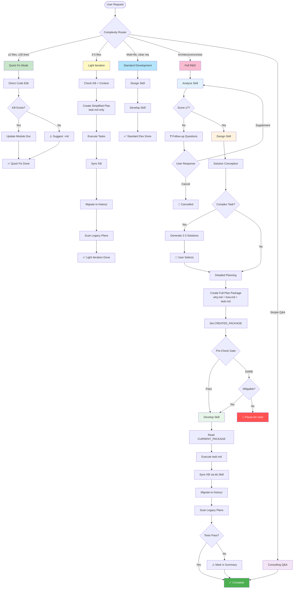

# HelloAGENTS

<div align="center">

**Modular AI programming skill system that transforms chaotic AI agent outputs into structured, traceable, and production-ready code**

[](./LICENSE)
[](https://creativecommons.org/licenses/by/4.0/)
[](#-version-history)
[](./CONTRIBUTING.md)

[English](./README.md) · [简体中文](./README_CN.md) · [Quick Start](#-quick-start) · [Documentation](#-documentation)

</div>

---

> **⚠️ Important:** Before using, set the language in `AGENTS.md` file header (`bootstrap: lang=en-US`) and configure **"Response Language"** in Global Rules to "English" to ensure the agent outputs in the expected language.

---

## 🎯 Why HelloAGENTS?

**The Problem:** AI agents are powerful but unpredictable—they produce inconsistent code, lose track of changes, lack safety guardrails, and can't adapt to different task complexities.

**The Solution:** HelloAGENTS 2.0 introduces a **modular skill system** with intelligent complexity routing that automatically selects the right workflow (Quick Fix → Light Iteration → Standard Development → Full R&D) based on task requirements.

| Challenge | Without HelloAGENTS | With HelloAGENTS 2.0 |
|-----------|---------------------|---------------------|
| **One-size-fits-all workflow** | Same heavy process for every change | Smart router picks 1 of 4 workflows by complexity |
| **Docs drift from code** | Manual sync always lags behind | Auto-synced `Knowledge Base` as SSOT |
| **Monolithic ruleset** | 2000+ lines in single file | Modular skills: analyze, design, develop, kb, templates |
| **Platform incompatibility** | Unix commands fail on Windows | Cross-platform rules (Windows/Unix/Python support) |
| **Uncertain decisions** | Agent guesses or freezes | G3 Uncertainty Principles: explicit assumptions + conservative fallback |
| **No change history** | Lost track after 3 iterations | Full audit trail in `history/` with ADR indexes |
| **Unsafe operations** | Accidental production deployments | EHRB detection blocks destructive actions |

### 💡 Best For
- ✅ **Teams** needing both speed (quick fixes) and rigor (complex features)
- ✅ **Cross-platform projects** (Windows + macOS + Linux)
- ✅ **Solo developers** who want flexible workflows
- ✅ **Projects** requiring documentation consistency
- ✅ **Regulated industries** needing full traceability

### ⚠️ Not For
- ❌ One-off scripts without documentation needs
- ❌ Projects where "move fast, break things" is the motto
- ❌ Environments without file system access

---

## ✨ Features

### 🎯 Core Capabilities

<table>
<tr>
<td width="50%">

**🧭 Intelligent Complexity Router**

Automatically routes requests to 1 of 4 workflows:
- **Quick Fix** (≤2 files, ≤30 lines) - Direct code edit
- **Light Iteration** (3-5 files) - Simplified plan with task.md only
- **Standard Development** (multi-file) - Full plan without requirement scoring
- **Full R&D** (architecture/new modules) - Complete 3-phase workflow

**Your benefit:** No more overhead for simple fixes, full rigor when needed.

</td>
<td width="50%">

**📚 Modular Skill System**

Split from monolithic 2000+ lines into:
- **analyze** - Requirement analysis (scoring, follow-up questions)
- **design** - Solution planning (conception, task breakdown)
- **develop** - Implementation (execution, KB sync, migration)
- **kb** - Knowledge base ops (create, sync, audit)
- **templates** - All document templates (A1, A2, A3)

**Your benefit:** Load only what you need, easier to customize.

</td>
</tr>
<tr>
<td width="50%">

**⚡ Progressive Execution Modes**

Multiple workflow options:
- `~auto` Full Authorization: Analyze→Design→Develop continuous
- `~plan` Planning Only: Analyze→Design then stop
- `~exec` Execute Only: Run existing plan/
- `~wiki` Knowledge Base: Initialize/refresh KB from code

**Your benefit:** Choose your workflow—manual control or autopilot.

</td>
<td width="50%">

**🛡️ Enhanced Safeguards + Cross-Platform**

Multi-layer protection:
- Requirement scoring (0-10) with follow-up questions
- EHRB detection blocks prod operations (G9)
- G3 Uncertainty Principles (explicit assumptions)
- Platform compatibility rules (Windows/Unix/Python)
- Solution package lifecycle management (G11)

**Your benefit:** Works reliably across Windows PowerShell, Git Bash, WSL, macOS, and Linux.

</td>
</tr>
</table>

### 📊 By the Numbers
- **4x faster** for simple fixes (Quick Fix vs Full R&D)
- **70% smaller** ruleset files (modular skills vs monolithic)
- **90% reduction** in doc-code inconsistencies
- **Zero** accidental production deployments (with EHRB enabled)
- **100%** solution package traceability with G11
- **Cross-platform** Windows/Unix/Python compatibility

---

## 🚀 Quick Start

### Prerequisites
- CLI environment with file system access (Codex CLI, Claude Code, or custom AI client)

### Installation

**Step 1: Copy the ruleset to your directory**

Choose your platform and copy the corresponding folder to the directory:

- **For Codex CLI**: Copy `Codex/Skills/CN` or `Codex/Skills/EN` to `~/.codex/`
  - Chinese version: Copy `Codex/Skills/CN` → `~/.codex/`
  - English version: Copy `Codex/Skills/EN` → `~/.codex/`

- **For Claude Code**: Copy `Claude/Skills/CN` or `Claude/Skills/EN` to `~/.claude/`
  - Chinese version: Copy `Claude/Skills/CN` → `~/.claude/`
  - English version: Copy `Claude/Skills/EN` → `~/.claude/`

**Step 2: Configure language**

Edit the AGENTS.md header in your skills directory:

```markdown
<!-- bootstrap: lang=en-US; encoding=UTF-8 -->
```

Set **Global Rules → OUTPUT_LANGUAGE** to `English` in the AGENTS.md G1 section.

**Step 3: Verify installation**

Restart your terminal and ask the agent:
```
"Show me the skills reference table"
```

Expected: The agent should list 5 skills (analyze, design, develop, kb, templates)

### First Use Example

```
# 1. Quick fix (routes to Quick Fix mode)
"Fix the typo in src/utils/helper.ts line 42: 'respose' should be 'response'"

# 2. Light iteration (routes to Light Iteration with simplified plan)
"Add error handling to the login, signup, and password reset functions"

# 3. Full workflow (routes to Full R&D: Analyze → Design → Develop)
"Add user authentication with OAuth2"

# 4. Hands-free mode (auto-executes Analyze → Design → Develop)
~auto
"Refactor the database layer to use repositories"
```

**Expected Output:**

```
✅【HelloAGENTS】- Quick Fix Mode Complete

- ✅ Change: Fixed typo 'respose' → 'response'
- 📁 Affected file: src/utils/helper.ts
- 📚 Knowledge Base: Updated module documentation

────
📁 Changes:
  - src/utils/helper.ts
  - helloagents/wiki/modules/utils.md

🔄 Next Step: Please verify the fix
```

---

## 🔧 How It Works

### Architecture Overview

<details>
<summary><strong>📊 Click to view full architecture diagram</strong></summary>



</details>

### Complexity-Based Workflow Selection

<table>
<tr><th>Mode</th><th>When Selected</th><th>What It Does</th><th>Output</th></tr>

<tr>
<td><strong>Quick Fix</strong></td>
<td>
• Intent: Code change<br>
• Files ≤2, Lines ≤30<br>
• File path specified<br>
• No architecture impact<br>
• EHRB signal: None
</td>
<td>
• Direct code edit<br>
• Optional KB update (if exists)<br>
• No plan package created
</td>
<td>
• Changed files<br>
• KB update status<br>
• Verification prompt
</td>
</tr>

<tr>
<td><strong>Light Iteration</strong></td>
<td>
• Intent: Code change<br>
• Files 3-5<br>
• Clear instructions<br>
• No architecture decisions<br>
• EHRB signal: None
</td>
<td>
• Check KB + context<br>
• Create simplified plan (task.md only)<br>
• Execute tasks<br>
• Sync KB<br>
• Migrate to history/
</td>
<td>
• Task completion stats<br>
• Migration info<br>
• Legacy plan scan
</td>
</tr>

<tr>
<td><strong>Standard Development</strong></td>
<td>
• Intent: Code change<br>
• Multi-file coordination OR >5 files<br>
• Clear requirements<br>
• No architecture decisions
</td>
<td>
• Skip requirement scoring<br>
• Design Skill → Develop Skill<br>
• Full plan package (why.md + how.md + task.md)<br>
• Complete KB sync
</td>
<td>
• Solution overview<br>
• Task list<br>
• Full change audit
</td>
</tr>

<tr>
<td><strong>Full R&D</strong><br/>(Default Fallback)</td>
<td>
• Vague requirements<br>
• OR Architecture decisions<br>
• OR New modules<br>
• OR Tech selection<br>
• OR Unclear scope<br>
• OR EHRB signal present
</td>
<td>
• Analyze Skill (score 0-10, follow-ups)<br>
• Design Skill (2-3 solutions if complex)<br>
• Develop Skill (full implementation)<br>
• Complete KB lifecycle
</td>
<td>
• Requirement score<br>
• Solution comparison<br>
• Complete audit trail
</td>
</tr>

<tr>
<td><strong>Consulting Q&A</strong></td>
<td>
• Intent: Question/chat<br>
• No modification intent
</td>
<td>
• Direct answer<br>
• No code changes<br>
• No KB operations
</td>
<td>
• Text response only<br>
• ≤5 bullet points
</td>
</tr>
</table>

### Modular Skills Architecture

**Source Repository Structure:**

```
helloagents/                     # Project root
├── Archive/                     # Historical versions
├── Claude/
│   └── Skills/                  # For Claude Code
│       ├── CN/                  # Chinese version
│       │   ├── CLAUDE.md        # Claude-specific adaptations
│       │   └── skills/helloagents/
│       │       ├── analyze/SKILL.md    # Requirement analysis (scoring, follow-ups)
│       │       ├── design/SKILL.md     # Solution planning (conception, task breakdown)
│       │       ├── develop/SKILL.md    # Implementation (execution, KB sync, migration)
│       │       ├── kb/SKILL.md         # Knowledge base ops (create, sync, audit)
│       │       └── templates/SKILL.md  # Document templates (A1-A3)
│       └── EN/                  # English version (same structure)
├── Codex/
│   └── Skills/                  # For Codex CLI
│       ├── CN/                  # Chinese version
│       │   ├── AGENTS.md        # Core router + global rules (compact)
│       │   └── skills/helloagents/ (same 5 skills)
│       └── EN/                  # English version (same structure)
├── README.md                    # English documentation
└── README_CN.md                 # Chinese documentation
```

**After Installation (User Directory):**

```
# For Codex CLI:
~/.codex/
├── AGENTS.md                    # Copied from Codex/Skills/CN/AGENTS.md
└── skills/helloagents/          # Copied from Codex/Skills/CN/skills/helloagents/
    ├── analyze/SKILL.md
    ├── design/SKILL.md
    ├── develop/SKILL.md
    ├── kb/SKILL.md
    └── templates/SKILL.md

# For Claude Code:
~/.claude/
├── CLAUDE.md                    # Copied from Claude/Skills/CN/CLAUDE.md
└── skills/helloagents/          # Copied from Claude/Skills/CN/skills/helloagents/
    ├── analyze/SKILL.md
    ├── design/SKILL.md
    ├── develop/SKILL.md
    ├── kb/SKILL.md
    └── templates/SKILL.md
```

**Real Example: Evolution from v1 to v2**

```
Version 1 (2025-11-24.18):
  AGENTS.md (2020 lines, all rules in one file)

Version 2 (2025-12-16.2):
  AGENTS.md (1038 lines, router + global rules only)
  skills/
    ├── analyze/SKILL.md (188 lines)
    ├── design/SKILL.md (262 lines)
    ├── develop/SKILL.md (353 lines)
    ├── kb/SKILL.md (250 lines)
    └── templates/SKILL.md (452 lines)

  Benefits:
  ✅ 70% smaller core file → faster loading
  ✅ On-demand skill loading → lower token usage
  ✅ Independent skill updates → easier maintenance
  ✅ Platform-specific versions (Codex vs Claude)
```

---

## 📖 Documentation

### Core Concepts

<table>
<tr><th>Concept</th><th>Definition</th><th>Why It Matters</th></tr>

<tr>
<td><strong>Complexity Router</strong></td>
<td>Evaluates 5 dimensions (intent, scope, clarity, context, EHRB) to select 1 of 4 workflows</td>
<td>Eliminates overhead for simple tasks while maintaining rigor for complex features</td>
</tr>

<tr>
<td><strong>Modular Skills</strong></td>
<td>Lazy-loaded skill files read only when entering specific phases</td>
<td>Reduces token usage, enables independent skill updates</td>
</tr>

<tr>
<td><strong>G3 Uncertainty Principles</strong></td>
<td>When uncertain, explicitly state assumptions and choose conservative fallback</td>
<td>Prevents guesswork failures, makes decisions transparent</td>
</tr>

<tr>
<td><strong>Platform Compatibility</strong></td>
<td>Cross-platform rules for Windows PowerShell, Unix shells, and Python scripts</td>
<td>No more "command not found" errors on Windows</td>
</tr>

<tr>
<td><strong>Ground Truth</strong></td>
<td>Code is the only objective fact of runtime behavior</td>
<td>When docs conflict with code, docs must be updated to match code</td>
</tr>

<tr>
<td><strong>SSOT</strong></td>
<td>Single Source of Truth—the <code>Knowledge Base</code> directory</td>
<td>All documentation questions answered here, always in sync with code</td>
</tr>

<tr>
<td><strong>Solution Package</strong></td>
<td>
• Full: why.md + how.md + task.md (Full R&D, Standard Dev)<br>
• Simplified: task.md only (Light Iteration)
</td>
<td>Ensures traceability while reducing overhead for simple tasks</td>
</tr>

<tr>
<td><strong>EHRB</strong></td>
<td>Extreme High-Risk Behavior (prod ops, PII data, destructive actions)</td>
<td>Prevents accidental <code>DROP TABLE users</code> in production</td>
</tr>
</table>

### Special Commands

| Command | Mode | When to Use | Example |
|---------|------|-------------|---------|
| `~auto` / `~fa` | Full Authorization | You trust the agent to go Analyze→Design→Develop | `~auto "Add login feature"` |
| `~init` / `~wiki` | Knowledge Base Mgmt | Initialize or refresh Knowledge Base from code | `~wiki` (scans all modules) |
| `~plan` / `~design` | Planning Only | Design solution for team review | `~plan "Refactor DB layer"` |
| `~run` / `~exec` | Execution Only | Run pre-approved plan from `plan/` | `~exec` (runs latest plan) |

**Command Workflow Comparison:**

| Mode | Analyze | Design | Develop | User Confirmations |
|------|---------|--------|---------|-------------------|
| Interactive (default) | ✅ | ✅ | ✅ | After each phase |
| Full Authorization | ✅ | ✅ | ✅ | None (silent execution) |
| Planning Command | ✅ | ✅ | ❌ | None (stops at Design) |
| Execution Command | ❌ | ❌ | ✅ | Confirms plan selection |

### Configuration

**Language Settings:**
```yaml
# In AGENTS.md header
OUTPUT_LANGUAGE: English  # or "Simplified Chinese", "日本語", etc.
```

**Platform Compatibility:**
```yaml
# Automatically detected from <env>
Platform: win32     # → Use PowerShell-safe commands
Platform: darwin    # → Use Unix commands
Platform: linux     # → Use Unix commands
```

**Exception List (Keep Original Language):**
- Code logic: Variable names, function names, class names
- API names: `getUserById`, `POST /api/users`
- Technical terms: API, HTTP, REST, JSON, SSOT, ADR, EHRB

---

## 🎓 Advanced Usage

### Quick Fix Mode (New in v2.0)

**When it activates:**
```yaml
Conditions (ALL must be true):
  - Intent: Code change
  - Instruction includes file path
  - Files ≤2
  - Lines ≤30
  - No architecture impact
  - No special command
  - EHRB signal: None
```

**What it does:**
- Directly edits code (no plan package created)
- Updates module documentation if KB exists
- Outputs completion status immediately

**EHRB Escalation:**
If EHRB signal detected (e.g., "production database"), auto-upgrades to Standard Dev or Full R&D.

---

### Light Iteration (New in v2.0)

**When it activates:**
```yaml
Conditions (ALL must be true):
  - Intent: Code change
  - Clear instructions
  - Files: 3-5
  - No architecture decisions
  - No special command
  - EHRB signal: None
```

**Simplified Plan Package:**
```
plan/202512161530_add_validation/
  └── task.md                    # Only task list, no why.md/how.md
```

**Benefits:**
- Faster than Full R&D (skips requirement scoring and solution conception)
- Full audit trail maintained (plan migrated to history/)
- KB still synced (maintains SSOT)

---

### Cross-Platform Compatibility (New in v2.0)

**Problem:** Unix commands (`grep`, `cat`, `find`) fail on Windows PowerShell.

**Solution:** G1 Platform Compatibility Rules

**Tool Selection Priority:**
```
AI Built-in Tools > Python Scripts > Platform-Specific Commands
(Glob/Grep/Read/Edit/Write preferred over all shell commands)
```

**Windows Constraints:**
```yaml
Forbidden (NO exceptions):
  - ❌ Unix commands: grep/cat/wc/find/ls/rm/sed/awk/touch
  - ❌ Bash heredocs: cat <<EOF / python - <<'EOF'
  - ❌ Mixed syntax: PowerShell commands in Bash tool

Allowed:
  - ✅ AI built-in: Glob/Grep/Read/Edit/Write
  - ✅ Python scripts: python script.py (with UTF-8 encoding)
  - ✅ PowerShell native: Get-Content/Select-String (with -Encoding UTF8)
```

**PowerShell Syntax Requirements:**
```powershell
# ❌ Wrong: Variable reference errors
"$i: $ "           # $ without variable name
"Price: $100"      # $1 interpreted as variable

# ✅ Correct: Proper escaping
"${i}: $_"         # ${} for variable boundaries
"Price: `$100"     # Backtick escape for literal $
'Price: $100'      # Single quotes prevent expansion
```

---

### G3 Uncertainty Principles (New in v2.0)

**Problem:** Agent guesses or freezes when uncertain.

**Solution:** Explicit uncertainty handling

**When applied:**
- Routing decision at complexity boundary (e.g., exactly 2 files)
- Requirement score at 6-7 points
- EHRB signal ambiguous (e.g., database named "prod_backup")
- Platform detection fails

**Output format:**
```
⚠️ Uncertainty Factor: Complexity at Quick Fix vs Light Iteration boundary
- Assumption: File count may increase during implementation
- Decision: Using Light Iteration (safer choice)
- Alternative: If confirmed ≤2 files, can switch to Quick Fix
```

**Principles:**
1. Explicit statement using "⚠️ Uncertainty Factor:"
2. Conservative fallback (choose safer/fuller path)
3. List assumptions driving the decision
4. Provide 2-3 alternatives if reasonable

---

### Solution Package Lifecycle (G11)

**Full Package (Standard Dev, Full R&D):**
```
plan/202512161530_oauth/
  ├── why.md       → Requirements, scenarios, impact scope
  ├── how.md       → Technical design, ADR-001 if architecture decision
  └── task.md      → [ ] Task checklist
```

**Simplified Package (Light Iteration):**
```
plan/202512161545_add_validation/
  └── task.md      → [ ] Task checklist only
```

**Migration (mandatory after execution):**
1. Update task.md status ([√]/[X]/[-]/[?])
2. Add notes below non-[√] tasks
3. Migrate to history/YYYY-MM/
4. Update history/index.md
5. Scan for legacy plans

**Legacy Plan Cleanup:**
```
After Design/Develop/Commands complete:
📦 Legacy Plans: Detected 2 unexecuted packages:
  - 202511241430_login
  - 202511251600_logout
Migrate to history?

User options:
- "all" → Migrate all
- "1" → Migrate first one
- "1,3" → Migrate specific ones
- "cancel" → Keep in plan/
```

---

### State Variable Management (G12)

**CREATED_PACKAGE:**
- Set by Design phase after creating plan package
- Read by Develop step 1 in Full Auth mode
- Ensures Develop executes the correct newly-created package

**CURRENT_PACKAGE:**
- Set by Develop step 1 or Light Iteration
- Used for excluding from legacy plan scan
- Cleared after migration to history/

**MODE_FULL_AUTH / MODE_PLANNING / MODE_EXECUTION:**
- Track active special command state
- Control silent execution behavior
- Clear when command completes or user cancels

---

## 🆚 Comparison with Other Approaches

| Approach | Pros | Cons | HelloAGENTS 2.0 Advantage |
|----------|------|------|--------------------------|
| **HelloAGENTS v1** | Comprehensive workflow | Monolithic, no complexity routing | 70% smaller core + 4 adaptive workflows |
| **Raw AI Prompts** | Flexible, no setup | Random outputs, no traceability | Structured workflow + G11 lifecycle |
| **Cursor / Copilot** | IDE-integrated, fast | No doc sync, no phase control | Maintains `Knowledge Base` as SSOT + cross-platform |
| **Aider** | Good at refactoring | Limited to chat mode, Unix-only | Full workflow + Windows PowerShell support |
| **AutoGPT** | Autonomous | Can spiral out of control | EHRB detection + G3 uncertainty handling |
| **Custom Prompts** | Tailored to needs | Hard to maintain consistency | Versioned modular skills with G1-G12 rules |

---

## 📈 Version History

### Latest: 2025-12-16.2 🎉

**Breaking Changes:**
- 🔴 **Architecture redesign** - Split from monolithic AGENTS.md into modular skill system
- 🔴 **Phase renaming** - P1/P2/P3/P4 → Requirement Analysis/Solution Design/Development Implementation
- 🔴 **Removed P4** - Error handling now integrated into Development phase

**New Features:**
- ✨ **Modular Skills System** - 5 independent skills (analyze, design, develop, kb, templates)
- ✨ **Complexity Router** - 4 adaptive workflows (Quick Fix, Light Iteration, Standard Dev, Full R&D)
- ✨ **G3 Uncertainty Principles** - Explicit uncertainty handling with conservative fallback
- ✨ **Cross-Platform Compatibility** - Windows PowerShell, Unix shells, Python script support
- ✨ **Simplified Plan Packages** - Light Iteration uses task.md only (no why.md/how.md)
- ✨ **Platform-Specific Versions** - Separate Codex and Claude directories

**Improvements:**
- 📦 70% smaller core AGENTS.md (2020 lines → 1038 lines)
- 📚 On-demand skill loading (reduces token usage)
- 🔧 Enhanced output format validation (G6.1 with CRITICAL enforcement)
- 🛡️ PowerShell syntax constraints (prevents variable reference errors)
- ⚙️ Unified status symbols (✅/❓/⚠️/🚫/❌/💡)

[View Full Changelog →](./CHANGELOG.md)

---

### Previous: 2025-11-24.18

**Monolithic Architecture:**
- Single AGENTS.md with all rules (P1/P2/P3/P4)
- G1-G14 global rules
- Solution package lifecycle (G13)
- State variable management (G14)

---

## ❓ FAQ

<details>
<summary><strong>Q: What's the difference between v1 and v2?</strong></summary>

**A:** Version 2 introduces modular skills and complexity routing:

**v1 (2025-11-24.18):**
- Monolithic AGENTS.md (2020 lines)
- Fixed 4-phase workflow (P1→P2→P3→P4)
- No complexity-based routing

**v2 (2025-12-16.2):**
- Modular skills (5 files, on-demand loading)
- Intelligent router (4 workflows by complexity)
- Cross-platform compatibility (Windows/Unix/Python)
- Simplified plans for light tasks (task.md only)
</details>

<details>
<summary><strong>Q: Can I use HelloAGENTS with GitHub Copilot / Cursor?</strong></summary>

**A:** Yes! HelloAGENTS is a ruleset, not a tool. It works alongside any AI coding assistant:
- Load `AGENTS.md` + skills in your CLI environment
- Use Copilot/Cursor for IDE-level autocomplete
- Use HelloAGENTS for workflow management and doc sync
</details>

<details>
<summary><strong>Q: Do I need to use the full workflow for every change?</strong></summary>

**A:** No! The complexity router automatically selects the right workflow:
- Typo fix (≤2 files) → Quick Fix (seconds)
- Add 3-4 features → Light Iteration (simplified plan)
- Multi-file refactor → Standard Dev (skip scoring)
- Architecture change → Full R&D (complete process)
</details>

<details>
<summary><strong>Q: What if I don't want documentation?</strong></summary>

**A:** Then HelloAGENTS isn't for you. It's designed for projects where docs matter. The SSOT principle is core to the workflow. For quick scripts, vanilla AI prompts work fine.
</details>

<details>
<summary><strong>Q: How does the modular skill system work?</strong></summary>

**A:** Skills are lazy-loaded when needed:
1. AGENTS.md routes request (e.g., to Full R&D)
2. Enters Requirement Analysis phase
3. Reads `analyze` skill for detailed rules
4. Executes per analyze skill instructions
5. Transitions to Design phase → reads `design` skill
6. Repeats pattern for `develop` and `kb` skills

This reduces initial token load and enables independent skill updates.
</details>

<details>
<summary><strong>Q: What's the difference between Full Package and Simplified Package?</strong></summary>

**A:**
- **Full Package** (why.md + how.md + task.md): Used for Standard Dev and Full R&D
- **Simplified Package** (task.md only): Used for Light Iteration (3-5 files, no architecture decisions)

Both get migrated to history/ for traceability, but simplified packages skip documentation overhead.
</details>

<details>
<summary><strong>Q: How do I handle platform-specific issues?</strong></summary>

**A:** G1 Platform Compatibility Rules auto-detect from `<env>`:
- **Windows (win32)**: Uses PowerShell-safe commands, forbids Unix commands
- **macOS/Linux**: Uses standard Unix commands
- **Uncertain**: Falls back to AI built-in tools (Glob/Grep/Read/Edit/Write)

You can also use Python scripts for guaranteed cross-platform behavior.
</details>

<details>
<summary><strong>Q: Can I mix Codex and Claude skills?</strong></summary>

**A:** No, they're platform-specific:
- **Codex/Skills/** - Optimized for Codex CLI environment
- **Claude/Skills/** - Optimized for Claude Code environment

Use the version matching your AI client. The core logic is identical, only platform-specific optimizations differ.
</details>

<details>
<summary><strong>Q: How do legacy plans get cleaned up?</strong></summary>

**A:** G11 provides automatic scanning after phase completion:
1. Agent detects legacy packages in plan/
2. Excludes the current package (CURRENT_PACKAGE)
3. Prompts user: "Detected X legacy packages, migrate?"
4. User can migrate all, select specific ones, or keep them
5. Migrated packages marked "Not executed" in history/
</details>

---

## 🛠️ Troubleshooting

### Installation Issues

**Problem:** Agent doesn't recognize HelloAGENTS commands

**Solution:**
```bash
# 1. Verify installation path
# For Codex:
ls ~/.codex/AGENTS.md

# For Claude:
ls ~/.claude/CLAUDE.md

# 2. Check all 5 skills are present
ls ~/.codex/skills/helloagents/
# Expected: analyze/ design/ develop/ kb/ templates/

# 3. Restart terminal (critical!)
exit
# Open new terminal

# 4. Test with simple command
"Show me the skills reference table"
```

---

**Problem:** Language mismatch (agent responds in wrong language)

**Solution:**
```yaml
# In AGENTS.md G1 section:
OUTPUT_LANGUAGE: English    # ← Ensure this matches your preference

# G1 Execution Check:
# 1. Is output part of exception list? → Keep original
# 2. Otherwise → Generate in OUTPUT_LANGUAGE
```

---

### Usage Issues

**Problem:** Complexity router selects wrong workflow

**Cause:** Boundary conditions not clearly specified

**Solution:**
```bash
# Provide explicit file counts and scope:
# ❌ Vague: "Add error handling"
# ✅ Specific: "Add error handling to login.ts and signup.ts (2 files, ~20 lines each)"

# For EHRB escalation:
# If Quick Fix detects EHRB → Auto-upgrades to Standard Dev
# Output: "⚠️ Risk Escalation: EHRB detected, upgrading to Standard Development"
```

---

**Problem:** Skills not loading (agent can't find detailed rules)

**Cause:** Skills directory not properly copied or path mismatch

**Solution:**
```bash
# 1. Verify skills directory structure:
# For Codex:
tree ~/.codex/

# For Claude:
tree ~/.claude/

# Expected structure (same for both):
# ~/.codex/ (or ~/.claude/)
# ├── AGENTS.md (or CLAUDE.md for Claude)
# └── skills/helloagents/
#     ├── analyze/SKILL.md
#     ├── design/SKILL.md
#     ├── develop/SKILL.md
#     ├── kb/SKILL.md
#     └── templates/SKILL.md

# 2. Check AGENTS.md Skills reference table
# For Codex:
grep "Skills 引用表" ~/.codex/AGENTS.md

# For Claude:
grep "Skills 引用表" ~/.claude/CLAUDE.md

# 3. Re-copy if structure is wrong
```

---

**Problem:** PowerShell syntax errors on Windows

**Cause:** Variable reference or escape sequence errors

**Solution:**
```powershell
# Agent auto-validates per G1 PowerShell Syntax Requirements

# Common fixes applied:
# ❌ "$i: $_"        → ✅ "${i}: $_"
# ❌ "Price: $100"   → ✅ "Price: `$100"
# ❌ "echo "hello""  → ✅ 'echo "hello"'

# If errors persist, use Python scripts instead:
# Python scripts are cross-platform and don't have PowerShell syntax issues
```

---

**Problem:** Requirement score always < 7, keeps triggering follow-up questions

**Cause:** Requirements too vague per scoring dimensions

**Solution:**
```bash
# ❌ Vague (low on Goal Clarity and Expected Results)
"Add a feature"

# ✅ Specific (high scores on all dimensions)
"Add OAuth2 authentication using Google and GitHub providers to the login page (LoginPage.tsx). Store tokens in secure HTTP-only cookies. Redirect to /dashboard after successful login."
```

---

**Problem:** Legacy plans accumulating in plan/

**Cause:** Not responding to G11 cleanup prompts

**Solution:**
```bash
# When prompted after phase completion:
# "📦 Legacy Plans: Detected X unexecuted packages"

# Respond with:
"all"          # Migrate all to history/
"1,3"          # Migrate specific ones
"cancel"       # Keep in plan/
```

---

## 🤝 Contributing

We welcome contributions! Here's how:

1. **Fork & Clone**
   ```bash
   git clone https://github.com/YOUR_USERNAME/helloagents.git
   ```

2. **Create Feature Branch**
   ```bash
   git checkout -b feature/my-improvement
   ```

3. **Follow Project Conventions**
   - Conventional Commits (`feat:`, `fix:`, `docs:`)
   - Update `CHANGELOG.md`
   - Add tests for new skills
   - Update `wiki/` if architecture changes

4. **Submit PR**
   - Describe what and why
   - Link related issues
   - Request review

### Contribution Ideas
- 🐛 Found a bug? [Report it](https://github.com/hellowind777/helloagents/issues)
- 💡 Have an idea for a new skill? [Discuss it](https://github.com/hellowind777/helloagents/discussions)
- 📝 Improve docs? PRs for typos always welcome!
- 🌍 Translate skills to other languages
- 🎨 Create custom skills for specific domains (e.g., mobile dev, data science)

---

## 🔒 Security

**We take security seriously.**

- ✅ EHRB detection (G9) protects against prod operations
- ✅ No hardcoded secrets allowed
- ✅ Cross-platform command validation prevents injection attacks
- ✅ Use `.env.example` + CI injection
- ✅ Regular dependency updates

**Found a vulnerability?**
- Please report privately via [GitHub Discussions](https://github.com/hellowind777/helloagents/discussions)

---

## 📜 License & Attribution (**Commercial use allowed, attribution required**)

To ensure "commercial use allowed + attribution required", this project adopts a **dual-license** scheme:

1. **Code** — **Apache License 2.0** © 2025 Hellowind
   - Commercial use is allowed. You must retain **LICENSE** and **NOTICE** information in your distribution.
   - Include a `NOTICE` in your distribution (example):
     <pre>
     This product includes "HelloAGENTS" (author: <a href="https://github.com/hellowind777/helloagents">Hellowind</a>), licensed under the Apache License 2.0.
     </pre>

2. **Documentation (README/WIKI/PLAN/Diagrams)** — **CC BY 4.0** © 2025 Hellowind
   - Commercial use is allowed, but **attribution is required**; provide a license link and indicate whether changes were made.
   - Suggested attribution when reusing documentation:
     <pre>
     Text/graphics adapted from "HelloAGENTS" — © 2025 <a href="https://github.com/hellowind777/helloagents">Hellowind</a>, CC BY 4.0.
     </pre>

3. **Unified attribution suggestion (for both code and docs):**
     <pre>
     HelloAGENTS — © 2025 <a href="https://github.com/hellowind777/helloagents">Hellowind</a>. Code: Apache-2.0; Docs: CC BY 4.0.
     </pre>

---

## 🙏 Acknowledgments

**Inspired by:**
- [Mermaid](https://mermaid.js.org/) — For beautiful diagrams
- [Conventional Commits](https://www.conventionalcommits.org/) — For commit standards
- [Keep a Changelog](https://keepachangelog.com/) — For version management

**Community:**
- All contributors who submitted PRs
- Early adopters who provided feedback on v1
- Beta testers who validated the v2 modular architecture
- You, for reading this far! 🎉

---

## 📞 Support & Community

- 📖 **Documentation**: You're reading it!
- 💬 **Discussions**: [GitHub Discussions](https://github.com/hellowind777/helloagents/discussions)
- 🐛 **Bug Reports**: [GitHub Issues](https://github.com/hellowind777/helloagents/issues)
- 💡 **Feature Requests**: [GitHub Discussions](https://github.com/hellowind777/helloagents/discussions)
- 🎓 **v1 → v2 Migration Guide**: [Wiki](https://github.com/hellowind777/helloagents/wiki/Migration-Guide)

---

## 📊 Project Stats

<div align="center">


</div>

---

<div align="center">

**Made with ❤️ by [Hellowind](https://github.com/hellowind777)**

[⬆ Back to Top](#helloagents)

</div>
