# HelloAGENTS

<div align="center">

**Intelligent Workflow System — Transform chaotic AI agent outputs into structured, traceable, production-ready results through intelligent routing and human-centric workflows**

[](./LICENSE)
[](https://creativecommons.org/licenses/by/4.0/)
[](#-version-history)
[](./CONTRIBUTING.md)

[English](./README.md) · [简体中文](./README_CN.md) · [Quick Start](#-quick-start) · [Documentation](#-documentation)

</div>

---

> **⚠️ Important:** Before using, set the language in `AGENTS.md` file header (`bootstrap: lang=en-US`) and configure **"Response Language"** in Global Rules to "English" to ensure the agent outputs in the expected language.

---

## 🎯 Why HelloAGENTS?

**The Problem:** AI agents are powerful but unpredictable—they produce inconsistent outputs, can't adapt to different task complexities, lack systematic requirement validation, and make decisions without transparency.

**The Solution:** HelloAGENTS introduces an **Intelligent Workflow System** with intelligent complexity routing, semantic intent analysis, structured requirement scoring, and human-centric interaction patterns that automatically adapt to your task needs.

| Challenge | Without HelloAGENTS | With HelloAGENTS |
|-----------|---------------------|------------------|
| **One-size-fits-all workflow** | Same heavy process for every change | Smart 3-layer router auto-selects from 4+ execution modes |
| **Vague requirements accepted** | Agent guesses and fails | 10-point scoring system with targeted follow-up questions |
| **Black-box decision making** | No insight into why agent chose an approach | On-demand internal thinking with explicit uncertainty handling |
| **No state awareness** | Loses context between interactions | State variables track stages, modes, KB status, and packages |
| **Inconsistent outputs** | Random formatting and structure | G3 unified output format with shell/content separation |
| **Platform incompatibility** | Unix commands fail on Windows | Cross-platform rules with tool priority system |
| **Unsafe operations** | Accidental production deployments | Two-layer EHRB detection (keyword + semantic analysis) |
| **No quality gates** | Ship without validation | Three-layer acceptance criteria (stage/gate/flow) |

### 💡 Best For
- ✅ **Teams** needing intelligent workflow selection based on task complexity
- ✅ **Projects** requiring systematic requirement validation before execution
- ✅ **Developers** who want transparency in AI decision-making processes
- ✅ **Cross-platform projects** (Windows PowerShell + macOS + Linux)
- ✅ **Regulated industries** requiring full traceability and audit trails
- ✅ **AI-assisted workflows** beyond just coding (documentation, analysis, planning)

### ⚠️ Not For
- ❌ One-off scripts without quality requirements
- ❌ Projects where "just make it work" is acceptable
- ❌ Environments without file system access

---

## ✨ Features

### 🎯 Core Capabilities

<table>
<tr>
<td width="50%">

**🧭 3-Layer Intelligent Routing**

Multi-layer analysis for automatic workflow selection:
- **Layer 1 - Context**: Checks for ongoing tasks or external tools
- **Layer 2 - Tools**: Detects CLI commands, HelloAGENTS commands, external tools (SKILL/MCP/plugins)
- **Layer 3 - Intent**: Semantic analysis for modification vs Q&A requests
- **EHRB Detection**: Two-layer (keyword + semantic) risk identification

**Your benefit:** Right workflow every time—no manual mode switching.

</td>
<td width="50%">

**📊 Requirements Evaluation with Scoring**

Structured validation before any code changes:
- **10-point scoring** across 4 dimensions (Goal clarity, Expected results, Scope boundaries, Constraints)
- **Targeted follow-up questions** when score <7
- **On-demand internal thinking** in `<thinking>` blocks
- **Complexity-based routing** to appropriate execution mode

**Your benefit:** Fewer failed implementations from vague requirements.

</td>
</tr>
<tr>
<td width="50%">

**🔄 5-Stage Workflow Management**

Systematic workflow with full traceability:
- **5 stages**: Evaluate → Analyze → Design → Develop → Tweak
- **4+ execution modes**: Tweak, Lightweight Iteration, Standard Development, Direct Execution
- **State variables**: WORKFLOW_MODE, CURRENT_STAGE, KB_SKIPPED, CURRENT_PACKAGE
- **Package lifecycle**: Auto-migration to archive/

**Your benefit:** Never lose track of what was planned vs. executed.

</td>
<td width="50%">

**🛡️ Three-Layer Quality Assurance**

Transparent and safe AI behavior:
- **Layer 1 - Stage acceptance**: Validation within each stage
- **Layer 2 - Stage gates**: Requirements between stage transitions
- **Layer 3 - Flow acceptance**: End-to-end validation
- **Modular references**: 23 reference modules for fine-grained rules

**Your benefit:** Understand why the agent made each decision.

</td>
</tr>
</table>

### 📊 By the Numbers
- **44 total files** with modular architecture (vs. 6 files in v1)
- **5 workflow stages** with 4+ execution modes auto-selected via 3-layer routing
- **23 reference modules** (12 functions + 5 stages + 4 rules + 2 services)
- **7 Python scripts** for automation (package validation, KB upgrade, stats)
- **10-point scoring** with 4 dimensions ensures requirement quality before execution
- **3-layer acceptance** criteria (stage/gate/flow) for quality assurance
- **6 core principles** guiding autonomous intelligent behavior
- **Cross-platform** Windows PowerShell + Unix + Python compatibility

---

## 🚀 Quick Start

### Prerequisites
- CLI environment with file system access (Codex CLI, Claude Code, or custom AI client)

### Installation

**Step 1: Copy the ruleset to your directory**

Choose your platform and language version:

- **For Codex CLI**: Copy folder to `~/.codex/`
  - Chinese: `Codex/Skills/CN` → `~/.codex/`
  - English: `Codex/Skills/EN` → `~/.codex/`
  - **New modular version**: `helloagents/` → `~/.codex/`

- **For Claude Code**: Copy folder to `~/.claude/`
  - Chinese: `Claude/Skills/CN` → `~/.claude/`
  - English: `Claude/Skills/EN` → `~/.claude/`
  - **New modular version**: `helloagents/` → `~/.claude/`

**Step 2: Configure language**

Edit the AGENTS.md header:

```yaml
# In AGENTS.md G1 section:
OUTPUT_LANGUAGE: English  # or "Simplified Chinese"
```

**Step 3: Verify installation**

Restart your terminal and ask:
```
"~help"
```

**Expected:** Agent displays available commands (12 functions including ~auto, ~plan, ~exec, ~init, ~upgrade, etc.)

### First Use Example

```bash
# 1. Simple fix → Routes to Tweak Mode (≤2 files, ≤30 lines, clear path)
"Fix the typo in src/utils/helper.ts line 42: 'respose' should be 'response'"

# 2. Medium task → Routes to Lightweight Iteration (3-5 files, local impact)
"Add error handling to login, signup, and password reset functions"

# 3. Complex task → Routes to Standard Development with full R&D flow
"Add user authentication with OAuth2"
# Agent will score requirements and may ask follow-up questions

# 4. Direct execution mode → Execute existing package
~exec "Select package pkg-xxx to execute"

# 5. Full authorization mode → Continuous execution
~auto "Refactor the database layer to use repositories"
```

**Expected Output (Tweak Mode):**

```
✅【HelloAGENTS】- Tweak Mode Complete

- ✅ Change: Fixed typo 'respose' → 'response'
- 📁 Affected file: src/utils/helper.ts
- 📚 Knowledge Base: Updated module documentation

────
📁 Changes:
  - src/utils/helper.ts
  - helloagents/modules/utils.md

🔄 Next Step: Please verify the fix
```

**Expected Output (Requirement Scoring Follow-up):**

```
❓【HelloAGENTS】- Requirements Analysis

Current requirement completeness score: 5/10, unable to determine optimization goals and expected outcomes.

1. Which file or module do you want to optimize?
2. What specific problems need optimization? (e.g., slow performance, code duplication)
3. What results do you expect after optimization?
4. Are there specific performance metrics or time constraints?

Please answer by number, or enter "continue with current requirements" to skip (may affect solution quality).
```

---

## 🔧 How It Works

### Architecture Overview

```mermaid
flowchart TD
    Start([User Request]) --> Layer1{Layer 1: Context}

    Layer1 -->|"Ongoing task?"| Continue[Continue External Tool / HelloAGENTS Task]
    Layer1 -->|"No ongoing"| Layer2{Layer 2: Tools}

    Layer2 -->|"CLI command"| CLI[Execute CLI Command]
    Layer2 -->|"HelloAGENTS cmd"| HACmd{HelloAGENTS Command}
    Layer2 -->|"External tool"| ExtTool[SKILL / MCP / Plugin]
    Layer2 -->|"No match"| Layer3{Layer 3: Intent}

    HACmd -->|"~auto"| Auto[Full Authorization Mode]
    HACmd -->|"~plan"| Plan[Planning Mode]
    HACmd -->|"~exec"| Exec[Direct Execution]
    HACmd -->|"~init/~upgrade"| KB[Knowledge Base Ops]
    HACmd -->|"~help"| Help[Show Help]

    Layer3 -->|"Q&A type"| QA[💡 Direct Answer]
    Layer3 -->|"Modification type"| Evaluate[📋 Evaluate Stage]

    Evaluate --> Scoring{Score ≥7?}
    Scoring -->|"<7"| FollowUp[❓ Targeted Follow-up]
    FollowUp --> UserResp{User Response}
    UserResp -->|"Supplement"| Scoring
    UserResp -->|"Continue anyway"| Complexity
    UserResp -->|"Cancel"| Cancelled[🚫 Cancelled]

    Scoring -->|"≥7"| Complexity{Complexity Check}

    Complexity -->|"≤2 files, ≤30 lines"| Tweak[⚡ Tweak Mode]
    Complexity -->|"3-5 files, local"| LightIter[🔄 Lightweight Iteration]
    Complexity -->|"Multi-file / EHRB"| StdDev[📦 Standard Development]

    Tweak --> DirectEdit[Direct Code Edit]
    DirectEdit --> SyncKB1[Sync Knowledge Base]

    LightIter --> Analyze1[📊 Analyze Stage]
    Analyze1 --> Design1[📐 Design Stage - Simplified]
    Design1 --> Develop1[🛠️ Develop Stage]

    StdDev --> Analyze2[📊 Analyze Stage]
    Analyze2 --> Design2[📐 Design Stage - Full]
    Design2 --> Develop2[🛠️ Develop Stage]

    Auto --> Evaluate
    Plan --> Evaluate
    Exec --> SelectPkg[Select Package]
    SelectPkg --> Develop3[🛠️ Develop Stage]

    Develop1 --> Acceptance{3-Layer Acceptance}
    Develop2 --> Acceptance
    Develop3 --> Acceptance

    Acceptance --> Archive[Migrate to archive/]
    Archive --> Done[✅ Complete]
    SyncKB1 --> Done
    QA --> Done

    style Layer1 fill:#e8f5e9,stroke:#4caf50,stroke-width:2px
    style Layer2 fill:#e3f2fd,stroke:#1976d2,stroke-width:2px
    style Layer3 fill:#fff3e0,stroke:#f57c00,stroke-width:2px
    style Scoring fill:#fce4ec,stroke:#c2185b
    style Acceptance fill:#f3e5f5,stroke:#7b1fa2,stroke-width:2px
    style Done fill:#4caf50,color:#fff
    style Cancelled fill:#ff5252,color:#fff
```

<details>
<summary><strong>📊 Click to view full architecture diagram</strong></summary>



</details>

### 3-Layer Routing Explained

<table>
<tr><th>Layer</th><th>What It Does</th><th>Evaluation Criteria</th><th>Output</th></tr>

<tr>
<td><strong>Layer 1: Context</strong></td>
<td>
• Check for ongoing external tools<br>
• Check for ongoing HelloAGENTS tasks<br>
• Resume if applicable
</td>
<td>Active task state detection</td>
<td>
• Continue existing task<br>
• Or proceed to Layer 2
</td>
</tr>

<tr>
<td><strong>Layer 2: Tools</strong></td>
<td>
• Detect CLI built-in commands<br>
• Detect HelloAGENTS commands (~auto, ~plan, etc.)<br>
• Detect external tools (SKILL, MCP, plugins)
</td>
<td>Command pattern matching</td>
<td>
• Execute matched command<br>
• Or proceed to Layer 3
</td>
</tr>

<tr>
<td><strong>Layer 3: Intent</strong></td>
<td>
• Classify as Q&A or Modification<br>
• Semantic analysis of request<br>
• Scope and complexity estimation
</td>
<td>User's primary goal + scope analysis</td>
<td>
• Q&A → Direct answer<br>
• Modification → Evaluate stage
</td>
</tr>

<tr>
<td><strong>Complexity Check</strong></td>
<td>
• File count estimation<br>
• Code line estimation<br>
• Architecture impact assessment<br>
• EHRB signal detection
</td>
<td>Two-layer detection (keyword + semantic)</td>
<td>
• Tweak / Lightweight / Standard mode
</td>
</tr>

</table>

### Requirements Analysis Deep Dive

**The 10-Point Scoring System:**

<table>
<tr><th>Dimension</th><th>Points</th><th>What It Measures</th><th>Low Score Triggers</th></tr>

<tr>
<td><strong>Goal Clarity</strong></td>
<td>0-3</td>
<td>Is the task objective clear and specific?</td>
<td>"Optimize code", "Make it better"</td>
</tr>

<tr>
<td><strong>Expected Results</strong></td>
<td>0-3</td>
<td>Are success criteria and deliverables defined?</td>
<td>No mention of expected behavior</td>
</tr>

<tr>
<td><strong>Scope Boundaries</strong></td>
<td>0-2</td>
<td>Is the task scope clearly bounded?</td>
<td>Open-ended requests</td>
</tr>

<tr>
<td><strong>Constraints</strong></td>
<td>0-2</td>
<td>Are time, performance, business limits stated?</td>
<td>No constraints mentioned</td>
</tr>

</table>

**On-Demand Internal Thinking:**

```
<thinking>
1. Analyze each scoring dimension:
   - Goal Clarity (0-3): User wants "optimization" but doesn't specify what → 1 point
   - Expected Results (0-3): No success criteria mentioned → 1 point
   - Scope Boundaries (0-2): "the code" is too vague → 0 points
   - Constraints (0-2): No constraints → 0 points
2. Evidence: User said "optimize the code" without specifics
3. Missing info: Which module? What problem? What metrics?
4. Total: 2/10 points
5. Decision: Must ask follow-up questions
</thinking>
```

**Targeted Follow-up Questions:**

The system asks only what it doesn't know:
- ✅ "Which module needs optimization?" (user hasn't specified)
- ✅ "What specific problem are you facing?" (not mentioned)
- ❌ ~~"What framework are you using?"~~ (already known from codebase)
- ❌ ~~"What's the project structure?"~~ (already scanned)

---

## 📖 Documentation

### Core Concepts

<table>
<tr><th>Concept</th><th>Definition</th><th>Why It Matters</th></tr>

<tr>
<td><strong>3-Layer Routing</strong></td>
<td>Context → Tools → Intent hierarchical request processing</td>
<td>Reduces unnecessary scanning, better external tool integration</td>
</tr>

<tr>
<td><strong>5 Workflow Stages</strong></td>
<td>Evaluate → Analyze → Design → Develop → Tweak</td>
<td>Fine-grained control with stage-specific validation</td>
</tr>

<tr>
<td><strong>4+ Execution Modes</strong></td>
<td>Tweak, Lightweight Iteration, Standard Development, Direct Execution</td>
<td>Right-sized workflow for every task complexity</td>
</tr>

<tr>
<td><strong>Requirement Scoring</strong></td>
<td>10-point scale across 4 dimensions with ≥7 threshold</td>
<td>Prevents wasted effort on poorly-defined requirements</td>
</tr>

<tr>
<td><strong>3-Layer Acceptance</strong></td>
<td>Stage acceptance → Stage gates → Flow acceptance</td>
<td>Systematic quality assurance at every level</td>
</tr>

<tr>
<td><strong>Reference Modules</strong></td>
<td>23 modular references (functions, stages, rules, services)</td>
<td>Fine-grained, maintainable rule definitions</td>
</tr>

<tr>
<td><strong>Two-Layer EHRB</strong></td>
<td>Keyword detection + Semantic analysis for risk identification</td>
<td>Comprehensive safety without false positives</td>
</tr>

<tr>
<td><strong>Knowledge Base</strong></td>
<td>INDEX.md, context.md, modules/, plan/, archive/ structure</td>
<td>Organized project knowledge with 4 creation modes</td>
</tr>

</table>

### Special Commands

| Command | Mode | When to Use | Example |
|---------|------|-------------|---------|
| `~auto` | Full Authorization | Trust agent for complete Evaluate→Analyze→Design→Develop | `~auto "Add login"` |
| `~plan` | Planning Only | Design solution for review before execution | `~plan "Refactor DB"` |
| `~exec` | Direct Execution | Execute pre-approved package from plan/ | `~exec` |
| `~init` | KB Initialize | Create knowledge base for new project | `~init` |
| `~upgrade` | KB Upgrade | Refresh KB from current codebase | `~upgrade` |
| `~clean` | KB Clean | Remove stale or orphaned KB entries | `~clean` |
| `~commit` | Git Commit | Commit changes with standardized message | `~commit` |
| `~test` | Run Tests | Execute project test suite | `~test` |
| `~review` | Code Review | Review recent changes | `~review` |
| `~validate` | Package Validate | Verify package structure and content | `~validate` |
| `~rollback` | Rollback | Revert recent changes | `~rollback` |
| `~help` | Help | Show available commands and usage | `~help` |

### State Variables

```yaml
WORKFLOW_MODE: Current execution mode
  - Values: tweak | lightweight | standard | direct
  - Set: After complexity determination
  - Use: Controls which stages to execute

CURRENT_STAGE: Active workflow stage
  - Values: evaluate | analyze | design | develop | tweak
  - Set: When entering a stage
  - Use: Tracks progress, controls transitions

KB_SKIPPED: Knowledge base skip flag
  - Values: true | false
  - Set: When KB check is skipped (e.g., no KB exists)
  - Use: Controls KB sync behavior

CURRENT_PACKAGE: Currently executing solution package
  - Set: When Develop determines which package to execute
  - Use: Excluded from legacy scan, tracks active work
  - Clear: After migration to archive/

KB_CREATE_MODE: Knowledge base creation mode
  - Values: 0 (off) | 1 (prompt) | 2 (auto-simple) | 3 (auto-full)
  - Set: By user preference or project detection
  - Use: Controls KB auto-creation behavior
```

### Modular Reference Architecture

HelloAGENTS v2 introduces a modular reference library for fine-grained rules:

```yaml
Reference Modules (23 total):

Functions (12):
  - auto.md, plan.md, exec.md      # Main commands
  - init.md, upgrade.md, clean.md  # KB commands
  - commit.md, test.md, review.md  # Auxiliary commands
  - validate.md, rollback.md, help.md

Stages (5):
  - evaluate.md   # Requirement evaluation (new)
  - analyze.md    # Project analysis
  - design.md     # Solution design
  - develop.md    # Development implementation
  - tweak.md      # Quick modification (new)

Rules (4):
  - package.md    # Package lifecycle
  - scaling.md    # Project scale detection
  - state.md      # State variable management
  - tools.md      # Script/tool invocation

Services (2):
  - knowledge.md  # KB operations
  - templates.md  # Document templates

Scripts (7 Python tools):
  - upgradewiki.py      # KB generation/upgrade
  - validate_package.py # Package validation
  - create_package.py   # Package creation
  - migrate_package.py  # Archive migration
  - list_packages.py    # Package listing
  - project_stats.py    # Project statistics
  - utils.py            # Utility functions
```

### Project Directory Structure (v2)

```
helloagents/                          # Root directory
├── AGENTS.md                         # Core rules (main entry point)
└── skills/helloagents/               # Skill package
    ├── SKILL.md                      # Skill entry (explicit activation)
    ├── SKILL.toml                    # Skill configuration
    ├── assets/
    │   ├── icon-large.svg            # Brand icon
    │   ├── icon-small-400px.svg      # Small icon
    │   └── templates/                # Document templates
    │       ├── INDEX.md              # KB entry template
    │       ├── context.md            # Project context template
    │       ├── CHANGELOG.md          # Changelog template
    │       ├── CHANGELOG_{YYYY}.md   # Annual changelog (large projects)
    │       ├── modules/_index.md     # Module index template
    │       ├── modules/module.md     # Module doc template
    │       ├── plan/proposal.md      # Proposal template
    │       ├── plan/tasks.md         # Task list template
    │       └── archive/_index.md     # Archive index template
    ├── references/                   # Modular reference library
    │   ├── functions/                # 12 command modules
    │   │   ├── auto.md, plan.md, exec.md
    │   │   ├── init.md, upgrade.md, clean.md
    │   │   ├── commit.md, test.md, review.md
    │   │   └── validate.md, rollback.md, help.md
    │   ├── rules/                    # 4 rule modules
    │   │   ├── package.md            # Package lifecycle
    │   │   ├── scaling.md            # Scale detection
    │   │   ├── state.md              # State management
    │   │   └── tools.md              # Tool invocation
    │   ├── services/                 # 2 service modules
    │   │   ├── knowledge.md          # KB operations
    │   │   └── templates.md          # Template management
    │   └── stages/                   # 5 stage modules
    │       ├── evaluate.md           # Requirement evaluation
    │       ├── analyze.md            # Project analysis
    │       ├── design.md             # Solution design
    │       ├── develop.md            # Development
    │       └── tweak.md              # Quick modification
    └── scripts/                      # 7 Python automation tools
        ├── upgradewiki.py            # KB generation/upgrade
        ├── validate_package.py       # Package validation
        ├── create_package.py         # Package creation
        ├── migrate_package.py        # Archive migration
        ├── list_packages.py          # Package listing
        ├── project_stats.py          # Project statistics
        └── utils.py                  # Utility functions
```

### Core Principles (v2)

HelloAGENTS v2 operates with 6 core principles:

| Principle | Description |
|-----------|-------------|
| **Truth Baseline** | Code is the single source of truth. When docs conflict with code, update docs. |
| **Documentation First** | Knowledge base is the centralized store. Code changes must sync to KB. |
| **Complete Execution** | Don't stop at analysis. Autonomously proceed to implementation and validation. |
| **Structured Workflow** | Follow Evaluate → Complexity → Execute flow for quality and traceability. |
| **Prudent Verification** | Don't assume missing context. Verify file paths and modules before referencing. |
| **Conservative Modification** | Don't delete or overwrite existing code unless explicitly instructed. |

---

## ❓ FAQ

<details>
<summary><strong>Q: What's new in HelloAGENTS v2 (2026-01-16)?</strong></summary>

**A:** Major positioning and architectural upgrade:

| Aspect | v1 (Old) | v2 (New) |
|--------|----------|----------|
| **Name** | AI Programming Modular Skill System | **Intelligent Workflow System** |
| **Role** | Advanced Programming Partner | **Advanced Intelligent Partner** |
| Files | 6 files | 44 files |
| Stages | 3 (analyze→design→develop) | 5 (+ evaluate, tweak) |
| Modes | 3 | 4+ |
| Commands | 4 | 12 |
| Principles | 4 | 6 (+ prudent, conservative) |
| References | Embedded | 23 modular files |
| Scripts | None | 7 Python tools |
| Routing | Single-layer | 3-layer |
| Acceptance | Basic | 3-layer |
| External Tools | None | SKILL/MCP/plugins |

</details>

<details>
<summary><strong>Q: How does the 3-layer routing differ from the old router?</strong></summary>

**A:** The new 3-layer routing:

| Layer | Purpose | Benefit |
|-------|---------|---------|
| Layer 1: Context | Check ongoing tasks | Avoids unnecessary re-routing |
| Layer 2: Tools | Match commands/tools | Better external tool support |
| Layer 3: Intent | Semantic analysis | Only when needed |

**Key improvement:** Reduces pre-routing scanning, better external tool integration (SKILL/MCP/plugins).

</details>

<details>
<summary><strong>Q: Why is requirement scoring important?</strong></summary>

**A:** Without scoring, agents often:
- Start coding with incomplete understanding
- Produce solutions that miss the actual need
- Require multiple rounds of correction

With the 10-point system:
- Clear threshold (≥7) before proceeding
- Targeted questions fill specific gaps
- Higher first-attempt success rate
</details>

<details>
<summary><strong>Q: What happens when the agent is uncertain?</strong></summary>

**A:** G3 Uncertainty Principles require:
1. **Explicit disclosure**: "⚠️ Uncertainty Factor: [description]"
2. **List assumptions**: What the decision is based on
3. **Conservative choice**: Safer/more complete path
4. **Alternatives**: 2-3 options if reasonable

Example:
```
⚠️ Uncertainty Factor: Scope at Quick Fix vs Light Iteration boundary
- Assumption: Implementation may touch more files
- Decision: Using Light Iteration (safer choice)
- Alternative: If confirmed ≤2 files, can switch to Quick Fix
```
</details>

<details>
<summary><strong>Q: How does state management prevent context loss?</strong></summary>

**A:** G12 state variables maintain:
- **CREATED_PACKAGE**: Links Design output to Develop input
- **CURRENT_PACKAGE**: Tracks what's being executed
- **MODE_***: Remembers active command context

This ensures:
- Develop executes the right plan (not an old one)
- Legacy scan excludes current work
- Commands can be cancelled cleanly
</details>

<details>
<summary><strong>Q: What makes HelloAGENTS "human-centric"?</strong></summary>

**A:** Several design choices:
- **Transparent decisions**: G3 explains why, not just what
- **Targeted questions**: Doesn't ask what it already knows
- **Unified format**: Predictable, consistent outputs
- **Phase confirmations**: User can review before proceeding
- **Safe defaults**: Conservative routing, EHRB detection
</details>

<details>
<summary><strong>Q: Is this compliant with GPT/SKILLS official guidelines?</strong></summary>

**A:** Yes, HelloAGENTS follows official patterns:
- **Modular architecture**: Skills loaded on-demand
- **XML-like tags**: For structured rule sections
- **CRITICAL markers**: Clear mandatory vs. optional rules
- **Template method**: Consistent output structure
- **State management**: Explicit variable tracking
</details>

---

## 🛠️ Troubleshooting

### Routing Issues

**Problem:** Agent routes to wrong workflow

**Cause:** Ambiguous scope or missing context

**Solution:**
```bash
# ❌ Vague (uncertain scope)
"Add error handling"

# ✅ Specific (clear scope)
"Add try-catch error handling to login.ts and signup.ts (2 files, ~20 lines each)"
```

---

**Problem:** Requirement score always <7, constant follow-ups

**Cause:** Request lacks required dimensions

**Solution:**
```bash
# ❌ Missing dimensions (scores ~2-3/10)
"Optimize the code"

# ✅ All dimensions covered (scores 8-9/10)
"Optimize the ProductList component (src/components/ProductList.tsx)
 to reduce re-renders. Currently renders 50+ times per page load.
 Target: <10 renders. Must maintain existing filter functionality."
```

---

### State Issues

**Problem:** Wrong solution package executed

**Cause:** State variables not properly set/cleared

**Solution:**
```bash
# Check current state by asking:
"What is the current CREATED_PACKAGE and CURRENT_PACKAGE?"

# If stuck, reset by:
"Cancel current operation and start fresh"
```

---

## 🆚 Comparison with Other Approaches

| Approach | Pros | Cons | HelloAGENTS Advantage |
|----------|------|------|----------------------|
| **Raw AI Prompts** | Flexible | No structure, inconsistent | 3-layer routing + unified format |
| **Cursor / Copilot** | IDE-integrated | No requirement validation | 10-point scoring + 3-layer acceptance |
| **Custom Prompts** | Tailored | No state management | State variables + package lifecycle |
| **AutoGPT** | Autonomous | Black-box decisions | Modular references + transparent routing |
| **Aider** | Good refactoring | Unix-only, no phases | Cross-platform + 5-stage workflow |

---

## 📈 Version History

### Latest: 2026-01-16 (v2.0) 🎉

**Positioning Evolution:**
- 🔴 **System Rename**: From "AI Programming Modular Skill System" to **"Intelligent Workflow System"**
- 🔴 **Role Shift**: From "Advanced Programming Partner" to **"Advanced Intelligent Partner"**
- 🔴 **Scope Expansion**: Beyond coding to general AI-assisted workflows

**Major Architectural Upgrade:**
- 🔴 **Modular Architecture**: From 6 files to 44 files with reference library
- 🔴 **5 Workflow Stages**: Added Evaluate and Tweak stages
- 🔴 **3-Layer Routing**: Context → Tools → Intent hierarchical processing
- 🔴 **3-Layer Acceptance**: Stage/Gate/Flow quality assurance
- 🔴 **6 Core Principles**: Added "Prudent Verification" and "Conservative Modification"
- ✨ **12 Commands**: Full command set (~auto, ~plan, ~exec, ~init, ~upgrade, ~clean, ~commit, ~test, ~review, ~validate, ~rollback, ~help)
- ✨ **23 Reference Modules**: Functions, Stages, Rules, Services
- ✨ **7 Python Scripts**: Automation tools for package/KB management
- ✨ **External Tool Support**: SKILL, MCP, plugins integration
- ✨ **4 KB Creation Modes**: Flexible knowledge base management
- ✨ **Two-Layer EHRB Detection**: Keyword + Semantic analysis
- ✨ **New Directory Structure**: skills/helloagents/ with SKILL.md and SKILL.toml

**Previous: 2025-12-18.2**
- ✨ Windows PowerShell syntax constraints
- ✨ Enhanced file operations and parameter validation

**Previous: 2025-12-16.2**
- ✨ Modular Skills System (5 independent skills)
- ✨ Complexity Router (4 adaptive workflows)
- ✨ G3 Uncertainty Principles
- ✨ Cross-Platform Compatibility

[View Full Changelog →](./CHANGELOG.md)

---

## 🤝 Contributing

1. **Fork & Clone** the repository
2. **Create feature branch**: `git checkout -b feature/my-improvement`
3. **Follow conventions**: Conventional Commits, update CHANGELOG
4. **Submit PR** with description

### Contribution Ideas
- 🐛 Found a bug? [Report it](https://github.com/hellowind777/helloagents/issues)
- 💡 Have an idea? [Discuss it](https://github.com/hellowind777/helloagents/discussions)
- 🌍 Translate skills to other languages
- 🎨 Create domain-specific skills (mobile, data science)

---

## 🔒 Security

**We take security seriously.**

- ✅ EHRB detection (G9) protects against prod operations
- ✅ No hardcoded secrets allowed
- ✅ Cross-platform command validation
- ✅ Automatic workflow escalation on risk detection

**Found a vulnerability?** Report privately via [GitHub Discussions](https://github.com/hellowind777/helloagents/discussions)

---

## 📜 License & Attribution (**Commercial use allowed, attribution required**)

To ensure "commercial use allowed + attribution required", this project adopts a **dual-license** scheme:

1. **Code** — **Apache License 2.0** © 2025 Hellowind
   - Commercial use is allowed. You must retain **LICENSE** and **NOTICE** information in your distribution.
   - Include a `NOTICE` in your distribution (example):
     <pre>
     This product includes "HelloAGENTS" (author: <a href="https://github.com/hellowind777/helloagents">Hellowind</a>), licensed under the Apache License 2.0.
     </pre>

2. **Documentation (README/PROJECTWIKI/Diagrams)** — **CC BY 4.0** © 2025 Hellowind
   - Commercial use is allowed, but **attribution is required**; provide a license link and indicate whether changes were made.
   - Suggested attribution when reusing documentation:
     <pre>
     Text/graphics adapted from "HelloAGENTS" — © 2025 <a href="https://github.com/hellowind777/helloagents">Hellowind</a>, CC BY 4.0.
     </pre>

3. **Unified attribution suggestion (for both code and docs):**
     <pre>
     HelloAGENTS — © 2025 <a href="https://github.com/hellowind777/helloagents">Hellowind</a>. Code: Apache-2.0; Docs: CC BY 4.0.
     </pre>

---

## 🙏 Acknowledgments

**Inspired by:**
- [Mermaid](https://mermaid.js.org/) — Beautiful diagrams
- [Conventional Commits](https://www.conventionalcommits.org/) — Commit standards
- [Keep a Changelog](https://keepachangelog.com/) — Version management
- GPT/SKILLS Official Guidelines — Rule structure patterns

**Community:**
- All contributors who submitted PRs
- Early adopters who provided feedback
- You, for reading this far! 🎉

---

## 📞 Support & Community

- 📖 **Documentation**: You're reading it!
- 💬 **Discussions**: [GitHub Discussions](https://github.com/hellowind777/helloagents/discussions)
- 🐛 **Bug Reports**: [GitHub Issues](https://github.com/hellowind777/helloagents/issues)
- 💡 **Feature Requests**: [GitHub Discussions](https://github.com/hellowind777/helloagents/discussions)

---

## 📊 Project Stats

<div align="center">


</div>

---

<div align="center">

**Made with ❤️ by [Hellowind](https://github.com/hellowind777)**

[⬆ Back to Top](#helloagents)

</div>
