# HelloAGENTS

<div align="center">

**AI Programming Modular Skill System — Transform chaotic AI agent outputs into structured, traceable, production-ready code through intelligent routing and human-centric workflows**

[](./LICENSE)
[](https://creativecommons.org/licenses/by/4.0/)
[](#-version-history)
[](./CONTRIBUTING.md)

[English](./README.md) · [简体中文](./README_CN.md) · [Quick Start](#-quick-start) · [Documentation](#-documentation)

</div>

---

> **⚠️ Important:** Before using, set the language in `AGENTS.md` file header (`bootstrap: lang=en-US`) and configure **"Response Language"** in Global Rules to "English" to ensure the agent outputs in the expected language.

---

## 🎯 Why HelloAGENTS?

**The Problem:** AI agents are powerful but unpredictable—they produce inconsistent outputs, can't adapt to different task complexities, lack systematic requirement validation, and make decisions without transparency.

**The Solution:** HelloAGENTS introduces an **AI Programming Modular Skill System** with intelligent complexity routing, semantic intent analysis, structured requirement scoring, and human-centric interaction patterns that automatically adapt to your task needs.

| Challenge | Without HelloAGENTS | With HelloAGENTS |
|-----------|---------------------|------------------|
| **One-size-fits-all workflow** | Same heavy process for every change | Smart router picks 1 of 4 workflows via semantic + intent analysis |
| **Vague requirements accepted** | Agent guesses and fails | 10-point scoring system with targeted follow-up questions |
| **Black-box decision making** | No insight into why agent chose an approach | On-demand internal thinking with explicit uncertainty handling |
| **No state awareness** | Loses context between interactions | G12 state variables track packages, modes, and context |
| **Inconsistent outputs** | Random formatting and structure | G6 unified output format with mandatory validation |
| **Platform incompatibility** | Unix commands fail on Windows | Cross-platform rules with PowerShell syntax validation |
| **Unsafe operations** | Accidental production deployments | EHRB detection with automatic workflow escalation |

### 💡 Best For
- ✅ **Teams** needing intelligent workflow selection based on task complexity
- ✅ **Projects** requiring systematic requirement validation before coding
- ✅ **Developers** who want transparency in AI decision-making processes
- ✅ **Cross-platform projects** (Windows PowerShell + macOS + Linux)
- ✅ **Regulated industries** requiring full traceability and audit trails

### ⚠️ Not For
- ❌ One-off scripts without quality requirements
- ❌ Projects where "just make it work" is acceptable
- ❌ Environments without file system access

---

## ✨ Features

### 🎯 Core Capabilities

<table>
<tr>
<td width="50%">

**🧭 Unified Intelligent Routing**

Multi-dimensional analysis for automatic workflow selection:
- **Semantic Analysis**: Understands request meaning, not just keywords
- **Intent Classification**: Q&A / Modification / Command types
- **Scope Estimation**: Micro (≤2 files) → Large (architecture-level)
- **EHRB Signal Detection**: Automatic risk identification

**Your benefit:** Right workflow every time—no manual mode switching.

</td>
<td width="50%">

**📊 Requirements Analysis with Scoring**

Structured validation before any code changes:
- **10-point scoring** across 4 dimensions (Goal clarity, Expected results, Scope boundaries, Constraints)
- **Targeted follow-up questions** when score <7
- **On-demand internal thinking** in `<thinking>` blocks
- **Context-aware questioning** avoids asking known information

**Your benefit:** Fewer failed implementations from vague requirements.

</td>
</tr>
<tr>
<td width="50%">

**🔄 Phase & State Management**

Systematic workflow with full traceability:
- **3-phase workflow**: Requirements Analysis → Solution Design → Development Implementation
- **G12 state variables**: CREATED_PACKAGE, CURRENT_PACKAGE, MODE_*
- **G11 lifecycle management**: Auto-migration to history/
- **Context preservation**: Handles follow-ups, selections, confirmations

**Your benefit:** Never lose track of what was planned vs. executed.

</td>
<td width="50%">

**🛡️ Human-Centric Safeguards**

Transparent and safe AI behavior:
- **G3 Uncertainty Principles**: Explicit assumptions + conservative fallback
- **EHRB escalation**: Auto-upgrades to stricter workflow on risk detection
- **Unified output format**: Consistent, validated responses (G6.1)
- **GPT/SKILLS compliant**: Rule structure follows official guidelines

**Your benefit:** Understand why the agent made each decision.

</td>
</tr>
</table>

### 📊 By the Numbers
- **4 intelligent workflows** auto-selected via semantic routing (vs. manual mode switching)
- **10-point scoring** with 4 dimensions ensures requirement quality before coding
- **70% smaller** core ruleset through modular skill architecture
- **Zero** black-box decisions with G3 uncertainty disclosure
- **100%** traceability through G11 solution package lifecycle
- **Cross-platform** Windows PowerShell + Unix + Python compatibility

---

## 🚀 Quick Start

### Prerequisites
- CLI environment with file system access (Codex CLI, Claude Code, or custom AI client)

### Installation

**Step 1: Copy the ruleset to your directory**

Choose your platform and language version:

- **For Codex CLI**: Copy folder to `~/.codex/`
  - Chinese: `Codex/Skills/CN` → `~/.codex/`
  - English: `Codex/Skills/EN` → `~/.codex/`

- **For Claude Code**: Copy folder to `~/.claude/`
  - Chinese: `Claude/Skills/CN` → `~/.claude/`
  - English: `Claude/Skills/EN` → `~/.claude/`

**Step 2: Configure language**

Edit the AGENTS.md header:

```yaml
# In AGENTS.md G1 section:
OUTPUT_LANGUAGE: English  # or "Simplified Chinese"
```

**Step 3: Verify installation**

Restart your terminal and ask:
```
"Show me the skills reference table"
```

**Expected:** Agent lists 5 skills (analyze, design, develop, kb, templates)

### First Use Example

```bash
# 1. Simple fix → Routes to Quick Fix (semantic: modification + micro scope)
"Fix the typo in src/utils/helper.ts line 42: 'respose' should be 'response'"

# 2. Medium task → Routes to Light Iteration (semantic: modification + small scope)
"Add error handling to login, signup, and password reset functions"

# 3. Complex task → Routes to Full R&D with requirement scoring
"Add user authentication with OAuth2"
# Agent will score requirements and may ask follow-up questions

# 4. Full authorization mode → Continuous execution
~auto "Refactor the database layer to use repositories"
```

**Expected Output (Quick Fix):**

```
✅【HelloAGENTS】- Quick Fix Mode Complete

- ✅ Change: Fixed typo 'respose' → 'response'
- 📁 Affected file: src/utils/helper.ts
- 📚 Knowledge Base: Updated module documentation

────
📁 Changes:
  - src/utils/helper.ts
  - helloagents/wiki/modules/utils.md

🔄 Next Step: Please verify the fix
```

**Expected Output (Requirement Scoring Follow-up):**

```
❓【HelloAGENTS】- Requirements Analysis

Current requirement completeness score: 5/10, unable to determine optimization goals and expected outcomes.

1. Which file or module do you want to optimize?
2. What specific problems need optimization? (e.g., slow performance, code duplication)
3. What results do you expect after optimization?
4. Are there specific performance metrics or time constraints?

Please answer by number, or enter "continue with current requirements" to skip (may affect solution quality).
```

---

## 🔧 How It Works

### Architecture Overview

```mermaid
flowchart TD
    Start([User Request]) --> Extract[Information Extraction]

    Extract --> Semantic{Semantic Analysis}
    Semantic --> Intent{Intent Classification}
    Intent --> Scope{Scope Estimation}
    Scope --> EHRB{EHRB Signal Check}

    EHRB --> Router{Unified Intelligent Router}

    Router -->|"Intent=Q&A"| QA[💡 Consultation Q&A]
    Router -->|"Micro scope, clear path"| QuickFix[⚡ Quick Fix Mode]
    Router -->|"Small scope, no arch"| LightIter[🔄 Light Iteration]
    Router -->|"Multi-file, clear req"| StdDev[📦 Standard Development]
    Router -->|"Vague/arch/EHRB"| FullRD[🔬 Full R&D]

    FullRD --> Analyze[📋 Analyze Skill]
    Analyze --> Scoring{Score ≥7?}

    Scoring -->|"<7"| FollowUp[❓ Targeted Follow-up]
    FollowUp --> UserResp{User Response}
    UserResp -->|"Supplement"| Scoring
    UserResp -->|"Continue anyway"| Design
    UserResp -->|"Cancel"| Cancelled[🚫 Cancelled]

    Scoring -->|"≥7"| Design[📐 Design Skill]
    Design --> Develop[🛠️ Develop Skill]

    StdDev --> Design
    LightIter --> SimplePlan[Simplified Plan<br/>task.md only]
    SimplePlan --> Develop

    QuickFix --> DirectEdit[Direct Code Edit]
    DirectEdit --> KBCheck{KB Exists?}
    KBCheck -->|Yes| UpdateKB[Update Module Doc]
    KBCheck -->|No| WarnInit[⚠️ Suggest ~init]

    Develop --> StateUpdate[Update State Variables<br/>CURRENT_PACKAGE]
    StateUpdate --> Execute[Execute task.md]
    Execute --> SyncKB[Sync Knowledge Base]
    SyncKB --> Migrate[Migrate to history/]
    Migrate --> ScanLegacy[Scan Legacy Plans<br/>G11]

    ScanLegacy --> Done[✅ Complete]
    UpdateKB --> Done
    WarnInit --> Done
    QA --> Done

    style Router fill:#e3f2fd,stroke:#1976d2,stroke-width:2px
    style Scoring fill:#fff3e0,stroke:#f57c00,stroke-width:2px
    style FollowUp fill:#fce4ec,stroke:#c2185b
    style Done fill:#4caf50,color:#fff
    style Cancelled fill:#ff5252,color:#fff
```

<details>
<summary><strong>📊 Click to view full architecture diagram</strong></summary>



</details>

### Unified Intelligent Routing Explained

<table>
<tr><th>Analysis Step</th><th>What It Does</th><th>Evaluation Criteria</th><th>Output</th></tr>

<tr>
<td><strong>1. Semantic Analysis</strong></td>
<td>
• Understands request meaning<br>
• Identifies action verbs and objects<br>
• Detects implicit requirements
</td>
<td>Natural language understanding, not keyword matching</td>
<td>
• Request interpretation<br>
• Implied constraints
</td>
</tr>

<tr>
<td><strong>2. Intent Classification</strong></td>
<td>
• Q&A type (question/chat)<br>
• Modification type (code change)<br>
• Command type (~auto/~plan/~exec)
</td>
<td>User's primary goal</td>
<td>
• Intent category<br>
• Command detection
</td>
</tr>

<tr>
<td><strong>3. Scope Estimation</strong></td>
<td>
• Micro: ≤2 files, ≤30 lines<br>
• Small: 3-5 files<br>
• Medium: Multi-file coordination<br>
• Large: Architecture-level
</td>
<td>File count, line count, architecture impact</td>
<td>
• Scope category<br>
• Uncertainty flag
</td>
</tr>

<tr>
<td><strong>4. EHRB Detection</strong></td>
<td>
• Production environment signals<br>
• PII data processing<br>
• Destructive operations<br>
• Payment-related changes
</td>
<td>Keywords: prod, DROP, rm -rf, payment</td>
<td>
• Risk level<br>
• Escalation trigger
</td>
</tr>

<tr>
<td><strong>5. Route Selection</strong></td>
<td>
• Apply decision principles<br>
• Handle uncertainty (G3)<br>
• Select optimal workflow
</td>
<td>"All must meet" for simple modes; "Any match" for Full R&D</td>
<td>
• Selected workflow<br>
• Reasoning trace
</td>
</tr>

</table>

### Requirements Analysis Deep Dive

**The 10-Point Scoring System:**

<table>
<tr><th>Dimension</th><th>Points</th><th>What It Measures</th><th>Low Score Triggers</th></tr>

<tr>
<td><strong>Goal Clarity</strong></td>
<td>0-3</td>
<td>Is the task objective clear and specific?</td>
<td>"Optimize code", "Make it better"</td>
</tr>

<tr>
<td><strong>Expected Results</strong></td>
<td>0-3</td>
<td>Are success criteria and deliverables defined?</td>
<td>No mention of expected behavior</td>
</tr>

<tr>
<td><strong>Scope Boundaries</strong></td>
<td>0-2</td>
<td>Is the task scope clearly bounded?</td>
<td>Open-ended requests</td>
</tr>

<tr>
<td><strong>Constraints</strong></td>
<td>0-2</td>
<td>Are time, performance, business limits stated?</td>
<td>No constraints mentioned</td>
</tr>

</table>

**On-Demand Internal Thinking:**

```
<thinking>
1. Analyze each scoring dimension:
   - Goal Clarity (0-3): User wants "optimization" but doesn't specify what → 1 point
   - Expected Results (0-3): No success criteria mentioned → 1 point
   - Scope Boundaries (0-2): "the code" is too vague → 0 points
   - Constraints (0-2): No constraints → 0 points
2. Evidence: User said "optimize the code" without specifics
3. Missing info: Which module? What problem? What metrics?
4. Total: 2/10 points
5. Decision: Must ask follow-up questions
</thinking>
```

**Targeted Follow-up Questions:**

The system asks only what it doesn't know:
- ✅ "Which module needs optimization?" (user hasn't specified)
- ✅ "What specific problem are you facing?" (not mentioned)
- ❌ ~~"What framework are you using?"~~ (already known from codebase)
- ❌ ~~"What's the project structure?"~~ (already scanned)

---

## 📖 Documentation

### Core Concepts

<table>
<tr><th>Concept</th><th>Definition</th><th>Why It Matters</th></tr>

<tr>
<td><strong>Semantic Analysis</strong></td>
<td>Understanding request meaning through NLU, not keyword matching</td>
<td>Enables accurate intent detection even with ambiguous phrasing</td>
</tr>

<tr>
<td><strong>Intent Classification</strong></td>
<td>Categorizing user requests into Q&A, Modification, or Command types</td>
<td>Determines whether to route to Q&A, development workflow, or command execution</td>
</tr>

<tr>
<td><strong>Requirement Scoring</strong></td>
<td>10-point scale across 4 dimensions with ≥7 threshold</td>
<td>Prevents wasted effort on poorly-defined requirements</td>
</tr>

<tr>
<td><strong>Follow-up Mechanism</strong></td>
<td>Targeted questions when score <7, avoiding known information</td>
<td>Efficient requirement gathering without redundant questions</td>
</tr>

<tr>
<td><strong>Phase Management</strong></td>
<td>3-phase workflow: Analysis → Design → Implementation</td>
<td>Ensures systematic progression with clear checkpoints</td>
</tr>

<tr>
<td><strong>State Management (G12)</strong></td>
<td>Variables tracking packages, modes, and context</td>
<td>Maintains consistency across multi-turn interactions</td>
</tr>

<tr>
<td><strong>G3 Uncertainty Principles</strong></td>
<td>Explicit disclosure of assumptions and conservative fallback</td>
<td>Transparent decision-making, no hidden guesswork</td>
</tr>

<tr>
<td><strong>EHRB Detection</strong></td>
<td>Extreme High-Risk Behavior identification and escalation</td>
<td>Automatic safety guardrails for dangerous operations</td>
</tr>

</table>

### Special Commands

| Command | Mode | When to Use | Example |
|---------|------|-------------|---------|
| `~auto` / `~fa` | Full Authorization | Trust agent for complete Analysis→Design→Develop | `~auto "Add login"` |
| `~plan` / `~design` | Planning Only | Design solution for review before execution | `~plan "Refactor DB"` |
| `~exec` / `~run` | Execution Only | Run pre-approved plan from `plan/` | `~exec` |
| `~init` / `~wiki` | Knowledge Base | Initialize or refresh KB from codebase | `~init` |

### State Variables (G12)

```yaml
CREATED_PACKAGE: Solution package path created during Design phase
  - Set: After detailed planning creates package
  - Read: By Develop step 1 in Full Auth mode
  - Clear: After read or process terminated

CURRENT_PACKAGE: Currently executing solution package path
  - Set: When Develop determines which package to execute
  - Use: Excluded from legacy plan scan
  - Clear: After migration to history/

MODE_FULL_AUTH: Full authorization command active state
MODE_PLANNING: Planning command active state
MODE_EXECUTION: Execution command active state
  - Track: Active special command state
  - Control: Silent execution behavior
  - Clear: When command completes or user cancels
```

### GPT/SKILLS Compliant Rule Structure

HelloAGENTS follows official guidelines for AI agent ruleset design:

```yaml
Rule Structure Pattern:
  - Global rules (G1-G12): Universal constraints and principles
  - Modular skills: Lazy-loaded detailed procedures
  - XML-like tags: <uncertainty_principles>, <routing_rules>
  - CRITICAL markers: ⚠️ for mandatory enforcement
  - Hierarchical organization: Phase → Step → Action

Output Format Compliance:
  - Template method pattern: Consistent structure across all outputs
  - Status symbols: ✅❓⚠️🚫❌💡 with defined meanings
  - Validation checklist: Self-check before output
  - Language rules: G1 OUTPUT_LANGUAGE enforcement
```

---

## ❓ FAQ

<details>
<summary><strong>Q: How does semantic analysis differ from keyword matching?</strong></summary>

**A:** Semantic analysis understands meaning, not just words:

| Input | Keyword Matching | Semantic Analysis |
|-------|------------------|-------------------|
| "Make login faster" | Might miss "faster" = performance | Understands: optimization request for login module |
| "Fix the thing that broke" | Can't determine what "thing" is | Asks targeted follow-up about specific error |
| "Add OAuth like we discussed" | Doesn't know context | Checks conversation history for OAuth details |

</details>

<details>
<summary><strong>Q: Why is requirement scoring important?</strong></summary>

**A:** Without scoring, agents often:
- Start coding with incomplete understanding
- Produce solutions that miss the actual need
- Require multiple rounds of correction

With the 10-point system:
- Clear threshold (≥7) before proceeding
- Targeted questions fill specific gaps
- Higher first-attempt success rate
</details>

<details>
<summary><strong>Q: What happens when the agent is uncertain?</strong></summary>

**A:** G3 Uncertainty Principles require:
1. **Explicit disclosure**: "⚠️ Uncertainty Factor: [description]"
2. **List assumptions**: What the decision is based on
3. **Conservative choice**: Safer/more complete path
4. **Alternatives**: 2-3 options if reasonable

Example:
```
⚠️ Uncertainty Factor: Scope at Quick Fix vs Light Iteration boundary
- Assumption: Implementation may touch more files
- Decision: Using Light Iteration (safer choice)
- Alternative: If confirmed ≤2 files, can switch to Quick Fix
```
</details>

<details>
<summary><strong>Q: How does state management prevent context loss?</strong></summary>

**A:** G12 state variables maintain:
- **CREATED_PACKAGE**: Links Design output to Develop input
- **CURRENT_PACKAGE**: Tracks what's being executed
- **MODE_***: Remembers active command context

This ensures:
- Develop executes the right plan (not an old one)
- Legacy scan excludes current work
- Commands can be cancelled cleanly
</details>

<details>
<summary><strong>Q: What makes HelloAGENTS "human-centric"?</strong></summary>

**A:** Several design choices:
- **Transparent decisions**: G3 explains why, not just what
- **Targeted questions**: Doesn't ask what it already knows
- **Unified format**: Predictable, consistent outputs
- **Phase confirmations**: User can review before proceeding
- **Safe defaults**: Conservative routing, EHRB detection
</details>

<details>
<summary><strong>Q: Is this compliant with GPT/SKILLS official guidelines?</strong></summary>

**A:** Yes, HelloAGENTS follows official patterns:
- **Modular architecture**: Skills loaded on-demand
- **XML-like tags**: For structured rule sections
- **CRITICAL markers**: Clear mandatory vs. optional rules
- **Template method**: Consistent output structure
- **State management**: Explicit variable tracking
</details>

---

## 🛠️ Troubleshooting

### Routing Issues

**Problem:** Agent routes to wrong workflow

**Cause:** Ambiguous scope or missing context

**Solution:**
```bash
# ❌ Vague (uncertain scope)
"Add error handling"

# ✅ Specific (clear scope)
"Add try-catch error handling to login.ts and signup.ts (2 files, ~20 lines each)"
```

---

**Problem:** Requirement score always <7, constant follow-ups

**Cause:** Request lacks required dimensions

**Solution:**
```bash
# ❌ Missing dimensions (scores ~2-3/10)
"Optimize the code"

# ✅ All dimensions covered (scores 8-9/10)
"Optimize the ProductList component (src/components/ProductList.tsx)
 to reduce re-renders. Currently renders 50+ times per page load.
 Target: <10 renders. Must maintain existing filter functionality."
```

---

### State Issues

**Problem:** Wrong solution package executed

**Cause:** State variables not properly set/cleared

**Solution:**
```bash
# Check current state by asking:
"What is the current CREATED_PACKAGE and CURRENT_PACKAGE?"

# If stuck, reset by:
"Cancel current operation and start fresh"
```

---

## 🆚 Comparison with Other Approaches

| Approach | Pros | Cons | HelloAGENTS Advantage |
|----------|------|------|----------------------|
| **Raw AI Prompts** | Flexible | No structure, inconsistent | Semantic routing + unified format |
| **Cursor / Copilot** | IDE-integrated | No requirement validation | 10-point scoring + follow-ups |
| **Custom Prompts** | Tailored | No state management | G12 state + G11 lifecycle |
| **AutoGPT** | Autonomous | Black-box decisions | G3 uncertainty disclosure |
| **Aider** | Good refactoring | Unix-only, no phases | Cross-platform + 3-phase workflow |

---

## 📈 Version History

### Latest: 2025-12-18.2 🎉

**New in this version:**
- 🔴 **Renamed**: "Modular AI Programming Skill System" → "AI Programming Modular Skill System"
- ✨ **Enhanced**: Windows PowerShell syntax constraints (G1)
  - Added: File operations -Force, Environment variables $env:VAR
  - Added: Parameter combination validation, Command chaining rules
  - Added: Comparison operators (-gt/-lt), Null comparison ($null placement)

**Previous: 2025-12-16.2**
- ✨ Modular Skills System (5 independent skills)
- ✨ Complexity Router (4 adaptive workflows)
- ✨ G3 Uncertainty Principles
- ✨ Cross-Platform Compatibility
- 📦 70% smaller core ruleset

[View Full Changelog →](./CHANGELOG.md)

---

## 🤝 Contributing

1. **Fork & Clone** the repository
2. **Create feature branch**: `git checkout -b feature/my-improvement`
3. **Follow conventions**: Conventional Commits, update CHANGELOG
4. **Submit PR** with description

### Contribution Ideas
- 🐛 Found a bug? [Report it](https://github.com/hellowind777/helloagents/issues)
- 💡 Have an idea? [Discuss it](https://github.com/hellowind777/helloagents/discussions)
- 🌍 Translate skills to other languages
- 🎨 Create domain-specific skills (mobile, data science)

---

## 🔒 Security

**We take security seriously.**

- ✅ EHRB detection (G9) protects against prod operations
- ✅ No hardcoded secrets allowed
- ✅ Cross-platform command validation
- ✅ Automatic workflow escalation on risk detection

**Found a vulnerability?** Report privately via [GitHub Discussions](https://github.com/hellowind777/helloagents/discussions)

---

## 📜 License & Attribution (**Commercial use allowed, attribution required**)

To ensure "commercial use allowed + attribution required", this project adopts a **dual-license** scheme:

1. **Code** — **Apache License 2.0** © 2025 Hellowind
   - Commercial use is allowed. You must retain **LICENSE** and **NOTICE** information in your distribution.
   - Include a `NOTICE` in your distribution (example):
     <pre>
     This product includes "HelloAGENTS" (author: <a href="https://github.com/hellowind777/helloagents">Hellowind</a>), licensed under the Apache License 2.0.
     </pre>

2. **Documentation (README/PROJECTWIKI/Diagrams)** — **CC BY 4.0** © 2025 Hellowind
   - Commercial use is allowed, but **attribution is required**; provide a license link and indicate whether changes were made.
   - Suggested attribution when reusing documentation:
     <pre>
     Text/graphics adapted from "HelloAGENTS" — © 2025 <a href="https://github.com/hellowind777/helloagents">Hellowind</a>, CC BY 4.0.
     </pre>

3. **Unified attribution suggestion (for both code and docs):**
     <pre>
     HelloAGENTS — © 2025 <a href="https://github.com/hellowind777/helloagents">Hellowind</a>. Code: Apache-2.0; Docs: CC BY 4.0.
     </pre>

---

## 🙏 Acknowledgments

**Inspired by:**
- [Mermaid](https://mermaid.js.org/) — Beautiful diagrams
- [Conventional Commits](https://www.conventionalcommits.org/) — Commit standards
- [Keep a Changelog](https://keepachangelog.com/) — Version management
- GPT/SKILLS Official Guidelines — Rule structure patterns

**Community:**
- All contributors who submitted PRs
- Early adopters who provided feedback
- You, for reading this far! 🎉

---

## 📞 Support & Community

- 📖 **Documentation**: You're reading it!
- 💬 **Discussions**: [GitHub Discussions](https://github.com/hellowind777/helloagents/discussions)
- 🐛 **Bug Reports**: [GitHub Issues](https://github.com/hellowind777/helloagents/issues)
- 💡 **Feature Requests**: [GitHub Discussions](https://github.com/hellowind777/helloagents/discussions)

---

## 📊 Project Stats

<div align="center">


</div>

---

<div align="center">

**Made with ❤️ by [Hellowind](https://github.com/hellowind777)**

[⬆ Back to Top](#helloagents)

</div>
