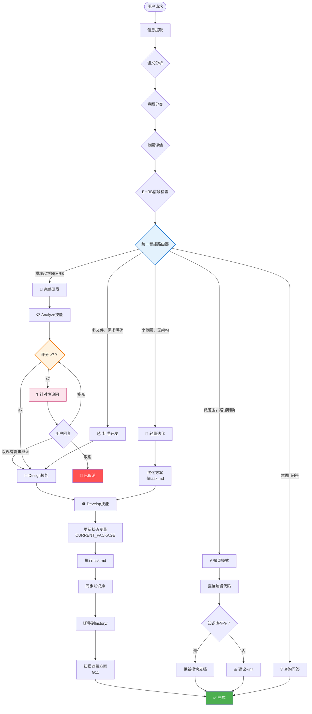

# HelloAGENTS

<div align="center">

**AI编程模块化技能系统 — 通过智能路由和人性化工作流，将混乱的智能体输出转化为结构化、可追溯、生产就绪的代码**

[](./LICENSE)
[](https://creativecommons.org/licenses/by/4.0/)
[](#-版本历史)
[](./CONTRIBUTING.md)

[简体中文](./README_CN.md) · [English](./README.md) · [快速开始](#-快速开始) · [文档](#-文档)

</div>

---

> **⚠️ 重要提示：** 使用前请先在 `AGENTS.md` 文件头部的 `bootstrap: lang=zh-CN` 中设置语言，并在全局规则的 **"Response Language"** 中配置回复语言为"简体中文"，以确保智能体按预期语言输出。

---

## 🎯 为什么选择 HelloAGENTS？

**问题：** AI 智能体功能强大但不可预测——它们产生不一致的输出，无法适应不同任务复杂度，缺乏系统化的需求验证，做决策时也不透明。

**解决方案：** HelloAGENTS 引入**AI编程模块化技能系统**，具备智能复杂度路由、语义意图分析、结构化需求评分以及人性化交互模式，能够自动适应你的任务需求。

| 挑战 | 没有 HelloAGENTS | 使用 HelloAGENTS |
|------|------------------|------------------|
| **单一工作流** | 每次变更都用同样的繁重流程 | 智能路由通过语义+意图分析选择4种工作流之一 |
| **接受模糊需求** | 智能体猜测然后失败 | 10分评分系统配合针对性追问 |
| **黑盒决策** | 不知道智能体为何选择某种方案 | 按需内部思考，明确的不确定性处理 |
| **无状态感知** | 交互之间丢失上下文 | G12状态变量追踪方案包、模式和上下文 |
| **输出不一致** | 随机的格式和结构 | G6统一输出格式，带强制验证 |
| **平台不兼容** | Unix命令在Windows上失败 | 跨平台规则，带PowerShell语法验证 |
| **不安全操作** | 意外的生产环境部署 | EHRB检测，自动工作流升级 |

### 💡 最适合
- ✅ **团队**需要基于任务复杂度的智能工作流选择
- ✅ **项目**需要在编码前进行系统化需求验证
- ✅ **开发者**希望AI决策过程透明
- ✅ **跨平台项目**（Windows PowerShell + macOS + Linux）
- ✅ **受监管行业**需要完整可追溯性和审计轨迹

### ⚠️ 不适合
- ❌ 没有质量要求的一次性脚本
- ❌ "能用就行"的项目
- ❌ 无文件系统访问的环境

---

## ✨ 特性

### 🎯 核心能力

<table>
<tr>
<td width="50%">

**🧭 统一智能路由**

多维度分析实现自动工作流选择：
- **语义分析**：理解请求含义，而非仅匹配关键词
- **意图分类**：问答型 / 改动型 / 命令型
- **范围评估**：微（≤2文件）→ 大（架构级）
- **EHRB信号检测**：自动风险识别

**你的收益：** 每次都选对工作流——无需手动切换模式。

</td>
<td width="50%">

**📊 带评分的需求分析**

代码变更前的结构化验证：
- **10分评分**跨4个维度（目标明确性、预期结果、边界范围、约束条件）
- 评分<7时**针对性追问**
- `<thinking>`块中的**按需内部思考**
- **上下文感知提问**避免询问已知信息

**你的收益：** 减少因需求模糊导致的实现失败。

</td>
</tr>
<tr>
<td width="50%">

**🔄 阶段与状态管理**

系统化工作流，完整可追溯：
- **3阶段工作流**：需求分析 → 方案设计 → 开发实施
- **G12状态变量**：CREATED_PACKAGE、CURRENT_PACKAGE、MODE_*
- **G11生命周期管理**：自动迁移到history/
- **上下文保持**：处理追问、选择、确认

**你的收益：** 永不丢失计划与执行的追踪。

</td>
<td width="50%">

**🛡️ 人性化安全防护**

透明且安全的AI行为：
- **G3不确定性原则**：明确假设 + 保守兜底
- **EHRB升级**：检测到风险时自动升级到更严格的工作流
- **统一输出格式**：一致的、经过验证的响应（G6.1）
- **符合GPT/SKILLS规范**：规则结构遵循官方指南

**你的收益：** 理解智能体每个决策的原因。

</td>
</tr>
</table>

### 📊 数据说话
- **4种智能工作流**通过语义路由自动选择（vs 手动切换模式）
- **10分评分**跨4个维度，确保编码前的需求质量
- **70%更小**的核心规则集，通过模块化技能架构
- **零**黑盒决策，通过G3不确定性披露
- **100%**可追溯性，通过G11方案包生命周期
- **跨平台** Windows PowerShell + Unix + Python 兼容性

---

## 🚀 快速开始

### 前置要求
- 具有文件系统访问权限的CLI环境（Codex CLI、Claude Code或自定义AI客户端）

### 安装

**步骤1：复制规则集到目标目录**

选择您的平台和语言版本：

- **Codex CLI 用户**：复制文件夹到 `~/.codex/`
  - 中文版：`Codex/Skills/CN` → `~/.codex/`
  - 英文版：`Codex/Skills/EN` → `~/.codex/`

- **Claude Code 用户**：复制文件夹到 `~/.claude/`
  - 中文版：`Claude/Skills/CN` → `~/.claude/`
  - 英文版：`Claude/Skills/EN` → `~/.claude/`

**步骤2：配置语言**

编辑AGENTS.md头部：

```yaml
# 在 AGENTS.md G1 部分：
OUTPUT_LANGUAGE: 简体中文  # 或 "English"
```

**步骤3：验证安装**

重启终端并询问：
```
"显示技能引用表"
```

**预期：** 智能体列出5个技能（analyze, design, develop, kb, templates）

### 首次使用示例

```bash
# 1. 简单修复 → 路由到微调模式（语义：改动型 + 微范围）
"修复 src/utils/helper.ts 第42行的拼写错误：'respose' 应该是 'response'"

# 2. 中等任务 → 路由到轻量迭代（语义：改动型 + 小范围）
"为登录、注册和密码重置功能添加错误处理"

# 3. 复杂任务 → 路由到完整研发，带需求评分
"添加 OAuth2 用户认证"
# 智能体会评分需求，可能会追问

# 4. 全授权模式 → 连续执行
~auto "重构数据库层以使用仓储模式"
```

**预期输出（微调模式）：**

```
✅【HelloAGENTS】- 微调模式完成

- ✅ 改动：修复拼写错误 'respose' → 'response'
- 📁 涉及文件：src/utils/helper.ts
- 📚 知识库：已更新模块文档

────
📁 变更:
  - src/utils/helper.ts
  - helloagents/wiki/modules/utils.md

🔄 下一步：请验证改动效果
```

**预期输出（需求评分追问）：**

```
❓【HelloAGENTS】- 需求分析

当前需求完整性评分为 5/10 分，无法明确优化目标和预期效果。

1. 您要优化哪个文件或模块的代码？
2. 当前存在什么具体问题需要优化？（如性能慢、代码重复等）
3. 期望优化后达到什么效果？
4. 有具体的性能指标或时间要求吗？

请按序号回答，或输入"以现有需求继续"跳过追问（可能影响方案质量）。
```

---

## 🔧 工作原理

### 架构概览

<details>
<summary><strong>📊 点击查看完整架构图</strong></summary>



</details>

### 统一智能路由详解

<table>
<tr><th>分析步骤</th><th>做什么</th><th>评估标准</th><th>输出</th></tr>

<tr>
<td><strong>1. 语义分析</strong></td>
<td>
• 理解请求含义<br>
• 识别动作动词和对象<br>
• 检测隐含需求
</td>
<td>自然语言理解，非关键词匹配</td>
<td>
• 请求解释<br>
• 隐含约束
</td>
</tr>

<tr>
<td><strong>2. 意图分类</strong></td>
<td>
• 问答型（提问/聊天）<br>
• 改动型（代码变更）<br>
• 命令型（~auto/~plan/~exec）
</td>
<td>用户的主要目标</td>
<td>
• 意图类别<br>
• 命令检测
</td>
</tr>

<tr>
<td><strong>3. 范围评估</strong></td>
<td>
• 微：≤2文件，≤30行<br>
• 小：3-5文件<br>
• 中：多文件协调<br>
• 大：架构级
</td>
<td>文件数、行数、架构影响</td>
<td>
• 范围类别<br>
• 不确定标记
</td>
</tr>

<tr>
<td><strong>4. EHRB检测</strong></td>
<td>
• 生产环境信号<br>
• PII数据处理<br>
• 破坏性操作<br>
• 支付相关变更
</td>
<td>关键词：prod、DROP、rm -rf、支付</td>
<td>
• 风险级别<br>
• 升级触发
</td>
</tr>

<tr>
<td><strong>5. 路由选择</strong></td>
<td>
• 应用决策原则<br>
• 处理不确定性（G3）<br>
• 选择最优工作流
</td>
<td>简单模式"全部满足"；完整研发"满足任一"</td>
<td>
• 选中的工作流<br>
• 推理轨迹
</td>
</tr>

</table>

### 需求分析深度解析

**10分评分系统：**

<table>
<tr><th>维度</th><th>分值</th><th>衡量什么</th><th>低分触发词</th></tr>

<tr>
<td><strong>目标明确性</strong></td>
<td>0-3</td>
<td>任务目标是否清晰具体？</td>
<td>"优化代码"、"让它更好"</td>
</tr>

<tr>
<td><strong>预期结果</strong></td>
<td>0-3</td>
<td>成功标准和交付物是否定义？</td>
<td>未提及预期行为</td>
</tr>

<tr>
<td><strong>边界范围</strong></td>
<td>0-2</td>
<td>任务范围是否明确界定？</td>
<td>开放式请求</td>
</tr>

<tr>
<td><strong>约束条件</strong></td>
<td>0-2</td>
<td>时间、性能、业务限制是否说明？</td>
<td>未提及约束</td>
</tr>

</table>

**按需内部思考：**

```
<thinking>
1. 逐项分析评分维度：
   - 目标明确性（0-3）：用户说"优化"但未指明优化什么 → 1分
   - 预期结果（0-3）：未提及成功标准 → 1分
   - 边界范围（0-2）："代码"太模糊 → 0分
   - 约束条件（0-2）：无约束 → 0分
2. 证据：用户说"优化代码"但无具体说明
3. 缺失信息：哪个模块？什么问题？什么指标？
4. 总分：2/10分
5. 决策：必须追问
</thinking>
```

**针对性追问：**

系统只问它不知道的：
- ✅ "需要优化哪个模块？"（用户未指定）
- ✅ "面临什么具体问题？"（未提及）
- ❌ ~~"使用什么框架？"~~（已从代码库获知）
- ❌ ~~"项目结构是什么？"~~（已扫描过）

---

## 📖 文档

### 核心概念

<table>
<tr><th>概念</th><th>定义</th><th>为什么重要</th></tr>

<tr>
<td><strong>语义分析</strong></td>
<td>通过NLU理解请求含义，而非关键词匹配</td>
<td>即使表述模糊也能准确检测意图</td>
</tr>

<tr>
<td><strong>意图分类</strong></td>
<td>将用户请求分类为问答型、改动型或命令型</td>
<td>决定路由到问答、开发工作流还是命令执行</td>
</tr>

<tr>
<td><strong>需求评分</strong></td>
<td>跨4个维度的10分制评分，≥7分门槛</td>
<td>防止在定义不清的需求上浪费精力</td>
</tr>

<tr>
<td><strong>追问机制</strong></td>
<td>评分<7时的针对性问题，避免询问已知信息</td>
<td>高效的需求收集，无冗余问题</td>
</tr>

<tr>
<td><strong>阶段管理</strong></td>
<td>3阶段工作流：分析 → 设计 → 实施</td>
<td>确保系统化推进，有明确检查点</td>
</tr>

<tr>
<td><strong>状态管理（G12）</strong></td>
<td>追踪方案包、模式和上下文的变量</td>
<td>在多轮交互中保持一致性</td>
</tr>

<tr>
<td><strong>G3不确定性原则</strong></td>
<td>明确披露假设和保守兜底</td>
<td>透明决策，无隐藏猜测</td>
</tr>

<tr>
<td><strong>EHRB检测</strong></td>
<td>极高风险行为识别和升级</td>
<td>危险操作的自动安全防护</td>
</tr>

</table>

### 特殊命令

| 命令 | 模式 | 何时使用 | 示例 |
|------|------|----------|------|
| `~auto` / `~fa` | 全授权模式 | 信任智能体完成分析→设计→开发 | `~auto "添加登录"` |
| `~plan` / `~design` | 仅规划 | 设计方案供执行前评审 | `~plan "重构数据库"` |
| `~exec` / `~run` | 仅执行 | 运行 `plan/` 中的预批准计划 | `~exec` |
| `~init` / `~wiki` | 知识库 | 从代码库初始化或刷新知识库 | `~init` |

### 状态变量（G12）

```yaml
CREATED_PACKAGE：方案设计阶段创建的方案包路径
  - 设置：详细规划创建方案包后
  - 读取：全授权模式下开发实施步骤1
  - 清除：读取后或流程终止

CURRENT_PACKAGE：当前执行的方案包路径
  - 设置：开发实施确定执行哪个方案包时
  - 用途：遗留方案扫描时排除
  - 清除：迁移到history/后

MODE_FULL_AUTH：全授权命令激活状态
MODE_PLANNING：规划命令激活状态
MODE_EXECUTION：执行命令激活状态
  - 追踪：活跃的特殊命令状态
  - 控制：静默执行行为
  - 清除：命令完成或用户取消时
```

### GPT/SKILLS规范的规则结构

HelloAGENTS遵循AI智能体规则集设计的官方指南：

```yaml
规则结构模式：
  - 全局规则（G1-G12）：通用约束和原则
  - 模块化技能：按需延迟加载的详细流程
  - 类XML标签：<uncertainty_principles>、<routing_rules>
  - CRITICAL标记：⚠️用于强制执行
  - 层次化组织：阶段 → 步骤 → 动作

输出格式合规：
  - 模板方法模式：所有输出结构一致
  - 状态符号：✅❓⚠️🚫❌💡有明确含义
  - 验证清单：输出前自检
  - 语言规则：G1 OUTPUT_LANGUAGE强制执行
```

---

## ❓ 常见问题

<details>
<summary><strong>问：语义分析与关键词匹配有什么区别？</strong></summary>

**答：** 语义分析理解含义，而非仅匹配词语：

| 输入 | 关键词匹配 | 语义分析 |
|------|-----------|---------|
| "让登录更快" | 可能遗漏"更快"=性能 | 理解：登录模块的优化请求 |
| "修复那个坏掉的东西" | 无法确定"东西"是什么 | 针对具体错误追问 |
| "加OAuth，就像我们讨论的" | 不知道上下文 | 检查对话历史获取OAuth详情 |

</details>

<details>
<summary><strong>问：为什么需求评分很重要？</strong></summary>

**答：** 没有评分时，智能体经常：
- 在理解不完整时就开始编码
- 产出偏离实际需求的方案
- 需要多轮修正

使用10分制：
- 明确门槛（≥7）才能继续
- 针对性问题填补具体空白
- 首次尝试成功率更高
</details>

<details>
<summary><strong>问：智能体不确定时会发生什么？</strong></summary>

**答：** G3不确定性原则要求：
1. **明确披露**："⚠️ 不确定因素：[描述]"
2. **列出假设**：决策基于什么
3. **保守选择**：更安全/更完整的路径
4. **备选方案**：如合理提供2-3个选项

示例：
```
⚠️ 不确定因素：范围在微调模式与轻量迭代边界
- 假设：实现可能涉及更多文件
- 决策：使用轻量迭代（更安全的选择）
- 备选：如确认≤2个文件，可切换到微调模式
```
</details>

<details>
<summary><strong>问：状态管理如何防止上下文丢失？</strong></summary>

**答：** G12状态变量维护：
- **CREATED_PACKAGE**：连接设计输出到开发输入
- **CURRENT_PACKAGE**：追踪正在执行什么
- **MODE_***：记住活跃的命令上下文

这确保：
- 开发实施执行正确的计划（非旧计划）
- 遗留扫描排除当前工作
- 命令可以干净地取消
</details>

<details>
<summary><strong>问：HelloAGENTS为什么是"人性化"的？</strong></summary>

**答：** 多个设计选择：
- **透明决策**：G3解释为什么，而非仅是什么
- **针对性问题**：不问它已知的
- **统一格式**：可预测、一致的输出
- **阶段确认**：用户可在继续前审查
- **安全默认**：保守路由，EHRB检测
</details>

<details>
<summary><strong>问：这符合GPT/SKILLS官方指南吗？</strong></summary>

**答：** 是的，HelloAGENTS遵循官方模式：
- **模块化架构**：技能按需加载
- **类XML标签**：用于结构化规则段落
- **CRITICAL标记**：明确强制vs可选规则
- **模板方法**：一致的输出结构
- **状态管理**：显式变量追踪
</details>

---

## 🛠️ 故障排除

### 路由问题

**问题：** 智能体路由到错误的工作流

**原因：** 范围模糊或上下文缺失

**解决方案：**
```bash
# ❌ 模糊（范围不确定）
"添加错误处理"

# ✅ 明确（范围清晰）
"为login.ts和signup.ts添加try-catch错误处理（2个文件，每个约20行）"
```

---

**问题：** 需求评分总是<7，持续追问

**原因：** 请求缺少必需维度

**解决方案：**
```bash
# ❌ 缺少维度（评分约2-3/10）
"优化代码"

# ✅ 覆盖所有维度（评分8-9/10）
"优化ProductList组件（src/components/ProductList.tsx）
 减少重渲染。当前每次页面加载渲染50+次。
 目标：<10次。必须保持现有筛选功能。"
```

---

### 状态问题

**问题：** 执行了错误的方案包

**原因：** 状态变量未正确设置/清除

**解决方案：**
```bash
# 通过询问检查当前状态：
"当前CREATED_PACKAGE和CURRENT_PACKAGE是什么？"

# 如果卡住，重置：
"取消当前操作，重新开始"
```

---

## 🆚 与其他方法对比

| 方法 | 优点 | 缺点 | HelloAGENTS优势 |
|------|------|------|----------------|
| **原始AI提示** | 灵活 | 无结构，不一致 | 语义路由 + 统一格式 |
| **Cursor / Copilot** | IDE集成 | 无需求验证 | 10分评分 + 追问 |
| **自定义提示** | 定制化 | 无状态管理 | G12状态 + G11生命周期 |
| **AutoGPT** | 自主 | 黑盒决策 | G3不确定性披露 |
| **Aider** | 擅长重构 | 仅Unix，无阶段 | 跨平台 + 3阶段工作流 |

---

## 📈 版本历史

### 最新版本：2025-12-18.2 🎉

**本版本新增：**
- 🔴 **重命名**："模块化AI编程技能系统" → "AI编程模块化技能系统"
- ✨ **增强**：Windows PowerShell语法约束（G1）
  - 新增：文件操作-Force、环境变量$env:VAR
  - 新增：参数组合验证、命令连接规则
  - 新增：比较运算符（-gt/-lt）、空值比较（$null位置）

**上一版本：2025-12-16.2**
- ✨ 模块化技能系统（5个独立技能）
- ✨ 复杂度路由器（4种自适应工作流）
- ✨ G3不确定性原则
- ✨ 跨平台兼容性
- 📦 核心规则集缩小70%

[查看完整变更记录 →](./CHANGELOG.md)

---

## 🤝 贡献

1. **Fork & Clone** 仓库
2. **创建功能分支**：`git checkout -b feature/my-improvement`
3. **遵循约定**：Conventional Commits，更新CHANGELOG
4. **提交PR** 并描述

### 贡献想法
- 🐛 发现bug？[报告它](https://github.com/hellowind777/helloagents/issues)
- 💡 有想法？[讨论它](https://github.com/hellowind777/helloagents/discussions)
- 🌍 将技能翻译成其他语言
- 🎨 创建特定领域的技能（移动、数据科学）

---

## 🔒 安全

**我们认真对待安全。**

- ✅ EHRB检测（G9）防止生产操作
- ✅ 不允许硬编码密钥
- ✅ 跨平台命令验证
- ✅ 检测到风险时自动工作流升级

**发现漏洞？** 请通过 [GitHub Discussions](https://github.com/hellowind777/helloagents/discussions) 私下报告

---

## 许可证与署名（**允许商用，但必须注明出处**）

为确保"允许商用 + 必须署名"，本项目采用**双许可证**：

1. **代码** — **Apache License 2.0** © 2025 Hellowind
   - 允许商业使用。要求在分发中保留 **LICENSE** 与 **NOTICE** 信息（版权与许可说明）。
   - 在你的分发包中加入 `NOTICE`（示例）：
     <pre>
     本产品包含 "HelloAGENTS"（作者：<a href="https://github.com/hellowind777/helloagents">Hellowind</a>），依据 Apache License 2.0 授权。
     </pre>

2. **文档（README/PROJECTWIKI/图表）** — **CC BY 4.0** © 2025 Hellowind
   - 允许商业使用，但**必须署名**；需给出许可链接并标注是否做了修改。
   - 复用文档时建议的署名例句：
     <pre>
     文本/图表改编自 "HelloAGENTS" —— © 2025 <a href="https://github.com/hellowind777/helloagents">Hellowind</a>，CC BY 4.0。
     </pre>

3. **统一署名建议（代码与文档皆可）**：
     <pre>
     HelloAGENTS — © 2025 <a href="https://github.com/hellowind777/helloagents">Hellowind</a>. 代码：Apache-2.0；文档：CC BY 4.0。
     </pre>

---

## 🙏 致谢

**灵感来源：**
- [Mermaid](https://mermaid.js.org/) — 美丽的图表
- [Conventional Commits](https://www.conventionalcommits.org/) — 提交标准
- [Keep a Changelog](https://keepachangelog.com/) — 版本管理
- GPT/SKILLS官方指南 — 规则结构模式

**社区：**
- 所有提交PR的贡献者
- 提供反馈的早期采用者
- 你，读到这里！🎉

---

## 📞 支持与社区

- 📖 **文档**：你正在阅读！
- 💬 **讨论**：[GitHub Discussions](https://github.com/hellowind777/helloagents/discussions)
- 🐛 **Bug报告**：[GitHub Issues](https://github.com/hellowind777/helloagents/issues)
- 💡 **功能请求**：[GitHub Discussions](https://github.com/hellowind777/helloagents/discussions)

---

## 📊 项目统计

<div align="center">


</div>

---

<div align="center">

**用 ❤️ 制作，作者 [Hellowind](https://github.com/hellowind777)**

[⬆ 返回顶部](#helloagents)

</div>
