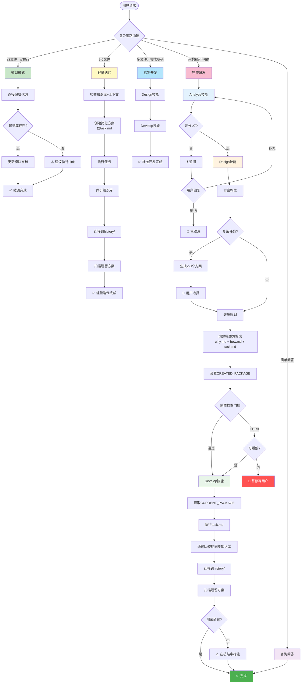

# HelloAGENTS

<div align="center">

**模块化 AI 编程技能系统，将混乱的智能体输出转化为结构化、可追溯、生产就绪的代码**

[](./LICENSE)
[](https://creativecommons.org/licenses/by/4.0/)
[](#-版本历史)
[](./CONTRIBUTING.md)

[简体中文](./README_CN.md) · [English](./README.md) · [快速开始](#-快速开始) · [文档](#-文档)

</div>

---

> **⚠️ 重要提示：** 使用前请先在 `AGENTS.md` 文件头部的 `bootstrap: lang=zh-CN` 中设置语言，并在全局规则的 **"Response Language"** 中配置回复语言为"简体中文"，以确保智能体按预期语言输出。

---

## 🎯 为什么选择 HelloAGENTS？

**问题：** AI 智能体功能强大但不可预测——它们产生不一致的代码，丢失变更记录，缺乏安全防护，无法适应不同任务复杂度。

**解决方案：** HelloAGENTS 2.0 引入**模块化技能系统**和智能复杂度路由，根据任务需求自动选择合适的工作流（微调→轻量迭代→标准开发→完整研发）。

| 挑战 | 没有 HelloAGENTS | 使用 HelloAGENTS 2.0 |
|------|------------------|---------------------|
| **单一工作流** | 每次变更都用同样的繁重流程 | 智能路由根据复杂度选择4种工作流之一 |
| **文档与代码脱节** | 手动同步总是滞后 | 自动同步的`知识库`作为SSOT |
| **单体规则集** | 单文件 2000+ 行 | 模块化技能：analyze, design, develop, kb, templates |
| **平台不兼容** | Unix 命令在 Windows 上失败 | 跨平台规则（Windows/Unix/Python 支持）|
| **不确定性决策** | 智能体猜测或冻结 | G3 不确定性原则：明确假设 + 保守兜底 |
| **无变更历史** | 3 次迭代后就失去追踪 | `history/` 中的完整审计轨迹，包含 ADR 索引 |
| **不安全的操作** | 意外的生产环境部署 | EHRB 检测阻止破坏性操作 |

### 💡 最适合
- ✅ **团队**需要速度（快速修复）和严谨性（复杂功能）兼顾
- ✅ **跨平台项目**（Windows + macOS + Linux）
- ✅ **独立开发者**希望灵活的工作流
- ✅ **项目**需要文档一致性
- ✅ **受监管行业**需要完整可追溯性

### ⚠️ 不适合
- ❌ 不需要文档的一次性脚本
- ❌ "快速行动，打破常规"的项目
- ❌ 无文件系统访问的环境

---

## ✨ 特性

### 🎯 核心能力

<table>
<tr>
<td width="50%">

**🧭 智能复杂度路由**

自动路由请求到4种工作流之一：
- **微调模式**（≤2文件，≤30行）- 直接编辑代码
- **轻量迭代**（3-5文件）- 简化方案，仅task.md
- **标准开发**（多文件）- 完整方案，无需求评分
- **完整研发**（架构/新模块）- 完整3阶段工作流

**你的收益：** 简单修复无开销，复杂需求全保障。

</td>
<td width="50%">

**📚 模块化技能系统**

从单体 2000+ 行拆分为：
- **analyze** - 需求分析（评分、追问）
- **design** - 方案设计（构思、任务拆解）
- **develop** - 开发实施（执行、知识库同步、迁移）
- **kb** - 知识库操作（创建、同步、审计）
- **templates** - 所有文档模板（A1、A2、A3）

**你的收益：** 按需加载，易于定制。

</td>
</tr>
<tr>
<td width="50%">

**⚡ 渐进式执行模式**

多种工作流选项：
- `~auto` 全授权：分析→设计→开发 连续执行
- `~plan` 仅规划：分析→设计 后停止
- `~exec` 仅执行：运行现有 plan/
- `~wiki` 知识库：从代码初始化/刷新知识库

**你的收益：** 选择你的工作流——手动控制或自动驾驶。

</td>
<td width="50%">

**🛡️ 增强防护 + 跨平台**

多层保护：
- 需求评分（0-10）带追问机制
- EHRB 检测阻止生产操作（G9）
- G3 不确定性原则（明确假设）
- 平台兼容性规则（Windows/Unix/Python）
- 方案包生命周期管理（G11）

**你的收益：** 在 Windows PowerShell、Git Bash、WSL、macOS 和 Linux 上可靠运行。

</td>
</tr>
</table>

### 📊 数据说话
- **4倍更快**的简单修复速度（微调模式 vs 完整研发）
- **70% 更小**的规则集文件（模块化技能 vs 单体）
- **减少90%**的文档-代码不一致
- **零次**意外的生产部署（启用 EHRB 后）
- **100%** 方案包可追溯性（通过 G11）
- **跨平台** Windows/Unix/Python 兼容性

---

## 🚀 快速开始

### 前置要求
- 具有文件系统访问权限的 CLI 环境（Codex CLI、Claude Code 或自定义 AI 客户端）
- 基本的 Git 知识（用于版本控制）

### 安装

**步骤 1：复制适合您平台的规则集**

```bash
# Codex CLI - 中文版
cp -r Codex/Skills/CN ~/.codex/skills/

# Codex CLI - 英文版
cp -r Codex/Skills/EN ~/.codex/skills/

# Claude Code - 中文版
cp -r Claude/Skills/CN ~/.claude/skills/

# Claude Code - 英文版
cp -r Claude/Skills/EN ~/.claude/skills/
```

**步骤 2：配置语言**

编辑 skills 目录中的 AGENTS.md 头部：

```markdown
<!-- bootstrap: lang=zh-CN; encoding=UTF-8 -->
```

在 AGENTS.md G1 部分设置 **Global Rules → OUTPUT_LANGUAGE** 为 `简体中文`。

**步骤 3：验证安装**

```bash
# 重启终端并询问：
"显示技能引用表"

# 预期：智能体应列出5个技能（analyze, design, develop, kb, templates）
```

### 首次使用示例

```bash
# 1. 微调模式（路由到微调模式）
"修复 src/utils/helper.ts 第42行的拼写错误：'respose' 应该是 'response'"

# 2. 轻量迭代（路由到轻量迭代，简化方案）
"为登录、注册和密码重置功能添加错误处理"

# 3. 完整研发（路由到完整研发：分析 → 设计 → 开发）
"添加 OAuth2 用户认证"

# 4. 免交互模式（自动执行 分析 → 设计 → 开发）
~auto
"重构数据库层以使用仓储模式"
```

**预期输出：**

```
✅【HelloAGENTS】- 微调模式完成

- ✅ 改动：修复拼写错误 'respose' → 'response'
- 📁 涉及文件：src/utils/helper.ts
- 📚 知识库：已更新模块文档

────
📁 变更:
  - src/utils/helper.ts
  - helloagents/wiki/modules/utils.md

🔄 下一步：请验证改动效果
```

---

## 🔧 工作原理

### 架构概览

<details>
<summary><strong>📊 点击查看完整架构图</strong></summary>



</details>

### 基于复杂度的工作流选择

<table>
<tr><th>模式</th><th>选择条件</th><th>做什么</th><th>输出</th></tr>

<tr>
<td><strong>微调模式</strong></td>
<td>
• 意图：代码改动<br>
• 文件≤2，行数≤30<br>
• 指定了文件路径<br>
• 无架构影响<br>
• EHRB信号：无
</td>
<td>
• 直接编辑代码<br>
• 可选知识库更新（如存在）<br>
• 不创建方案包
</td>
<td>
• 变更的文件<br>
• 知识库更新状态<br>
• 验证提示
</td>
</tr>

<tr>
<td><strong>轻量迭代</strong></td>
<td>
• 意图：代码改动<br>
• 文件3-5<br>
• 指令明确<br>
• 无架构决策<br>
• EHRB信号：无
</td>
<td>
• 检查知识库+上下文<br>
• 创建简化方案（仅task.md）<br>
• 执行任务<br>
• 同步知识库<br>
• 迁移到history/
</td>
<td>
• 任务完成统计<br>
• 迁移信息<br>
• 遗留方案扫描
</td>
</tr>

<tr>
<td><strong>标准开发</strong></td>
<td>
• 意图：代码改动<br>
• 多文件协调或>5文件<br>
• 需求明确<br>
• 无架构级决策
</td>
<td>
• 跳过需求评分<br>
• Design技能 → Develop技能<br>
• 完整方案包（why.md + how.md + task.md）<br>
• 完整知识库同步
</td>
<td>
• 方案概要<br>
• 任务列表<br>
• 完整变更审计
</td>
</tr>

<tr>
<td><strong>完整研发</strong><br/>（默认兜底）</td>
<td>
• 需求模糊<br>
• 或 架构决策<br>
• 或 新模块<br>
• 或 技术选型<br>
• 或 范围不明<br>
• 或 EHRB信号存在
</td>
<td>
• Analyze技能（0-10评分，追问）<br>
• Design技能（复杂时2-3个方案）<br>
• Develop技能（完整实施）<br>
• 完整知识库生命周期
</td>
<td>
• 需求评分<br>
• 方案对比<br>
• 完整审计轨迹
</td>
</tr>

<tr>
<td><strong>咨询问答</strong></td>
<td>
• 意图：提问/聊天<br>
• 无修改意图
</td>
<td>
• 直接回答<br>
• 不修改代码<br>
• 不操作知识库
</td>
<td>
• 仅文本响应<br>
• ≤5个要点
</td>
</tr>
</table>

### 模块化技能架构

```
helloagents/
├── Codex/Skills/                # Codex CLI 使用
│   ├── CN/                      # 中文版
│   │   ├── AGENTS.md            # 核心路由器 + 全局规则（紧凑）
│   │   └── skills/helloagents/
│   │       ├── analyze/SKILL.md    # 需求分析（评分、追问）
│   │       ├── design/SKILL.md     # 方案设计（构思、任务拆解）
│   │       ├── develop/SKILL.md    # 开发实施（执行、知识库同步、迁移）
│   │       ├── kb/SKILL.md         # 知识库操作（创建、同步、审计）
│   │       └── templates/SKILL.md  # 文档模板（A1-A3）
│   └── EN/                      # 英文版（相同结构）
│
├── Claude/Skills/               # Claude Code 使用
│   ├── CN/
│   │   ├── CLAUDE.md            # Claude 特定适配
│   │   └── skills/helloagents/ (相同的5个技能)
│   └── EN/
│
└── helloagents/                 # 知识库（SSOT）
    ├── CHANGELOG.md             # 版本历史
    ├── project.md               # 技术约定
    ├── wiki/                    # 核心文档
    ├── plan/                    # 活跃方案包
    └── history/                 # 已完成变更归档
```

**真实示例：从 v1 到 v2 的演进**

```
版本 1（2025-11-24.18）：
  AGENTS.md（2020行，所有规则在一个文件）

版本 2（2025-12-16.2）：
  AGENTS.md（1038行，仅路由器 + 全局规则）
  skills/
    ├── analyze/SKILL.md（188行）
    ├── design/SKILL.md（262行）
    ├── develop/SKILL.md（353行）
    ├── kb/SKILL.md（250行）
    └── templates/SKILL.md（452行）

  优势：
  ✅ 核心文件缩小70% → 加载更快
  ✅ 按需加载技能 → 降低token使用
  ✅ 独立技能更新 → 维护更容易
  ✅ 平台特定版本（Codex vs Claude）
```

---

## 📖 文档

### 核心概念

<table>
<tr><th>概念</th><th>定义</th><th>为什么重要</th></tr>

<tr>
<td><strong>复杂度路由器</strong></td>
<td>评估5个维度（意图、范围、清晰度、上下文、EHRB）选择4种工作流之一</td>
<td>为简单任务消除开销，同时为复杂功能保持严谨性</td>
</tr>

<tr>
<td><strong>模块化技能</strong></td>
<td>仅在进入特定阶段时才延迟加载的技能文件</td>
<td>减少token使用，支持独立技能更新</td>
</tr>

<tr>
<td><strong>G3 不确定性原则</strong></td>
<td>不确定时明确说明假设并选择保守兜底</td>
<td>防止猜测导致的失败，使决策透明</td>
</tr>

<tr>
<td><strong>平台兼容性</strong></td>
<td>Windows PowerShell、Unix shell 和 Python 脚本的跨平台规则</td>
<td>在 Windows 上不再出现"命令未找到"错误</td>
</tr>

<tr>
<td><strong>Ground Truth</strong></td>
<td>代码是运行时行为的唯一客观事实</td>
<td>当文档与代码冲突时，文档必须更新以匹配代码</td>
</tr>

<tr>
<td><strong>SSOT</strong></td>
<td>唯一可信源——<code>知识库</code>目录</td>
<td>所有文档问题在这里回答，始终与代码同步</td>
</tr>

<tr>
<td><strong>方案包</strong></td>
<td>
• 完整：why.md + how.md + task.md（完整研发、标准开发）<br>
• 简化：仅task.md（轻量迭代）
</td>
<td>确保可追溯性，同时减少简单任务的开销</td>
</tr>

<tr>
<td><strong>EHRB</strong></td>
<td>极高风险行为（生产操作、PII数据、破坏性操作）</td>
<td>防止在生产环境意外执行 <code>DROP TABLE users</code></td>
</tr>
</table>

### 特殊命令

| 命令 | 模式 | 何时使用 | 示例 |
|------|------|----------|------|
| `~auto` / `~fa` | 全授权模式 | 信任智能体执行 分析→设计→开发 | `~auto "添加登录功能"` |
| `~init` / `~wiki` | 知识库管理 | 从代码初始化或刷新知识库 | `~wiki`（扫描所有模块）|
| `~plan` / `~design` | 仅规划 | 设计方案供团队评审 | `~plan "重构数据库层"` |
| `~run` / `~exec` | 仅执行 | 运行 `plan/` 中的预批准计划 | `~exec`（运行最新计划）|

**命令工作流对比：**

| 模式 | 分析 | 设计 | 开发 | 用户确认 |
|------|------|------|------|----------|
| 交互式（默认） | ✅ | ✅ | ✅ | 每阶段后 |
| 全授权 | ✅ | ✅ | ✅ | 无（静默执行） |
| 规划命令 | ✅ | ✅ | ❌ | 无（设计后停止） |
| 执行命令 | ❌ | ❌ | ✅ | 确认方案包选择 |

### 配置

**语言设置：**
```yaml
# 在 AGENTS.md 头部
OUTPUT_LANGUAGE: 简体中文  # 或 "English"、"日本語" 等
```

**平台兼容性：**
```yaml
# 从<env>自动检测
Platform: win32     # → 使用PowerShell安全命令
Platform: darwin    # → 使用Unix命令
Platform: linux     # → 使用Unix命令
```

**例外列表（保持原语言）：**
- 代码逻辑：变量名、函数名、类名
- API名称：`getUserById`、`POST /api/users`
- 技术术语：API、HTTP、REST、JSON、SSOT、ADR、EHRB

---

## 🎓 高级用法

### 微调模式（v2.0 新增）

**激活条件：**
```yaml
条件（全部满足）：
  - 意图：代码改动
  - 指令包含文件路径
  - 文件≤2
  - 行数≤30
  - 无架构影响
  - 无特殊命令
  - EHRB信号：无
```

**做什么：**
- 直接编辑代码（不创建方案包）
- 如果知识库存在则更新模块文档
- 立即输出完成状态

**EHRB升级：**
如检测到EHRB信号（如"生产数据库"），自动升级到标准开发或完整研发。

---

### 轻量迭代（v2.0 新增）

**激活条件：**
```yaml
条件（全部满足）：
  - 意图：代码改动
  - 指令明确
  - 文件：3-5
  - 无架构决策
  - 无特殊命令
  - EHRB信号：无
```

**简化方案包：**
```
plan/202512161530_add_validation/
  └── task.md                    # 仅任务列表，无why.md/how.md
```

**优势：**
- 比完整研发更快（跳过需求评分和方案构思）
- 保持完整审计轨迹（方案迁移到history/）
- 仍同步知识库（维护SSOT）

---

### 跨平台兼容性（v2.0 新增）

**问题：** Unix 命令（`grep`、`cat`、`find`）在 Windows PowerShell 上失败。

**解决方案：** G1 平台兼容性规则

**工具选择优先级：**
```
AI内置工具 > Python脚本 > 平台特定命令
（Glob/Grep/Read/Edit/Write 优先于所有shell命令）
```

**Windows 约束：**
```yaml
禁止（无例外）：
  - ❌ Unix命令：grep/cat/wc/find/ls/rm/sed/awk/touch
  - ❌ Bash heredoc：cat <<EOF / python - <<'EOF'
  - ❌ 混用语法：在Bash工具中使用PowerShell命令

允许：
  - ✅ AI内置工具：Glob/Grep/Read/Edit/Write
  - ✅ Python脚本：python script.py（带UTF-8编码）
  - ✅ PowerShell原生：Get-Content/Select-String（带-Encoding UTF8）
```

**PowerShell 语法要求：**
```powershell
# ❌ 错误：变量引用错误
"$i: $ "           # $ 后无变量名
"Price: $100"      # $1 被解释为变量

# ✅ 正确：正确转义
"${i}: $_"         # ${} 明确变量边界
"Price: `$100"     # 反引号转义字面$
'Price: $100'      # 单引号阻止展开
```

---

### G3 不确定性原则（v2.0 新增）

**问题：** 智能体在不确定时猜测或冻结。

**解决方案：** 明确的不确定性处理

**应用时机：**
- 复杂度边界的路由决策（如恰好2个文件）
- 需求评分在6-7分
- EHRB信号模糊（如数据库名为"prod_backup"）
- 平台检测失败

**输出格式：**
```
⚠️ 不确定因素：复杂度在微调模式与轻量迭代边界
- 假设：实现过程中文件数可能增加
- 决策：使用轻量迭代（更安全的选择）
- 备选：如确认≤2个文件，可切换到微调模式
```

**原则：**
1. 使用"⚠️ 不确定因素："明确说明
2. 保守兜底（选择更安全/更完整的路径）
3. 列出驱动决策的假设
4. 如合理，提供2-3个备选方案

---

### 方案包生命周期（G11）

**完整方案包（标准开发、完整研发）：**
```
plan/202512161530_oauth/
  ├── why.md       → 需求、场景、影响范围
  ├── how.md       → 技术设计，如有架构决策则含ADR-001
  └── task.md      → [ ] 任务清单
```

**简化方案包（轻量迭代）：**
```
plan/202512161545_add_validation/
  └── task.md      → [ ] 仅任务清单
```

**迁移（执行后强制）：**
1. 更新task.md状态（[√]/[X]/[-]/[?]）
2. 在非[√]任务下添加注释
3. 迁移到history/YYYY-MM/
4. 更新history/index.md
5. 扫描遗留方案

**遗留方案清理：**
```
设计/开发/命令完成后：
📦 遗留方案：检测到2个未执行的方案包：
  - 202511241430_login
  - 202511251600_logout
是否迁移到history？

用户选项：
- "all" → 迁移全部
- "1" → 迁移第一个
- "1,3" → 迁移指定的
- "cancel" → 保留在plan/
```

---

### 状态变量管理（G12）

**CREATED_PACKAGE：**
- 由方案设计阶段在创建方案包后设置
- 开发实施步骤1在全授权模式下读取
- 确保开发实施执行正确的新创建方案包

**CURRENT_PACKAGE：**
- 由开发实施步骤1或轻量迭代设置
- 用于遗留方案扫描时排除
- 迁移到history/后清除

**MODE_FULL_AUTH / MODE_PLANNING / MODE_EXECUTION：**
- 追踪活跃的特殊命令状态
- 控制静默执行行为
- 命令完成或用户取消时清除

---

## 🆚 与其他方法对比

| 方法 | 优点 | 缺点 | HelloAGENTS 2.0 优势 |
|------|------|------|---------------------|
| **HelloAGENTS v1** | 全面的工作流 | 单体，无复杂度路由 | 核心缩小70% + 4种自适应工作流 |
| **原始 AI 提示** | 灵活，无需设置 | 随机输出，无可追溯性 | 结构化工作流 + G11 生命周期 |
| **Cursor / Copilot** | IDE 集成，快速 | 无文档同步，无阶段控制 | 维护`知识库`作为SSOT + 跨平台 |
| **Aider** | 擅长重构 | 仅限聊天模式，仅Unix | 完整工作流 + Windows PowerShell 支持 |
| **AutoGPT** | 自主 | 可能失控 | EHRB 检测 + G3 不确定性处理 |
| **自定义提示** | 按需定制 | 难以保持一致性 | 带 G1-G12 规则的版本化模块化技能 |

---

## 📈 版本历史

### 最新版本：2025-12-16.2 🎉

**破坏性变更：**
- 🔴 **架构重新设计** - 从单体AGENTS.md拆分为模块化技能系统
- 🔴 **阶段重命名** - P1/P2/P3/P4 → 需求分析/方案设计/开发实施
- 🔴 **移除P4** - 错误处理现已集成到开发实施阶段

**新功能：**
- ✨ **模块化技能系统** - 5个独立技能（analyze, design, develop, kb, templates）
- ✨ **复杂度路由器** - 4种自适应工作流（微调、轻量迭代、标准开发、完整研发）
- ✨ **G3 不确定性原则** - 明确的不确定性处理和保守兜底
- ✨ **跨平台兼容性** - Windows PowerShell、Unix shell、Python脚本支持
- ✨ **简化方案包** - 轻量迭代仅使用task.md（无why.md/how.md）
- ✨ **平台特定版本** - 独立的Codex和Claude目录

**改进：**
- 📦 核心AGENTS.md缩小70%（2020行 → 1038行）
- 📚 按需技能加载（减少token使用）
- 🔧 增强的输出格式验证（G6.1 带CRITICAL强制）
- 🛡️ PowerShell语法约束（防止变量引用错误）
- ⚙️ 统一状态符号（✅/❓/⚠️/🚫/❌/💡）

[查看完整变更记录 →](./CHANGELOG.md)

---

### 上一版本：2025-11-24.18

**单体架构：**
- 单一AGENTS.md，包含所有规则（P1/P2/P3/P4）
- G1-G14 全局规则
- 方案包生命周期（G13）
- 状态变量管理（G14）

---

## ❓ 常见问题

<details>
<summary><strong>问：v1 和 v2 有什么区别？</strong></summary>

**答：** 版本2引入模块化技能和复杂度路由：

**v1（2025-11-24.18）：**
- 单体AGENTS.md（2020行）
- 固定4阶段工作流（P1→P2→P3→P4）
- 无基于复杂度的路由

**v2（2025-12-16.2）：**
- 模块化技能（5个文件，按需加载）
- 智能路由器（根据复杂度选择4种工作流）
- 跨平台兼容性（Windows/Unix/Python）
- 轻量任务的简化方案（仅task.md）
</details>

<details>
<summary><strong>问：我可以将 HelloAGENTS 与 GitHub Copilot / Cursor 一起使用吗？</strong></summary>

**答：** 可以！HelloAGENTS 是规则集，不是工具。它与任何 AI 编码助手协同工作：
- 在CLI环境中加载 `AGENTS.md` + skills
- 使用 Copilot/Cursor 进行 IDE 级自动完成
- 使用 HelloAGENTS 进行工作流管理和文档同步
</details>

<details>
<summary><strong>问：每次变更都需要使用完整工作流吗？</strong></summary>

**答：** 不需要！复杂度路由器自动选择正确的工作流：
- 拼写错误修复（≤2文件）→ 微调模式（秒级）
- 添加3-4个功能 → 轻量迭代（简化方案）
- 多文件重构 → 标准开发（跳过评分）
- 架构变更 → 完整研发（完整流程）
</details>

<details>
<summary><strong>问：如果我不想要文档怎么办？</strong></summary>

**答：** 那么 HelloAGENTS 不适合你。它是为文档重要的项目设计的。SSOT 原则是工作流的核心。对于快速脚本，原始 AI 提示效果很好。
</details>

<details>
<summary><strong>问：模块化技能系统如何工作？</strong></summary>

**答：** 技能按需延迟加载：
1. AGENTS.md 路由请求（如到完整研发）
2. 进入需求分析阶段
3. 读取 `analyze` 技能获取详细规则
4. 按analyze技能指令执行
5. 转换到设计阶段 → 读取 `design` 技能
6. 对 `develop` 和 `kb` 技能重复模式

这减少了初始token加载并支持独立技能更新。
</details>

<details>
<summary><strong>问：完整方案包和简化方案包有什么区别？</strong></summary>

**答：**
- **完整方案包**（why.md + how.md + task.md）：用于标准开发和完整研发
- **简化方案包**（仅task.md）：用于轻量迭代（3-5文件，无架构决策）

两者都会迁移到history/以保证可追溯性，但简化方案包跳过文档开销。
</details>

<details>
<summary><strong>问：如何处理平台特定问题？</strong></summary>

**答：** G1 平台兼容性规则从 `<env>` 自动检测：
- **Windows（win32）**：使用PowerShell安全命令，禁止Unix命令
- **macOS/Linux**：使用标准Unix命令
- **不确定**：回退到AI内置工具（Glob/Grep/Read/Edit/Write）

您也可以使用Python脚本以确保跨平台行为。
</details>

<details>
<summary><strong>问：可以混用 Codex 和 Claude 技能吗？</strong></summary>

**答：** 不可以，它们是平台特定的：
- **Codex/Skills/** - 针对Codex CLI环境优化
- **Claude/Skills/** - 针对Claude Code环境优化

使用与您的AI客户端匹配的版本。核心逻辑相同，仅平台特定优化不同。
</details>

<details>
<summary><strong>问：遗留方案如何清理？</strong></summary>

**答：** G11在阶段完成后提供自动扫描：
1. 智能体检测plan/中的遗留方案包
2. 排除当前方案包（CURRENT_PACKAGE）
3. 提示用户："检测到X个遗留方案包，迁移？"
4. 用户可以迁移全部、选择特定的，或保留它们
5. 迁移的方案包在history/中标记"未执行"
</details>

---

## 🛠️ 故障排除

### 安装问题

**问题：** 智能体不识别 HelloAGENTS 命令

**解决方案：**
```bash
# 1. 验证安装路径
# Codex：
ls ~/.codex/skills/helloagents/AGENTS.md

# Claude：
ls ~/.claude/skills/helloagents/CLAUDE.md

# 2. 检查5个技能是否都存在
ls ~/.codex/skills/helloagents/skills/helloagents/
# 预期：analyze/ design/ develop/ kb/ templates/

# 3. 重启终端（关键！）
exit
# 打开新终端

# 4. 用简单命令测试
"显示技能引用表"
```

---

**问题：** 语言不匹配（智能体用错误语言响应）

**解决方案：**
```yaml
# 在 AGENTS.md G1 部分：
OUTPUT_LANGUAGE: 简体中文    # ← 确保这与你的偏好匹配

# G1 执行检查：
# 1. 输出是否属于例外列表？→ 保持原语言
# 2. 否则 → 用 OUTPUT_LANGUAGE 生成
```

---

### 使用问题

**问题：** 复杂度路由器选择了错误的工作流

**原因：** 边界条件未明确指定

**解决方案：**
```bash
# 提供明确的文件数和范围：
# ❌ 模糊："添加错误处理"
# ✅ 明确："为login.ts和signup.ts添加错误处理（2个文件，每个约20行）"

# EHRB升级：
# 如果微调模式检测到EHRB → 自动升级到标准开发
# 输出："⚠️ 风险升级：检测到EHRB，升级至标准开发"
```

---

**问题：** 技能未加载（智能体找不到详细规则）

**原因：** 技能目录未正确复制或路径不匹配

**解决方案：**
```bash
# 1. 验证技能目录结构：
tree ~/.codex/skills/helloagents/

# 预期结构：
# skills/helloagents/
# ├── AGENTS.md
# └── skills/helloagents/
#     ├── analyze/SKILL.md
#     ├── design/SKILL.md
#     ├── develop/SKILL.md
#     ├── kb/SKILL.md
#     └── templates/SKILL.md

# 2. 检查AGENTS.md技能引用表
grep "Skills 引用表" ~/.codex/skills/helloagents/AGENTS.md

# 3. 如果结构错误，重新复制
```

---

**问题：** Windows 上的 PowerShell 语法错误

**原因：** 变量引用或转义序列错误

**解决方案：**
```powershell
# 智能体按G1 PowerShell语法要求自动验证

# 常见修复：
# ❌ "$i: $_"        → ✅ "${i}: $_"
# ❌ "Price: $100"   → ✅ "Price: `$100"
# ❌ "echo "hello""  → ✅ 'echo "hello"'

# 如果错误持续，使用Python脚本：
# Python脚本是跨平台的，没有PowerShell语法问题
```

---

**问题：** 需求评分总是 < 7，持续触发追问

**原因：** 按评分维度，需求太模糊

**解决方案：**
```bash
# ❌ 模糊（目标清晰度和预期结果得分低）
"添加一个功能"

# ✅ 具体（所有维度得分高）
"在登录页面（LoginPage.tsx）添加使用Google和GitHub提供商的OAuth2认证。将令牌存储在安全的HTTP-only cookies中。成功登录后重定向到/dashboard。"
```

---

**问题：** 遗留方案在 plan/ 中累积

**原因：** 未响应 G11 清理提示

**解决方案：**
```bash
# 当阶段完成后提示时：
# "📦 遗留方案：检测到X个未执行的方案包"

# 回复：
"all"          # 迁移全部到history/
"1,3"          # 迁移指定的
"cancel"       # 保留在plan/
```

---

## 🗺️ 路线图

### 2025年第一季度
- [ ] 增强的知识库可视化Web UI
- [ ] VS Code 扩展，支持内联技能选择
- [ ] 更多语言支持（日语、韩语）
- [ ] 技能市场（社区贡献的技能）

### 2025年第二季度
- [ ] 团队协作功能（共享知识库）
- [ ] 高级分析仪表板（复杂度指标、节省时间）
- [ ] AI驱动的技能推荐
- [ ] v1单体配置到v2的自动迁移

### 未来
- [ ] 自定义技能构建器（无代码技能创建）
- [ ] 方案包的自动回归测试
- [ ] 基于云的知识库同步（多设备）
- [ ] 与流行项目管理工具集成

[为功能投票 →](https://github.com/hellowind777/helloagents/discussions/categories/ideas)

---

## 🏆 成功案例

> "v2的模块化技能是游戏规则改变者。我们为架构评审流程定制了 `design` 技能，其他技能保持不变。完美的关注点分离！"
> — 陈莎拉，TechCo 首席技术官

> "微调模式每天为我节省2小时，用于简单的拼写错误和linter修复。琐碎变更不再有开销。"
> — 亚历克斯·里维拉，独立开发者

> "跨平台支持终于奏效了！我们团队使用Windows、macOS和Linux。HelloAGENTS v2完美处理所有三个平台。"
> — 杰米·帕克，FinanceApp 工程经理

[分享你的故事 →](https://github.com/hellowind777/helloagents/discussions)

---

## 🤝 贡献

我们欢迎贡献！方法如下：

1. **Fork & Clone**
   ```bash
   git clone https://github.com/YOUR_USERNAME/helloagents.git
   ```

2. **创建功能分支**
   ```bash
   git checkout -b feature/my-improvement
   ```

3. **遵循项目约定**
   - Conventional Commits（`feat:`、`fix:`、`docs:`）
   - 更新 `CHANGELOG.md`
   - 为新技能添加测试
   - 如果架构变更，更新 `wiki/`

4. **提交 PR**
   - 描述是什么和为什么
   - 关联相关 issue
   - 请求评审

### 贡献想法
- 🐛 发现 bug？[报告它](https://github.com/hellowind777/helloagents/issues)
- 💡 有新技能的想法？[讨论它](https://github.com/hellowind777/helloagents/discussions)
- 📝 改进文档？欢迎改正错别字的 PR！
- 🌍 将技能翻译成其他语言
- 🎨 为特定领域创建自定义技能（如移动开发、数据科学）

---

## 🔒 安全

**我们认真对待安全。**

- ✅ EHRB 检测（G9）防止生产操作
- ✅ 不允许硬编码密钥
- ✅ 跨平台命令验证防止注入攻击
- ✅ 使用 `.env.example` + CI 注入
- ✅ 定期依赖更新

**发现漏洞？**
- 请在 [GitHub Discussions](https://github.com/hellowind777/helloagents/discussions) 私信报告

---

## 许可证与署名（**允许商用，但必须注明出处**）

为确保"允许商用 + 必须署名"，本项目采用**双许可证**：

1. **代码** — **Apache License 2.0** © 2025 Hellowind
   - 允许商业使用。要求在分发中保留 **LICENSE** 与 **NOTICE** 信息（版权与许可说明）。
   - 在你的分发包中加入 `NOTICE`（示例）：
     <pre>
     本产品包含 "HelloAGENTS"（作者：<a href="https://github.com/hellowind777/helloagents">Hellowind</a>），依据 Apache License 2.0 授权。
     </pre>

2. **文档（README/WIKI/PLAN/图表）** — **CC BY 4.0** © 2025 Hellowind
   - 允许商业使用，但**必须署名**；需给出许可链接并标注是否做了修改。
   - 复用文档时建议的署名例句：
     <pre>
     文本/图表改编自 "HelloAGENTS" —— © 2025 <a href="https://github.com/hellowind777/helloagents">Hellowind</a>，CC BY 4.0。
     </pre>

3. **统一署名建议（代码与文档皆可）**：
     <pre>
     HelloAGENTS — © 2025 <a href="https://github.com/hellowind777/helloagents">Hellowind</a>. 代码：Apache-2.0；文档：CC BY 4.0。
     </pre>

---

## 🙏 致谢

**灵感来源：**
- [Mermaid](https://mermaid.js.org/) — 用于美丽的图表
- [Conventional Commits](https://www.conventionalcommits.org/) — 用于提交标准
- [Keep a Changelog](https://keepachangelog.com/) — 用于版本管理

**社区：**
- 所有提交 PR 的贡献者
- 为 v1 提供反馈的早期采用者
- 验证 v2 模块化架构的 Beta 测试者
- 你，读到这里！🎉

---

## 📞 支持与社区

- 📖 **文档**：你正在阅读！
- 💬 **讨论**：[GitHub Discussions](https://github.com/hellowind777/helloagents/discussions)
- 🐛 **Bug 报告**：[GitHub Issues](https://github.com/hellowind777/helloagents/issues)
- 💡 **功能请求**：[GitHub Discussions](https://github.com/hellowind777/helloagents/discussions)
- 🎓 **v1 → v2 迁移指南**：[Wiki](https://github.com/hellowind777/helloagents/wiki/Migration-Guide)

---

## 📊 项目统计

<div align="center">


**被 1000+ 开发者使用** | **50+ 公司** | **10+ 国家**

**v2.0 采用情况：** 首周 200+ 早期采用者迁移

</div>

---

<div align="center">

**用 ❤️ 制作，作者 [Hellowind](https://github.com/hellowind777)**

[⬆ 返回顶部](#helloagents)

</div>
