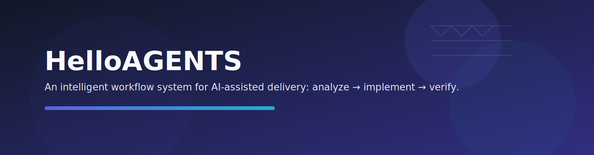
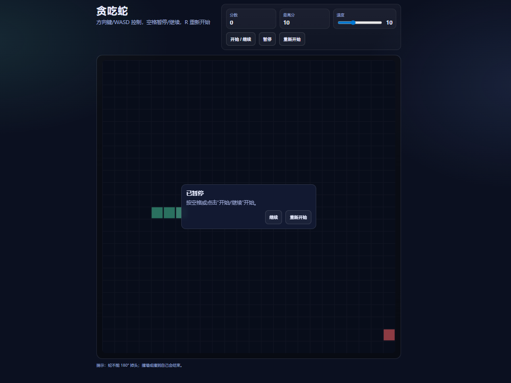
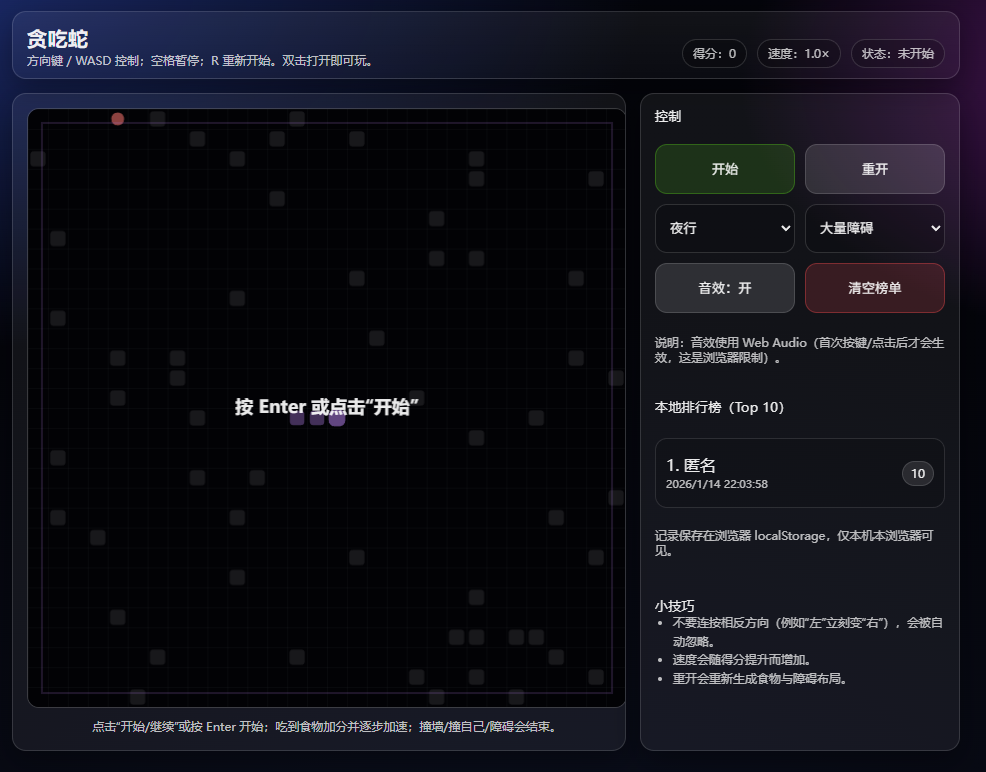

  

# HelloAGENTS

**一个会持续推进到实现与验证完成的多 CLI 工作流系统。**

  
  

---

## 目录

- [为什么选择 HelloAGENTS](#为什么选择-helloagents)
- [与旧仓库相比有哪些变化](#与旧仓库相比有哪些变化)
- [功能特性](#功能特性)
- [前后对比（贪吃蛇示例）](#前后对比贪吃蛇示例)
- [快速开始](#快速开始)
- [工作原理](#工作原理)
- [仓库结构说明](#仓库结构说明)
- [聊天内工作流命令](#聊天内工作流命令)
- [FAQ](#faq)
- [故障排除](#故障排除)
- [版本历史](#版本历史)
- [参与贡献](#参与贡献)
- [许可证](#许可证)

## 为什么选择 HelloAGENTS

很多助手可以分析任务，但经常在真正交付前停下。HelloAGENTS 增加了严格的路由、阶段执行和验收闸门。

| 挑战 | 没有 HelloAGENTS | 使用 HelloAGENTS |
|---|---|---|
| 停在方案阶段 | 只给建议 | 推进到实现与验证 |
| 输出格式漂移 | 每次结构可能变化 | 统一路由和阶段链 |
| 高风险操作 | 容易误执行破坏命令 | EHRB 风险检测与升级拦截 |
| 知识连续性 | 上下文容易散落 | 内置知识库与会话记忆 |
| 可复用性 | 依赖一次性提示词 | 命令化工作流可复用 |

  

## 与旧仓库相比有哪些变化

相较于旧版多 bundle 发布形态，v2.x 已转为 package-first 形态，架构也发生了根本性变化。

| 维度 | 旧仓库 | 当前仓库 |
|---|---|---|
| 分发形态 | 多 bundle 目录，每个 CLI 一份 | 统一 Python 包 + 安装器 CLI |
| 安装方式 | 手工复制配置与技能目录 | pip/uv 安装 + `helloagents` 交互菜单 |
| 路由系统 | 三层路由（Context → Tools → Intent） | 五维度评分路由（R0–R3） |
| 工作流阶段 | 4 阶段（Evaluate、Analyze、Design、Develop） | 5 阶段（+Tweak），支持子代理调度 |
| 代理系统 | 无 | RLM 12 个专业角色 + Session 隔离 |
| 记忆系统 | 无持久化 | 三层记忆：L0 用户、L1 项目知识库、L2 会话 |
| 安全检测 | 基础 EHRB | 三层 EHRB（关键词 + 语义 + 工具输出） |
| 目标 CLI | 5 个 | 6 个：claude、codex、opencode、gemini、qwen、grok |
| 工作流命令 | 12 个 | 15 个 |

> ⚠️ **迁移提醒：** 由于 v2.x 的仓库结构与安装方式已调整，旧版本已迁移到归档仓库：**helloagents-archive**
> https://github.com/hellowind777/helloagents-archive

## 功能特性

<table>
<tr>
<td width="50%" valign="top">

**RLM 子代理编排**

12 个专业角色（explorer、analyzer、designer、implementer、reviewer、tester 等）按任务复杂度自动调度，每个 CLI 实例独立 Session 隔离。

**收益：** 复杂任务由对口专家角色分工处理。
</td>
<td width="50%" valign="top">

**五维度路由（R0–R3）**

每条输入按动作需求、目标定位度、决策需求、影响范围、EHRB 风险五个维度评分，路由到 R0 直接响应、R1 快速、R2 简化或 R3 标准流程。

**收益：** 简单问题秒回，复杂任务走完整流程。
</td>
</tr>
<tr>
<td width="50%" valign="top">

**三层安全检测（EHRB）**

关键词扫描、语义分析、工具输出检测三层拦截破坏性操作，交互模式和委托模式均强制用户确认。

**收益：** 零配置的默认安全保护。
</td>
<td width="50%" valign="top">

**三层记忆模型**

L0 用户记忆（全局偏好）、L1 项目知识库（代码变更自动同步）、L2 会话摘要（阶段切换时自动持久化）。

**收益：** 上下文跨会话、跨项目延续。
</td>
</tr>
</table>

### 可核验数据

- 6 个 CLI 目标来自 helloagents/cli.py
- 15 个工作流命令来自 helloagents/functions
- 12 个 RLM 角色来自 helloagents/rlm/roles
- 4 个阶段定义来自 helloagents/stages
- 5 个核心服务来自 helloagents/services
- 4 个规则模块来自 helloagents/rules
- 8 个辅助脚本来自 helloagents/scripts
- 10 个知识库/方案模板来自 helloagents/templates

## 前后对比（贪吃蛇示例）

<table>
<tr>
<td width="50%" valign="top" align="center">

**Without HelloAGENTS**

</td>
<td width="50%" valign="top" align="center">

**With HelloAGENTS**

</td>
</tr>
</table>

## 快速开始

### 方式 A：一键安装脚本（推荐）

**macOS / Linux：**

    curl -fsSL https://raw.githubusercontent.com/hellowind777/helloagents/main/install.sh | bash

**Windows PowerShell：**

    irm https://raw.githubusercontent.com/hellowind777/helloagents/main/install.ps1 | iex

> 脚本会自动检测 `uv` 或 `pip` 安装 HelloAGENTS 包，安装完成后自动弹出交互菜单，按提示选择目标 CLI 即可。重复执行等同于更新。

**更新：**

    helloagents update

### 方式 B：UV（隔离环境）

**第 0 步 — 先安装 UV（已安装可跳过）：**

    # Windows PowerShell
    irm https://astral.sh/uv/install.ps1 | iex

    # macOS / Linux
    curl -LsSf https://astral.sh/uv/install.sh | sh

> 安装 UV 后请重启终端，使 `uv` 命令生效。

**安装并选择目标（一条命令）：**

    uv tool install --from git+https://github.com/hellowind777/helloagents helloagents && helloagents

> 安装包后自动弹出交互菜单，选择要安装的目标 CLI。也可以直接指定：`helloagents install codex`

**更新：**

    helloagents update

### 方式 C：pip（需要 Python >= 3.10）

**安装并选择目标（一条命令）：**

    pip install git+https://github.com/hellowind777/helloagents.git && helloagents

> 安装包后自动弹出交互菜单，选择要安装的目标 CLI。也可以直接指定：`helloagents install codex`

**更新：**

    pip install --upgrade git+https://github.com/hellowind777/helloagents.git

### 安装到 CLI 工具

    helloagents                  # 交互菜单，按提示选择

    helloagents install codex    # 直接指定目标

    helloagents install --all    # 安装到所有已检测的 CLI

### 验证命令

    helloagents status

    helloagents version

### 卸载命令

    helloagents uninstall codex

    helloagents uninstall --all

### 清理缓存命令

    helloagents clean

### Codex CLI 示例

**首次安装：**

    # 一键脚本（推荐，装完自动弹出交互菜单）
    # macOS / Linux
    curl -fsSL https://raw.githubusercontent.com/hellowind777/helloagents/main/install.sh | bash
    # Windows PowerShell
    irm https://raw.githubusercontent.com/hellowind777/helloagents/main/install.ps1 | iex

    # UV
    uv tool install --from git+https://github.com/hellowind777/helloagents helloagents && helloagents install codex

    # pip
    pip install git+https://github.com/hellowind777/helloagents.git && helloagents install codex

**后续更新（自动同步已安装目标）：**

    helloagents update

### Claude Code 示例

**首次安装：**

    # 一键脚本（推荐，装完自动弹出交互菜单）
    # macOS / Linux
    curl -fsSL https://raw.githubusercontent.com/hellowind777/helloagents/main/install.sh | bash
    # Windows PowerShell
    irm https://raw.githubusercontent.com/hellowind777/helloagents/main/install.ps1 | iex

    # UV
    uv tool install --from git+https://github.com/hellowind777/helloagents helloagents && helloagents install claude

    # pip
    pip install git+https://github.com/hellowind777/helloagents.git && helloagents install claude

**后续更新（自动同步已安装目标）：**

    helloagents update

### Beta 分支

如需安装 `beta` 分支，在仓库 URL 后追加 `@beta`：

    # 一键脚本（装完自动弹出交互菜单）
    # macOS / Linux
    curl -fsSL https://raw.githubusercontent.com/hellowind777/helloagents/beta/install.sh | HELLOAGENTS_BRANCH=beta bash

    # Windows PowerShell
    $env:HELLOAGENTS_BRANCH="beta"; irm https://raw.githubusercontent.com/hellowind777/helloagents/beta/install.ps1 | iex

    # UV
    uv tool install --from git+https://github.com/hellowind777/helloagents@beta helloagents && helloagents

    # pip
    pip install git+https://github.com/hellowind777/helloagents.git@beta && helloagents

## 工作原理

1. 安装包（脚本/pip/uv）并执行 `helloagents` 弹出交互菜单选择目标 CLI（也可直接 `helloagents install <target>`）。
2. 在 AI 聊天中，每条输入按五个维度评分并路由到 R0–R3。
3. R2/R3 任务进入阶段链：EVALUATE → ANALYZE → DESIGN → DEVELOP → TWEAK。
4. RLM 根据任务复杂度调度专业子代理（如 explorer、designer、implementer）。
5. EHRB 在每个步骤扫描破坏性操作，高风险行为需用户明确确认。
6. 三层记忆（用户 / 项目知识库 / 会话）跨会话保持上下文。
7. 阶段链完成后输出可验证结果，并可选同步知识库。

## 仓库结构说明

- AGENTS.md：路由与工作流协议
- pyproject.toml：包元数据（v2.2.2）
- helloagents/cli.py：安装器入口
- helloagents/functions：工作流命令
- helloagents/stages：analyze、design、develop、tweak
- helloagents/services：knowledge、package、memory 等服务
- helloagents/rules：state、cache、tools、scaling 规则
- helloagents/rlm：角色库与编排辅助
- helloagents/scripts：自动化脚本
- helloagents/templates：知识库与方案模板

## 聊天内工作流命令

这些命令运行在 AI 聊天中，不是系统终端命令。

| 命令 | 作用 |
|---|---|
| ~auto | 全自动工作流 |
| ~plan | 规划与方案包生成 |
| ~exec | 执行已有方案包 |
| ~init | 初始化知识库 |
| ~upgrade | 升级知识结构 |
| ~clean / ~cleanplan | 清理工作流产物 |
| ~test / ~review / ~validate | 质量检查 |
| ~commit | 基于上下文生成提交信息 |
| ~rollback | 回滚工作流状态 |
| ~rlm | 角色编排命令 |
| ~status / ~help | 状态与帮助 |

## FAQ

- Q: 这是 Python CLI 还是提示词包？
  A: 两者都是。CLI 管安装，工作流行为由 AGENTS.md 与 helloagents 文档定义。

- Q: 应该安装哪个目标？
  A: 按你使用的 CLI 选择：codex、claude、opencode、gemini、qwen、grok。

- Q: 已有规则文件会怎样？
  A: 非 HelloAGENTS 文件会先备份再替换。

- Q: RLM 是什么？
  A: Role Language Model — 子代理编排系统，12 个专业角色按任务复杂度自动调度。

- Q: 工作流知识库存在哪里？
  A: 项目内 `.helloagents/` 目录，代码变更时自动同步。

- Q: 记忆能跨会话保持吗？
  A: 能。L0 用户记忆全局共享，L1 项目知识库按项目存储，L2 会话摘要在阶段切换时自动保存。

## 故障排除

- command not found：确认安装路径已加入 PATH
- package version unknown：先安装包获取元数据
- target not detected：先启动目标 CLI 生成配置目录
- custom rules overwritten：在 CLI 配置目录中使用时间戳备份恢复
- images not rendering：保持相对路径并提交 readme_images 目录

## 版本历史

### v2.2.2（当前版本）

- **RLM 子代理系统：** 12 个专业角色，自动调度 + Session 隔离
- **五维度路由（R0–R3）：** 替代旧版三层路由
- **五阶段工作流：** 新增 TWEAK 阶段用于迭代微调
- **三层记忆：** L0 用户偏好、L1 项目知识库、L2 会话摘要
- **三层 EHRB：** 关键词 + 语义 + 工具输出安全检测
- **Package-first 安装器：** pip/uv 安装 + `helloagents` 交互菜单
- **15 个工作流命令：** 新增 ~rlm、~validate、~status
- **6 个 CLI 目标：** 新增 OpenCode 支持
- **交互式安装菜单：** 一条命令多选目标 CLI
- **自动语言检测：** CLI 提示根据系统 locale 自动切换中英文
- **Windows 编码修复：** 全平台 UTF-8 安全的子进程处理
- **知识库服务：** 结构化项目文档，代码变更自动同步
- **注意力服务：** 活状态跟踪与进度快照

### v2.0.1（旧多 bundle 基线版本）

- 多 bundle 分发，手工复制安装
- 三层路由（Context → Tools → Intent）
- 4 个工作流阶段、12 个命令、5 个 CLI 目标
- 无子代理系统、无持久化记忆

## 参与贡献

贡献规则与 PR 清单见 CONTRIBUTING.md。

## 许可证

本项目采用 MIT License，详见 LICENSE。

---

如果这个项目对你有帮助，欢迎点 Star。

感谢 <a href="https://codexzh.com">codexzh.com</a> / <a href="https://ccodezh.com">ccodezh.com</a> 对本项目的支持

