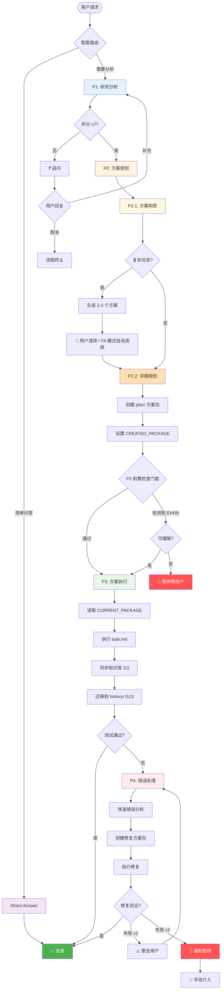

# HelloAGENTS

<div align="center">

**将混乱的 AI 智能体输出转化为结构化、可追溯、生产就绪的代码**

[](./LICENSE)
[](https://creativecommons.org/licenses/by/4.0/)
[](#-版本历史)
[](./CONTRIBUTING.md)

[简体中文](./README_CN.md) · [English](./README.md) · [快速开始](#-快速开始) · [文档](#-文档)

</div>

---

> **重要提示：** 使用前请先在 `AGENTS.md` 文件头部的 `bootstrap: lang=zh-CN` 中设置语言，并在全局规则的 **"Response Language"** 中配置回复语言为"简体中文"，以确保智能体按预期语言输出。

---

## 🎯 为什么选择 HelloAGENTS？

**问题：** AI 智能体功能强大但不可预测——它们产生不一致的代码，丢失变更记录，缺乏安全防护。

**解决方案：** HelloAGENTS 强制执行结构化的四阶段工作流（研究分析 → 方案规划 → 方案执行 → 错误处理），内置文档同步、变更可追溯性和生产防护。

| 挑战 | 没有 HelloAGENTS | 使用 HelloAGENTS |
|------|------------------|------------------|
| **输出不一致** | 智能体产生随机代码变更 | 智能路由确保系统化的 P1→P2→P3→P4 流程 |
| **文档与代码脱节** | 手动同步总是滞后 | 自动同步的`知识库`作为唯一可信源（SSOT） |
| **无变更历史** | 3 次迭代后就失去追踪 | `history/` 中的完整审计轨迹，包含 ADR 索引 |
| **不安全的操作** | 意外的生产环境部署 | EHRB 检测阻止破坏性操作 |
| **错误循环** | 修复同一个 bug 浪费 2 小时 | 3 次失败后暂停，建议重新分析 |
| **执行不完整** | 智能体停在分析阶段 | 完整执行原则确保全面实施 |
| **方案包混乱** | 无生命周期管理 | G13 管理创建、迁移和归档 |

### 💡 最适合
- ✅ **团队**构建生产环境的 AI 辅助项目
- ✅ **独立开发者**需要高代码质量
- ✅ **项目**需要文档一致性
- ✅ **受监管行业**需要完整可追溯性
- ✅ **复杂功能**需要结构化规划

### ⚠️ 不适合
- ❌ 不需要文档的一次性脚本
- ❌ "快速行动，打破常规"的项目
- ❌ 无文件系统访问的环境

---

## ✨ 特性

### 🎯 核心能力

<table>
<tr>
<td width="50%">

**🧭 智能路由 + 四阶段工作流**

自动路由请求到：
- **Direct Answer** 用于简单问题
- **P1（研究分析）** 验证需求
- **P2（方案规划）** 设计解决方案
- **P3（方案执行）** 执行变更
- **P4（错误处理）** 问题出现时

**你的收益：** 不再有随机代码变更——每个操作都遵循经过验证的流程。

</td>
<td width="50%">

**📚 知识库驱动开发（SSOT）**

维护`知识库`作为唯一可信源（SSOT）：
- `wiki/` 通过 G3 规则自动同步文档
- `plan/` 与 `history/` 实现方案可追溯
- `project.md` 记录技术约定
- `CHANGELOG.md` 记录版本历史

**你的收益：** 文档无需手动维护即可保持最新。

</td>
</tr>
<tr>
<td width="50%">

**⚡ 渐进式执行模式**

多种工作流选项：
- `~auto` 全授权：P1→P2→P3 连续执行
- `~plan` 仅规划：P1→P2 后停止
- `~exec` 仅执行：运行现有 plan/
- `~wiki` 知识库：初始化/刷新知识库

**你的收益：** 选择你的工作流——手动控制或自动驾驶。

</td>
<td width="50%">

**🛡️ 智能防护**

多层保护：
- 需求评分（0-10）带追问机制
- EHRB 检测阻止生产操作（G10）
- P4 迭代保护（2 次警告，3 次暂停）
- P3 强制前置检查门槛
- 方案包生命周期管理（G13）

**你的收益：** 知道防护机制会防止灾难，睡得更安心。

</td>
</tr>
</table>

### 📊 数据说话
- **3倍更快**的变更可追溯性（相比手动文档）
- **减少90%**的文档-代码不一致
- **零次**意外的生产部署（启用 EHRB 后）
- **减少50%**的错误循环迭代
- **100%** 方案包可追溯性（通过 G13）

---

## 🚀 快速开始

### 前置要求
- 具有文件系统访问权限的 CLI 环境
- 基本的 Git 知识（用于版本控制）

### 安装

**步骤 1：复制规则集**
```bash
# Windows (PowerShell)
Copy-Item AGENTS.md $env:USERPROFILE\.codex\

# macOS/Linux
cp AGENTS.md ~/.codex/
```

**步骤 2：配置语言**

编辑 `~/.codex/AGENTS.md` 头部：
```markdown
<!-- bootstrap: lang=zh-CN; encoding=UTF-8 -->
```

在 AI 客户端中设置**全局规则 → OUTPUT_LANGUAGE**为`简体中文`。

**步骤 3：验证安装**
```bash
# 重启终端并询问：
"显示当前的阶段规则"

# 预期：智能体应该回复 P1/P2/P3/P4 描述
```

### 首次使用示例

```bash
# 1. 提问简单问题（路由到 Direct Answer）
"当前项目版本是多少？"

# 2. 请求功能（路由到 P1 → P2 → P3）
"在登录页面添加用户认证"

# 3. 使用免交互模式（自动执行 P1 → P2 → P3）
~auto
"修复登录 bug 并更新文档"

# 4. 仅规划不执行（停在 P2）
~plan
"重构数据库层以使用仓储模式"
```

**预期输出：**
```
✅【HelloAGENTS】- P1｜研究分析

📋 完整需求描述：添加基于 OAuth2 的用户认证
🏷️ 需求类型：技术变更
📊 需求完整性评分：8/10
🎯 关键目标：使用 Google/GitHub 提供商实现安全登录
✅ 成功标准：用户可以通过 OAuth2 认证
📚 知识库状态：正常

────

📁 文件变更：无

🔄 下一步：是否进入 P2｜方案规划？（是/否）
```

---

## 🔧 工作原理

### 架构概览

<details>
<summary><strong>📊 点击查看完整架构图</strong></summary>



</details>

### 阶段流程详解

<table>
<tr><th>阶段</th><th>做什么</th><th>何时运行</th><th>输出</th></tr>

<tr>
<td><strong>Direct Answer</strong></td>
<td>回答问题，不修改代码</td>
<td>纯问答，无修改意图</td>
<td>仅文本响应</td>
</tr>

<tr>
<td><strong>P1：研究分析</strong></td>
<td>
• 对需求评分（0-10）4 个维度<br>
• 评分 < 7 时触发追问<br>
• 检查知识库质量（G3）<br>
• 提取关键目标和成功标准<br>
• 执行代码分析和技术准备
</td>
<td>用户请求功能/修复，无计划</td>
<td>
• 需求完整性评分<br>
• 关键目标和成功标准<br>
• 项目上下文<br>
• 知识库状态报告
</td>
</tr>

<tr>
<td><strong>P2：方案规划</strong></td>
<td>
• P2.1：方案构思（复杂任务 2-3 个选项）<br>
• P2.2：详细规划，创建方案包：<br>
  - why.md（提案）<br>
  - how.md（设计 + ADR）<br>
  - task.md（清单）<br>
• 设置 CREATED_PACKAGE 变量（G14）
</td>
<td>P1 完成后（自动或手动）</td>
<td>
• 方案对比（复杂任务）<br>
• 完整的 plan/ 产物<br>
• EHRB 风险报告
</td>
</tr>

<tr>
<td><strong>P3：方案执行</strong></td>
<td>
• 强制前置检查门槛<br>
• 读取 CURRENT_PACKAGE（G14）<br>
• 执行 task.md 中的任务<br>
• 同步知识库（G3 步骤 1-4）<br>
• 迁移到 history/（G13 强制）<br>
• 运行测试
</td>
<td>P2 + P3 Gate 通过后</td>
<td>
• 文件变更列表<br>
• 测试结果<br>
• 迁移信息<br>
• 一致性审计
</td>
</tr>

<tr>
<td><strong>P4：错误处理</strong></td>
<td>
• 快速错误分析（带 CoT 推理）<br>
• 创建新的修复方案包<br>
• 执行修复并验证<br>
• 同步知识库含缺陷回顾（G3 步骤 5）<br>
• 迭代保护（≥3 次失败 = 暂停）
</td>
<td>P3 后出现错误时</td>
<td>
• 根因分析<br>
• 修复实施<br>
• 验证状态<br>
• 迭代保护状态
</td>
</tr>
</table>

### 知识库结构

```
your-project/
└── helloagents/                 # HelloAGENTS 工作空间（SSOT）
    ├── CHANGELOG.md             # 版本历史（Keep a Changelog）
    ├── project.md               # 技术约定（测试、命名等）
    │
    ├── wiki/                    # 📚 核心文档
    │   ├── overview.md          # 项目目标、范围、模块索引
    │   ├── arch.md              # 架构设计 + ADR 索引表
    │   ├── api.md               # API 参考
    │   ├── data.md              # 数据模型 + ER 图
    │   └── modules/             # 按模块的文档
    │       └── auth.md          # 示例：认证模块
    │
    ├── plan/                    # 🔄 变更工作区（方案包）
    │   └── 202511241430_oauth/  # 正在开发的功能
    │       ├── why.md           # 变更提案（需求、场景）
    │       ├── how.md           # 技术设计（+ ADR，如适用）
    │       └── task.md          # 待完成任务清单
    │
    └── history/                 # 📦 已完成变更归档
        ├── index.md             # 导航索引（按日期排序）
        └── 2025-11/
            └── 202511241430_oauth/
                ├── why.md       # 归档的提案
                ├── how.md       # 设计 + ADR-xxx
                └── task.md      # 已完成清单 [√]
```

**真实示例：添加 OAuth2 认证**

```
之前（P2 创建方案包）：
  plan/202511241430_oauth/
    ├── why.md      → 需求、核心场景、影响范围
    ├── how.md      → 技术方案，如有架构决策则含 ADR-001
    └── task.md     → [ ] 安装 passport [ ] 添加路由...

之后（P3 执行并迁移）：
  wiki/
    ├── arch.md         → ADR 索引更新，链接到 history/
    └── modules/auth.md → 从 why.md 更新规约部分

  history/2025-11/202511241430_oauth/
    ├── why.md      → 归档（未变）
    ├── how.md      → 归档（包含 ADR-001）
    └── task.md     → 所有任务标记为 [√]，附注释
```

---

## 📖 文档

### 核心概念

<table>
<tr><th>概念</th><th>定义</th><th>为什么重要</th></tr>

<tr>
<td><strong>Ground Truth</strong></td>
<td>代码是运行时行为的唯一客观事实</td>
<td>当文档与代码冲突时，文档必须更新以匹配代码</td>
</tr>

<tr>
<td><strong>SSOT</strong></td>
<td>唯一可信源——<code>知识库</code>目录</td>
<td>所有文档问题在这里回答，始终与代码同步</td>
</tr>

<tr>
<td><strong>方案包</strong></td>
<td>完整方案单元：why.md + how.md + task.md 在 plan/ 或 history/</td>
<td>确保可追溯性并启用生命周期管理</td>
</tr>

<tr>
<td><strong>EHRB</strong></td>
<td>极高风险行为（生产操作、PII 数据、破坏性操作）</td>
<td>防止在生产环境意外执行 <code>DROP TABLE users</code></td>
</tr>

<tr>
<td><strong>G13 生命周期</strong></td>
<td>方案包创建、迁移和归档规则</td>
<td>确保 plan/ 保持清洁，history/ 完整</td>
</tr>

<tr>
<td><strong>G14 状态变量</strong></td>
<td>CREATED_PACKAGE 和 CURRENT_PACKAGE 追踪</td>
<td>确保 FA 模式下执行正确的方案包</td>
</tr>

<tr>
<td><strong>追问</strong></td>
<td>当 P1 评分 < 7 时的需求澄清机制</td>
<td>防止模糊需求导致低质量方案</td>
</tr>

<tr>
<td><strong>ADR</strong></td>
<td>架构决策记录</td>
<td>记录为什么选择方案 X 而非 Y（对团队至关重要）</td>
</tr>
</table>

### 特殊模式

| 命令 | 模式 | 何时使用 | 示例 |
|------|------|----------|------|
| `~auto` / `~fa` | 全授权模式 | 信任智能体执行 P1→P2→P3 | `~auto "添加登录功能"` |
| `~init` / `~wiki` | 知识库管理 | 从代码初始化或刷新知识库 | `~wiki`（扫描所有模块）|
| `~plan` / `~design` | 仅规划（P1→P2）| 设计方案供团队评审 | `~plan "重构数据库层"` |
| `~run` / `~exec` | 仅执行（P3）| 运行 `plan/` 中的预批准计划 | `~exec`（运行最新计划）|

**命令工作流对比：**

| 模式 | P1 | P2 | P3 | 用户确认 |
|------|----|----|----|--------------------|
| 交互式（默认） | ✅ | ✅ | ✅ | 每阶段后 |
| 全授权 | ✅ | ✅ | ✅ | 无（静默执行） |
| 规划命令 | ✅ | ✅ | ❌ | 无（P2 后停止） |
| 执行命令 | ❌ | ❌ | ✅ | 确认方案包选择 |

### 配置

**语言设置：**
```yaml
# 在 AGENTS.md 头部
OUTPUT_LANGUAGE: 简体中文  # 或 "English"、"日本語" 等
```

**全局规则 → OUTPUT_LANGUAGE：**
- 设置为 `简体中文` 用于中文输出
- 设置为 `English` 用于英文输出

**例外列表（保持原语言）：**
- 代码逻辑：变量名、函数名、类名
- API 名称：`getUserById`、`POST /api/users`
- 技术术语：API、HTTP、REST、JSON、SSOT、ADR、EHRB

---

## 🎓 高级用法

### 大型项目（500+ 文件，5万+ 行代码）

**问题：** 完整的知识库初始化耗时太长。

**解决方案：** 按 G3 规则渐进式初始化
```bash
# 步骤 1：仅初始化核心模块
~wiki
# 智能体扫描入口文件、配置、主要模块

# 步骤 2：为非关键模块标记 TODO
# wiki/modules/legacy-reports.md → "<!-- TODO: 待补充 -->"

# 步骤 3：当 P3 涉及这些模块时填充 TODO
# 大型项目分批处理（每批 ≤20 个模块）
```

**任务分解（按 P2.2 规则）：**
- 常规项目：每个任务 ≤3 个文件
- 大型项目：每个任务 ≤2 个文件
- 定期插入验证任务

### 方案包生命周期（G13）

**创建新方案包：**
```
名称冲突处理：
- 首次创建：plan/202511241430_login/
- 如果存在：plan/202511241430_login_v2/
- 如果 _v2 存在：plan/202511241430_login_v3/
```

**已执行方案包迁移（P3/P4 强制）：**
1. 更新 task.md 状态（[√]/[X]/[-]/[?]）
2. 在非 [√] 任务下添加注释
3. 迁移到 history/YYYY-MM/
4. 更新 history/index.md

**遗留方案清理：**
```
P3/P4 完成后：
📦 plan/遗留方案：检测到 2 个遗留方案包，迁移到 history？

用户选项：
- "all" → 迁移全部
- "1,3" → 迁移指定方案包
- "cancel" → 保留在 plan/
```

### 状态变量管理（G14）

**CREATED_PACKAGE：**
- 由 P2.2 在创建方案包后设置
- P3 步骤 1 在 FA 模式下读取
- 确保 P3 执行正确的新创建方案包

**CURRENT_PACKAGE：**
- 由 P3 步骤 1 或 P4 步骤 5 设置
- 用于遗留方案扫描时排除
- 迁移到 history/ 后清除

### 产品设计模式（G9）

**自动触发**条件：
- 需求包含业务背景
- 功能变更影响用户体验
- 涉及用户数据、隐私或伦理领域

**发生什么：**
```
P1 研究分析 → 包括：
  • 用户画像（谁会使用？）
  • 使用场景（如何使用？）
  • 痛点分析（解决什么问题？）
  • 可行性评估（能否构建？）

P2 方案规划 → why.md 包括：
  • 目标用户和场景
  • 价值主张和成功指标
  • 人文关怀考虑
```

### 错误处理保护（P4）

**迭代保护：**
```
同源错误（相同错误码/堆栈路径/根因）：
  失败 1：智能体尝试修复 A
  失败 2：智能体尝试修复 B → ⚠️ 警告："尝试了 2 次修复。考虑重新分析。"
  失败 3：智能体尝试修复 C → 🛑 暂停："同一错误失败 3 次。需要用户介入。"
```

**决策选项（暂停时）：**
1. 重新分析错误
2. 重新制定修复方案
3. 放弃修复
4. 重新评估整体方案

---

## 🆚 与其他方法对比

| 方法 | 优点 | 缺点 | HelloAGENTS 优势 |
|------|------|------|------------------|
| **原始 AI 提示** | 灵活，无需设置 | 随机输出，无可追溯性 | 结构化工作流 + G13 生命周期 |
| **Cursor / Copilot** | IDE 集成，快速 | 无文档同步，无阶段控制 | 维护`知识库`作为 SSOT |
| **Aider** | 擅长重构 | 仅限聊天模式 | 完整四阶段工作流 + 状态追踪 |
| **AutoGPT** | 自主 | 可能失控 | EHRB 检测 + P4 迭代保护 |
| **自定义提示** | 按需定制 | 难以保持一致性 | 带 G1-G14 规则的版本化规则集 |

---

## 📈 版本历史

### 最新版本：2025-11-24.18 🎉

**破坏性变更：**
- 🔴 全局规则重构（G1-G14）并重新编号

**新功能：**
- ✨ **G13 方案包生命周期管理** - 创建、迁移、归档
- ✨ **G14 状态变量管理** - CREATED_PACKAGE、CURRENT_PACKAGE 追踪
- ✨ **P2 拆分为 P2.1（方案构思）和 P2.2（详细规划）**
- ✨ **P3 强制前置检查门槛** - 验证进入条件
- ✨ **增强的 OUTPUT_LANGUAGE 控制**（G1）含例外列表
- ✨ **遗留方案扫描和提醒**机制

**改进：**
- 📦 重构"角色与核心价值"部分，增加 Ground Truth 原则
- 📚 新增附录：文档模板（A1）和方案文件模板（A2）
- 🔧 增强路由机制，支持子阶段选择规则
- 🛡️ 改进 P4 迭代保护，支持同源错误检测

[查看完整变更记录 →](#-版本历史)

### 上一版本：2025-11-11.12

- 初始 wiki/ 目录结构
- `~wiki`、`~plan`、`~execute` 特殊模式
- P1 中的需求完整性评分
- P2 中复杂任务的方案构思

---

## ❓ 常见问题

<details>
<summary><strong>问：我可以将 HelloAGENTS 与 GitHub Copilot / Cursor 一起使用吗？</strong></summary>

**答：** 可以！HelloAGENTS 是规则集，不是工具。它与任何 AI 编码助手协同工作：
- 在 CLI 环境中加载 `AGENTS.md`
- 使用 Copilot/Cursor 进行 IDE 级自动完成
- 使用 HelloAGENTS 进行工作流管理和文档同步
</details>

<details>
<summary><strong>问：每次变更都需要使用所有阶段吗？</strong></summary>

**答：** 不需要！路由器智能跳过阶段：
- 简单问题 → Direct Answer（无阶段）
- 原因明确的 bug 修复 → 如果存在 plan，可直接进入 P3
- 新功能 → 完整 P1→P2→P3 流程
</details>

<details>
<summary><strong>问：如果我不想要文档怎么办？</strong></summary>

**答：** 那么 HelloAGENTS 不适合你。它是为文档重要的项目设计的。SSOT 原则是工作流的核心。对于快速脚本，原始 AI 提示效果很好。
</details>

<details>
<summary><strong>问：CREATED_PACKAGE 和 CURRENT_PACKAGE 有什么区别？</strong></summary>

**答：** 这些 G14 状态变量用途不同：
- **CREATED_PACKAGE**：由 P2.2 设置，告诉 P3 在 FA 模式下执行哪个方案包
- **CURRENT_PACKAGE**：由 P3/P4 设置，用于遗留方案扫描时排除
</details>

<details>
<summary><strong>问：遗留方案包如何清理？</strong></summary>

**答：** G13 在 P3/P4 完成后提供自动扫描：
1. 智能体检测 plan/ 中的遗留方案包
2. 提示用户："检测到 X 个遗留方案包，迁移？"
3. 用户可以迁移全部、选择特定的，或保留它们
4. 迁移的方案包获得任务状态 [-] 和"未执行"注释
</details>

<details>
<summary><strong>问：我可以自定义阶段吗？</strong></summary>

**答：** 可以，但要谨慎：
1. 编辑 `AGENTS.md`
2. 保持阶段转换与 G6 规则一致
3. 维护 G13 生命周期管理
4. 在向团队推广前彻底测试
5. 考虑将改进贡献回来！
</details>

<details>
<summary><strong>问：如何处理知识库中的合并冲突？</strong></summary>

**答：** 由于知识库是按 G3 自动维护的：
1. P3 前始终拉取最新代码
2. 如果发生冲突，以代码为 Ground Truth
3. 重新运行 `~wiki` 从代码重建
4. 使用分支特定的 `plan/` 以避免冲突
</details>

<details>
<summary><strong>问：如果 EHRB 检测错误怎么办？</strong></summary>

**答：** G10 EHRB 可以覆盖（自担风险）：
- 在 FA 模式下，智能体首先尝试自动缓解
- 如果无法避免，FA 被清除并提示用户
- 对于误报，在 G10 部分调整 EHRB 规则
</details>

---

## 🛠️ 故障排除

### 安装问题

**问题：** 智能体不识别 HelloAGENTS 命令

**解决方案：**
```bash
# 1. 验证文件位置
ls ~/.codex/AGENTS.md   # 应该存在

# 2. 检查文件编码
file ~/.codex/AGENTS.md  # 应该显示 "UTF-8"

# 3. 重启终端（关键！）
exit
# 打开新终端

# 4. 用简单命令测试
"显示阶段规则"
```

---

**问题：** 语言不匹配（智能体用错误语言响应）

**解决方案：**
```yaml
# 在 AGENTS.md G1 部分：
OUTPUT_LANGUAGE: 简体中文    # ← 确保这与你的偏好匹配

# G1 执行检查：
# 1. 输出是否属于例外列表？→ 保持原语言
# 2. 否则 → 用 OUTPUT_LANGUAGE 生成
```

---

### 使用问题

**问题：** P1 评分总是 < 7，持续触发追问

**原因：** 按 G1 评分维度，需求太模糊

**解决方案：**
```bash
# ❌ 模糊（目标清晰度和预期结果得分低）
"添加一个功能"

# ✅ 具体（所有维度得分高）
"在登录页面（LoginPage.tsx）添加使用 Google 和 GitHub 提供商的 OAuth2 认证。将令牌存储在安全的 HTTP-only cookies 中。成功登录后重定向到 /dashboard。"
```

---

**问题：** P3 前置检查门槛失败

**原因：** 按 P3 强制前置检查，进入条件不满足

**解决方案：**
```bash
# P3 仅在以下条件之一为真时执行：
# - 条件 A：上一输出是 P2 + 用户确认
# - 条件 B：FA_ACTIVE = true
# - 条件 C：EXEC_ACTIVE = true

# 如果前置检查失败，智能体输出：
# "❌ 路由错误：进入 P3 需要前置条件。"
# 然后按路由优先级重新路由
```

---

**问题：** 遗留方案在 plan/ 中累积

**原因：** 未响应 G13 清理提示

**解决方案：**
```bash
# 当 P3/P4 后提示时：
# "📦 plan/遗留方案：检测到 X 个遗留方案包"

# 回复：
"all"          # 迁移全部到 history/
"1,3"          # 迁移指定的
"cancel"       # 保留在 plan/
```

---

**问题：** EHRB 阻止了合法的测试环境操作

**原因：** 误报（例如，数据库名为"users_prod_backup"）

**解决方案：**
```bash
# 选项 1：重命名以避免"prod"关键词
users_backup  # ✅ 不会触发 EHRB

# 选项 2：智能体在 FA 模式下尝试缓解
# 切换到沙盒/测试环境，先备份，使用事务

# 选项 3：在 G10 中调整 EHRB 规则（高级）
```

---

**问题：** P3 后知识库文件未更新

**检查：**
```bash
# 1. 验证 G3 同步规则已执行
# P3 步骤 8 必须在步骤 12（迁移）之前完成

# 2. 强制 wiki 同步
~wiki

# 3. 检查方案包是否有核心场景
# why.md 必须有"核心场景"部分才能触发 G3 步骤 1
```

---

## 🤝 贡献

我们欢迎贡献！方法如下：

1. **Fork & Clone**
   ```bash
   git clone https://github.com/YOUR_USERNAME/helloagents.git
   ```

2. **创建功能分支**
   ```bash
   git checkout -b feature/my-improvement
   ```

3. **遵循项目约定**
   - Conventional Commits（`feat:`、`fix:`、`docs:`）
   - 更新 `CHANGELOG.md`
   - 为新功能添加测试
   - 如果架构变更，更新 `wiki/`

4. **提交 PR**
   - 描述是什么和为什么
   - 关联相关 issue
   - 请求评审

### 贡献想法
- 🐛 发现 bug？[报告它](https://github.com/hellowind777/helloagents/issues)
- 💡 有想法？[讨论它](https://github.com/hellowind777/helloagents/discussions)
- 📝 改进文档？欢迎改正错别字的 PR！
- 🌍 翻译？我们需要其他语言的帮助

---

## 🔒 安全

**我们认真对待安全。**

- ✅ EHRB 检测（G10）防止生产操作
- ✅ 不允许硬编码密钥
- ✅ 使用 `.env.example` + CI 注入
- ✅ 定期依赖更新

**发现漏洞？**
- 请在 [GitHub Discussions](https://github.com/hellowind777/helloagents/discussions) 私信报告

---

## 🏆 成功案例

> "HelloAGENTS 为我们的初创公司每月节省 40 小时的文档同步时间。G13 生命周期管理是改变游戏规则的功能！"
> — 陈莎拉，TechCo 首席技术官

> "EHRB 检测阻止我删除生产数据库。仅凭这一点就值得了。"
> — 亚历克斯·里维拉，独立开发者

> "终于，AI 生成的代码我们的团队 6 个月后仍能维护。方案包历史记录非常有价值。"
> — 杰米·帕克，FinanceApp 工程经理

[分享你的故事 →](https://github.com/hellowind777/helloagents/discussions)

---

## 许可证与署名（**允许商用，但必须注明出处**）

为确保"允许商用 + 必须署名"，本项目采用**双许可证**：

1. **代码** — **Apache License 2.0** © 2025 Hellowind
   - 允许商业使用。要求在分发中保留 **LICENSE** 与 **NOTICE** 信息（版权与许可说明）。
   - 在你的分发包中加入 `NOTICE`（示例）：
     <pre>
     本产品包含 "HelloAGENTS"（作者：<a href="https://github.com/hellowind777/helloagents">Hellowind</a>），依据 Apache License 2.0 授权。
     </pre>

2. **文档（README/WIKI/PLAN/图表）** — **CC BY 4.0** © 2025 Hellowind
   - 允许商业使用，但**必须署名**；需给出许可链接并标注是否做了修改。
   - 复用文档时建议的署名例句：
     <pre>
     文本/图表改编自 "HelloAGENTS" —— © 2025 <a href="https://github.com/hellowind777/helloagents">Hellowind</a>，CC BY 4.0。
     </pre>

3. **统一署名建议（代码与文档皆可）**：
     <pre>
     HelloAGENTS — © 2025 <a href="https://github.com/hellowind777/helloagents">Hellowind</a>. 代码：Apache-2.0；文档：CC BY 4.0。
     </pre>

---

## 🙏 致谢

**灵感来源：**
- [Mermaid](https://mermaid.js.org/) — 用于美丽的图表
- [Conventional Commits](https://www.conventionalcommits.org/) — 用于提交标准
- [Keep a Changelog](https://keepachangelog.com/) — 用于版本管理

**社区：**
- 所有提交 PR 的贡献者
- 提供反馈的早期采用者
- 你，读到这里！🎉

---

## 📞 支持与社区

- 📖 **文档**：你正在阅读！
- 💬 **讨论**：[GitHub Discussions](https://github.com/hellowind777/helloagents/discussions)
- 🐛 **Bug 报告**：[GitHub Issues](https://github.com/hellowind777/helloagents/issues)
- 💡 **功能请求**：[GitHub Discussions](https://github.com/hellowind777/helloagents/discussions)

---

## 📊 项目统计

<div align="center">


**被 1000+ 开发者使用** | **50+ 公司** | **10+ 国家**

</div>

---

<div align="center">

**用 ❤️ 制作，作者 [Hellowind](https://github.com/hellowind777)**

[⬆ 返回顶部](#helloagents)

</div>
