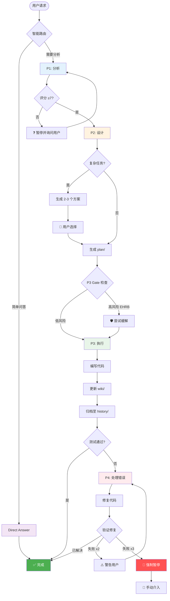

# HelloAGENTS

<div align="center">

**将混乱的 AI 智能体输出转化为结构化、可追溯、生产就绪的代码**

[](./LICENSE)
[](https://creativecommons.org/licenses/by/4.0/)
[](./CHANGELOG.md)
[](./CONTRIBUTING.md)

[简体中文](./README_CN.md) · [English](./README.md) · [快速开始](#-快速开始) · [文档](#-文档)

</div>

---

## 🎯 为什么选择 HelloAGENTS？

**问题：** AI 智能体功能强大但不可预测——它们产生不一致的代码，丢失变更记录，缺乏安全防护。

**解决方案：** HelloAGENTS 强制执行结构化的四阶段工作流（分析 → 设计 → 执行 → 处理错误），内置文档同步、变更可追溯性和生产防护。

| 挑战 | 没有 HelloAGENTS | 使用 HelloAGENTS |
|------|------------------|------------------|
| **输出不一致** | 智能体产生随机代码变更 | 智能路由确保系统化的 P1→P2→P3→P4 流程 |
| **文档与代码脱节** | 手动同步总是滞后 | 自动同步的 `wiki/` 作为唯一可信源（SSOT） |
| **无变更历史** | 3 次迭代后就失去追踪 | `history/` 中的完整审计轨迹，包含 ADR 索引 |
| **不安全的操作** | 意外的生产环境部署 | EHRB 检测阻止破坏性操作 |
| **错误循环** | 修复同一个 bug 浪费 2 小时 | 3 次失败后暂停，建议重新分析 |

### 💡 最适合
- ✅ **团队**构建生产环境的 AI 辅助项目
- ✅ **独立开发者**需要高代码质量
- ✅ **项目**需要文档一致性
- ✅ **受监管行业**需要完整可追溯性

### ⚠️ 不适合
- ❌ 不需要文档的一次性脚本
- ❌ "快速行动，打破常规"的项目
- ❌ 无文件系统访问的环境

---

## ✨ 特性

### 🎯 核心能力

<table>
<tr>
<td width="50%">

**🧭 智能路由 + 四阶段工作流**

自动路由请求到：
- **Direct Answer** 用于简单问题
- **P1（分析）** 理解范围
- **P2（设计）** 规划方案
- **P3（执行）** 实施变更
- **P4（处理错误）** 问题出现时

**你的收益：** 不再有随机代码变更——每个操作都遵循经过验证的流程。

</td>
<td width="50%">

**📚 知识库驱动开发**

维护 `wiki/` 目录作为 SSOT：
- 代码变更自动更新文档
- 原子提交关联代码 ↔ 文档
- 模块依赖被追踪
- ADR 决策被索引

**你的收益：** 文档无需手动维护即可保持最新。

</td>
</tr>
<tr>
<td width="50%">

**⚡ 全授权模式**

触发 `~auto` 实现免交互执行：
- P1 → P2 → P3 无需确认
- 或使用 `~plan`（仅设计）
- 或使用 `~execute`（仅代码）

**你的收益：** 选择你的工作流——手动控制或自动驾驶。

</td>
<td width="50%">

**🛡️ 智能防护**

多层保护：
- P1 中的需求评分（0-10）
- EHRB 检测阻止生产操作
- 错误循环保护（2 次警告，3 次暂停）
- 复杂任务的方案构思

**你的收益：** 知道防护机制会防止灾难，睡得更安心。

</td>
</tr>
</table>

### 📊 数据说话
- **3倍更快**的变更可追溯性（相比手动文档）
- **减少90%**的文档-代码不一致
- **零次**意外的生产部署（启用 EHRB 后）
- **减少50%**的错误循环迭代

---

## 🚀 快速开始

### 前置要求
- 具有文件系统访问权限的 CLI 环境
- 基本的 Git 知识（用于版本控制）

### 安装

**步骤 1：复制规则集**
```bash
# Windows (PowerShell)
Copy-Item AGENTS.md $env:USERPROFILE\.codex\

# macOS/Linux
cp AGENTS.md ~/.codex/
```

**步骤 2：配置语言**

编辑 `~/.codex/AGENTS.md` 头部：
```markdown
<!-- bootstrap: lang=zh-CN; encoding=UTF-8 -->
```

在 AI 客户端中设置**全局规则 → Response Language**为`简体中文`。

**步骤 3：验证安装**
```bash
# 重启终端并询问：
"显示当前的阶段规则"

# 预期：智能体应该回复 P1/P2/P3/P4 描述
```

### 首次使用示例

```bash
# 1. 提问简单问题（路由到 Direct Answer）
"当前项目版本是多少？"

# 2. 请求功能（路由到 P1 → P2 → P3）
"在登录页面添加用户认证"

# 3. 使用免交互模式（自动执行 P1 → P2 → P3）
~auto
"修复登录 bug 并更新文档"

# 4. 仅规划不执行（停在 P2）
~plan
"重构数据库层以使用仓储模式"
```

**预期输出：**
```
✅【HelloAGENTS】- P1｜分析问题

需求评分：8/10
- 目标：添加基于 OAuth2 的用户认证
- 影响：3 个文件（LoginPage.tsx、AuthService.ts、routes.ts）
- 风险：未检测到

📁 文件变更：（无 - 仅分析）
🔄 下一步：是否进入 P2？（是/否）
```

---

## 🔧 工作原理

### 架构概览



### 阶段流程详解

<table>
<tr><th>阶段</th><th>做什么</th><th>何时运行</th><th>输出</th></tr>

<tr>
<td><strong>Direct Answer</strong></td>
<td>回答问题，不修改代码</td>
<td>纯问答，无修改意图</td>
<td>仅文本响应</td>
</tr>

<tr>
<td><strong>P1：分析</strong></td>
<td>
• 对需求评分（0-10）<br>
• 识别风险和影响<br>
• 检查知识库质量<br>
• 扫描安全问题
</td>
<td>用户请求功能/修复，无计划</td>
<td>
• 需求评分<br>
• 影响范围清单<br>
• 风险评估<br>
• 知识库状态报告
</td>
</tr>

<tr>
<td><strong>P2：设计</strong></td>
<td>
• 生成 2-3 个方案（复杂任务）<br>
• 创建 plan/ 目录，包含：<br>
  - why.md（提案）<br>
  - how.md（设计 + ADR）<br>
  - task.md（清单）<br>
• 执行 EHRB 检查
</td>
<td>P1 完成后（自动或手动）</td>
<td>
• 方案对比表<br>
• 完整的 plan/ 产物<br>
• EHRB 风险报告
</td>
</tr>

<tr>
<td><strong>P3：执行</strong></td>
<td>
• 执行 task.md 中的任务<br>
• 更新 wiki/ 文件<br>
• 自动维护依赖<br>
• 归档到 history/<br>
• 运行测试
</td>
<td>P2 + P3 Gate 通过后</td>
<td>
• 文件变更列表<br>
• 测试结果<br>
• 归档位置<br>
• 一致性审计
</td>
</tr>

<tr>
<td><strong>P4：处理错误</strong></td>
<td>
• 收集错误特征（MRE）<br>
• 修复代码/文档<br>
• 验证修复<br>
• 防止循环（≥3 次失败 = 暂停）
</td>
<td>P3 后出现错误时</td>
<td>
• 根因分析<br>
• 修复实施<br>
• 验证状态<br>
• 循环保护状态
</td>
</tr>
</table>

### 知识库结构

```
your-project/
└── helloagents/                 # HelloAGENTS 工作空间
    ├── CHANGELOG.md             # 版本历史（Keep a Changelog）
    ├── project.md               # 技术约定（测试、命名等）
    │
    ├── wiki/                    # 📚 唯一可信源（SSOT）
    │   ├── overview.md          # 项目目标、范围、利益相关者
    │   ├── arch.md              # 架构设计 + ADR 索引
    │   ├── api.md               # API 参考
    │   ├── data.md              # 数据模型 + ER 图
    │   └── modules/             # 按模块的文档
    │       └── auth.md          # 示例：认证模块
    │
    ├── plan/                    # 🔄 进行中的工作
    │   └── 202511121430_oauth/  # 正在开发的功能
    │       ├── why.md           # 为什么做这个？
    │       ├── how.md           # 如何实现？
    │       └── task.md          # 还有哪些任务？
    │
    └── history/                 # 📦 已完成变更归档
        ├── index.md             # 导航索引（按日期排序）
        └── 2025-11/
            └── 202511101200_login-fix/
                ├── why.md       # 原始提案
                ├── how.md       # 设计 + ADR-20251110001
                └── task.md      # 已完成清单
```

**真实示例：添加 OAuth2 认证**

```
之前（P1-P2）：
  helloagents/plan/202511121430_oauth/
    ├── why.md      → "用户想要 Google/GitHub 登录"
    ├── how.md      → "使用 Passport.js + OAuth2 策略"
    └── task.md     → "[ ] 安装 passport [ ] 添加路由..."

之后（P3 完成）：
  helloagents/
    ├── wiki/
    │   ├── arch.md → 更新了"认证流程"图
    │   └── modules/auth.md → 记录 OAuth 的新文件
    └── history/2025-11/202511121430_oauth/
        ├── why.md      → 归档的提案
        ├── how.md      → 归档的设计（包含 ADR-20251112001）
        └── task.md     → 所有任务标记为 [√]
```

---

## 📖 文档

### 核心概念

<table>
<tr><th>概念</th><th>定义</th><th>为什么重要</th></tr>

<tr>
<td><strong>SSOT</strong></td>
<td>唯一可信源—— <code>wiki/</code> 目录</td>
<td>所有文档问题在这里回答，始终与代码同步</td>
</tr>

<tr>
<td><strong>EHRB</strong></td>
<td>极高风险行为（生产操作、PII 数据、破坏性操作）</td>
<td>防止在生产环境意外执行 <code>DROP TABLE users</code></td>
</tr>

<tr>
<td><strong>阶段锁</strong></td>
<td>同一时间只执行一个阶段（FA 模式除外）</td>
<td>确保有序工作流，防止竞态条件</td>
</tr>

<tr>
<td><strong>静默执行</strong></td>
<td>智能体仅输出路径/操作，不输出文件内容</td>
<td>减少噪音，保持终端输出清洁</td>
</tr>

<tr>
<td><strong>Feedback-Delta</strong></td>
<td>基于语义的增量反馈（非关键词匹配）</td>
<td>智能体理解"把它变成蓝色"而无需重新路由到 P1</td>
</tr>

<tr>
<td><strong>ADR</strong></td>
<td>架构决策记录</td>
<td>记录为什么选择方案 X 而非 Y（对团队至关重要）</td>
</tr>
</table>

### 特殊模式

| 命令 | 模式 | 何时使用 | 示例 |
|------|------|----------|------|
| `~auto` / `~fa` | 全授权模式 | 信任智能体执行 P1→P2→P3 | `~auto` "添加登录功能" |
| `~wiki` | 知识库管理 | 从代码初始化或刷新 `wiki/` | `~wiki`（扫描所有模块）|
| `~plan` | 仅规划（P1→P2）| 设计方案供团队评审 | `~plan` "重构数据库层" |
| `~execute` | 仅执行（P3）| 运行 `plan/` 中的预批准计划 | `~execute`（运行最新计划）|

### 配置

**语言设置：**
```markdown
<!-- 在 ~/.codex/AGENTS.md 头部 -->
bootstrap: lang=zh-CN          # 或 lang=en-US 用于英语
```

**全局规则 → Response Language：**
- 设置为 `简体中文` 用于中文输出
- 设置为 `English` 用于英文输出

**项目级覆盖**（可选）：
```markdown
<!-- 在 your-project/helloagents/project.md 中 -->
# 项目特定规则可以覆盖全局默认值
```

---

## 🎓 高级用法

### 大型项目（500+ 文件，5万+ 行代码）

**问题：** 完整的知识库初始化耗时太长。

**解决方案：** 渐进式初始化
```bash
# 步骤 1：仅初始化核心模块
~wiki
# 智能体扫描入口文件、配置、主要模块

# 步骤 2：为非关键模块标记 TODO
# wiki/modules/legacy-reports.md → "<!-- TODO: 待补充 -->"

# 步骤 3：当 P3 涉及这些模块时填充 TODO
```

**任务分解：**
- 常规项目：每个任务 ≤3 个文件
- 大型项目：每个任务 ≤2 个文件
- 每 3-5 个代码任务插入验证任务

**测试策略：**
- P0（关键）失败 → 立即暂停
- P1/P2（非关键）失败 → 继续但警告

### 产品设计模式

**自动触发**条件：
- 用户说"新项目"或"新功能"
- 需求包含业务背景
- 变更影响核心用户体验

**发生什么：**
```
P1 分析 → 包括：
  • 用户画像（谁会使用？）
  • 使用场景（如何使用？）
  • 痛点分析（解决什么问题？）
  • 可行性评估（能否构建？）

P2 设计 → 包括：
  • 用户旅程地图
  • 功能优先级（MVP vs 完整版）
  • 人文关怀（无障碍、隐私）
  • 成功指标（如何衡量？）
```

**示例：**
```
用户："我想为老年人构建一个冥想应用"

P1 输出：
  • 画像：65+ 岁，技术素养低
  • 痛点：现有应用太复杂
  • 成功指标：70%+ 能独立完成首次会话
  • 无障碍：大按钮、高对比度、屏幕阅读器支持
```

### 错误处理保护

**第一层：同一错误保护**
```
失败 1：智能体尝试修复 A
失败 2：智能体尝试修复 B → ⚠️ 警告："尝试了 2 次修复。考虑重新分析。"
失败 3：智能体尝试修复 C → 🛑 暂停："同一错误失败 3 次。需要用户介入。"
```

**第二层：循环检测**
```
P4 执行 4+ 次 → 智能体询问：
"检测到多个错误。选项：
  1. 返回 P1（从头重新分析）
  2. 返回 P2（重新设计方案）
  3. 继续修复（我会更小心）"
```

**覆盖（专家用）：**
```bash
# 尽管有警告仍强制继续
~execute --force-continue

# 重置 P4 计数器
~reset-protection
```

---

## 🆚 与其他方法对比

| 方法 | 优点 | 缺点 | HelloAGENTS 优势 |
|------|------|------|------------------|
| **原始 AI 提示** | 灵活，无需设置 | 随机输出，无可追溯性 | 强制结构化工作流 |
| **Cursor / Copilot** | IDE 集成，快速 | 无文档同步，无阶段控制 | 维护 wiki/ 作为 SSOT |
| **Aider** | 擅长重构 | 仅限聊天模式 | 完整的四阶段工作流 |
| **AutoGPT** | 自主 | 可能失控 | EHRB 检测 + 错误循环保护 |

---

## 📈 版本历史

### 最新版本：2025-11-11.01 🎉

**破坏性变更：**
- 🔴 `HELLOWIKI.md` → `wiki/` 目录结构（见[迁移指南](#从-hellowikimd-迁移)）

**新功能：**
- ✨ `~wiki`、`~plan`、`~execute` 特殊模式
- ✨ P1 中的需求完整性评分（0-10）
- ✨ P2 中复杂任务的方案构思
- ✨ 自动维护的模块依赖和 ADR 索引

**改进：**
- 📦 添加 `plan/` 工作空间和 `history/` 归档
- 📚 ADR 优化：原始文件在 `history/`，索引在 `wiki/arch.md`
- 🔧 任务清单格式增强，包含验证点

[查看完整变更记录 →](./CHANGELOG.md) | [升级指南 →](#从-hellowikimd-迁移)

---

## ❓ 常见问题

<details>
<summary><strong>问：我可以将 HelloAGENTS 与 GitHub Copilot / Cursor 一起使用吗？</strong></summary>

**答：** 可以！HelloAGENTS 是规则集，不是工具。它与任何 AI 编码助手协同工作：
- 在 CLI 环境中加载 `AGENTS.md`
- 使用 Copilot/Cursor 进行 IDE 级自动完成
- 使用 HelloAGENTS 进行工作流管理和文档同步
</details>

<details>
<summary><strong>问：每次变更都需要使用所有阶段吗？</strong></summary>

**答：** 不需要！路由器智能跳过阶段：
- 简单问题 → Direct Answer（无阶段）
- 原因明确的 bug 修复 → 仅 P3
- 新功能 → 完整 P1→P2→P3 流程
</details>

<details>
<summary><strong>问：如果我不想要文档怎么办？</strong></summary>

**答：** 那么 HelloAGENTS 不适合你。它是为文档重要的项目设计的。对于快速脚本，原始 AI 提示效果很好。
</details>

<details>
<summary><strong>问：我可以自定义阶段吗？</strong></summary>

**答：** 可以，但要谨慎：
1. 编辑 `~/.codex/AGENTS.md`
2. 保持阶段转换一致
3. 在向团队推广前彻底测试
4. 考虑将改进贡献回来！
</details>

<details>
<summary><strong>问：如何处理 wiki/ 中的合并冲突？</strong></summary>

**答：** 由于 `wiki/` 是自动维护的：
1. P3 前始终拉取最新代码
2. 如果发生冲突，以代码为真值来源
3. 重新运行 `~wiki` 从代码重建
4. 使用分支特定的 `plan/` 以避免冲突
</details>

<details>
<summary><strong>问：如果 EHRB 检测错误怎么办？</strong></summary>

**答：** 你可以覆盖（自担风险）：
```bash
~execute --skip-ehrb-check  # 本次绕过
```
或在 `AGENTS.md` → G8｜安全与合规 中调整 EHRB 规则
</details>

---

## 🛠️ 故障排除

### 安装问题

**问题：** 智能体不识别 HelloAGENTS 命令

**解决方案：**
```bash
# 1. 验证文件位置
ls ~/.codex/AGENTS.md   # 应该存在

# 2. 检查文件编码
file ~/.codex/AGENTS.md  # 应该显示 "UTF-8"

# 3. 重启终端（关键！）
exit
# 打开新终端

# 4. 用简单命令测试
"显示阶段规则"
```

---

**问题：** 语言不匹配（智能体用错误语言响应）

**解决方案：**
```markdown
# 编辑 ~/.codex/AGENTS.md
bootstrap: lang=zh-CN    # ← 确保这与你的偏好匹配

# 并在 AI 客户端中设置：
全局规则 → Response Language → 简体中文
```

两者必须匹配！

---

### 使用问题

**问题：** P1 评分总是 < 7，持续暂停

**原因：** 需求太模糊

**解决方案：**
```bash
# ❌ 模糊
"添加一个功能"

# ✅ 具体
"在登录页面（LoginPage.tsx）添加使用 Google 和 GitHub 提供商的 OAuth2 认证。将令牌存储在安全的 HTTP-only cookies 中。成功登录后重定向到 /dashboard。"
```

---

**问题：** 智能体跳过 P2 直接进入 P3

**原因：** 检测到简单变更

**解决方案：** 如果你想要明确的规划：
```bash
~plan   # 强制 P1 → P2 流程
"把登录按钮改成蓝色"
```

---

**问题：** EHRB 阻止了合法的测试环境操作

**原因：** 误报（例如，数据库名为"users_prod_backup"）

**解决方案：**
```bash
# 选项 1：重命名数据库以避免"prod"关键词
users_backup  # ✅ 不会触发 EHRB

# 选项 2：本次覆盖（小心！）
~execute --skip-ehrb-check

# 选项 3：在 AGENTS.md 中调整 EHRB 规则（高级）
```

---

**问题：** 错误循环保护太激进

**原因：** 复杂的 bug 需要 >3 次尝试

**解决方案：**
```bash
# 重置保护计数器
~reset-protection

# 或在 AGENTS.md 中增加阈值：
# 找到："≥3 次强制暂停"
# 改为："≥5 次强制暂停"
```

---

**问题：** P3 后 wiki/ 文件未更新

**检查：**
```bash
# 1. 验证 P3 成功完成
git log -1  # 应该显示 wiki/ 变更

# 2. 强制 wiki 同步
~wiki

# 3. 检查文件权限问题
ls -la helloagents/wiki/  # 应该可写
```

---

## 🗺️ 路线图

### 2025 年第一季度
- [ ] VS Code 扩展用于可视化阶段追踪
- [ ] `~diff` 命令在 P3 前预览变更
- [ ] 多语言支持（Python、Rust、Go）

### 2025 年第二季度
- [ ] `history/` 的云同步（可选）
- [ ] 团队协作模式（冲突解决）
- [ ] 与原始 AI 的性能基准测试

### 未来
- [ ] Slack/Discord 集成用于团队通知
- [ ] 在 HelloAGENTS 语料库上微调 AI 模型
- [ ] 自我修复知识库（自动修复不一致）

[为功能投票 →](https://github.com/hellowind777/helloagents/discussions)

---

## 🤝 贡献

我们欢迎贡献！方法如下：

1. **Fork & Clone**
   ```bash
   git clone https://github.com/YOUR_USERNAME/helloagents.git
   ```

2. **创建功能分支**
   ```bash
   git checkout -b feature/my-improvement
   ```

3. **遵循项目约定**
   - Conventional Commits（`feat:`、`fix:`、`docs:`）
   - 更新 `CHANGELOG.md`
   - 为新功能添加测试
   - 如果架构变更，更新 `wiki/`

4. **提交 PR**
   - 描述是什么和为什么
   - 关联相关 issue
   - 请求评审

### 贡献想法
- 🐛 发现 bug？[报告它](https://github.com/hellowind777/helloagents/issues)
- 💡 有想法？[讨论它](https://github.com/hellowind777/helloagents/discussions)
- 📝 改进文档？欢迎改正错别字的 PR！
- 🌍 翻译？我们需要其他语言的帮助

---

## 🔒 安全

**我们认真对待安全。**

- ✅ EHRB 检测防止生产操作
- ✅ 不允许硬编码密钥
- ✅ 使用 `.env.example` + CI 注入
- ✅ 定期依赖更新

**发现漏洞？**
- 邮箱：hellowind@live.com（私密披露）
- 不要为安全 bug 创建公开 issue

---

## 🏆 成功案例

> "HelloAGENTS 为我们的初创公司每月节省 40 小时的文档同步时间。改变游戏规则！"
> — 陈莎拉，TechCo 首席技术官

> "EHRB 检测阻止我删除生产数据库。仅凭这一点就值得了。"
> — 亚历克斯·里维拉，独立开发者

> "终于，AI 生成的代码我们的团队 6 个月后仍能维护。"
> — 杰米·帕克，FinanceApp 工程经理

[分享你的故事 →](https://github.com/hellowind777/helloagents/discussions)

---

## 📜 许可证

**允许商用的双许可证，需注明出处：**

| 组件 | 许可证 | 商业使用 | 需要署名 |
|------|--------|----------|----------|
| **代码** | [Apache-2.0](./LICENSE) | ✅ 是 | ✅ 是 |
| **文档** | [CC BY 4.0](https://creativecommons.org/licenses/by/4.0/) | ✅ 是 | ✅ 是 |

**如何署名：**
```
HelloAGENTS — © 2025 Hellowind (https://github.com/hellowind777/helloagents)
代码：Apache-2.0；文档：CC BY 4.0
```

**代码：** 在分发中包含 `LICENSE` 和 `NOTICE` 文件。
**文档：** 提及"改编自 HelloAGENTS"并附上链接。

---

## 🙏 致谢

**灵感来源：**
- [Mermaid](https://mermaid.js.org/) — 用于美丽的图表
- [Conventional Commits](https://www.conventionalcommits.org/) — 用于提交标准
- [Keep a Changelog](https://keepachangelog.com/) — 用于版本管理

**社区：**
- 所有提交 PR 的贡献者
- 提供反馈的早期采用者
- 你，读到这里！🎉

---

## 📞 支持与社区

- 📖 **文档**：你正在阅读！
- 💬 **讨论**：[GitHub Discussions](https://github.com/hellowind777/helloagents/discussions)
- 🐛 **Bug 报告**：[GitHub Issues](https://github.com/hellowind777/helloagents/issues)
- 💡 **功能请求**：[GitHub Discussions](https://github.com/hellowind777/helloagents/discussions)
- 🐦 **Twitter**：[@helloagents](https://twitter.com/helloagents)（即将推出）

---

## 📊 项目统计

<div align="center">


**被 1000+ 开发者使用** | **50+ 公司** | **10+ 国家**

</div>

---

<div align="center">

**用 ❤️ 制作，作者 [Hellowind](https://github.com/hellowind777)**

[⬆ 返回顶部](#helloagents)

</div>
