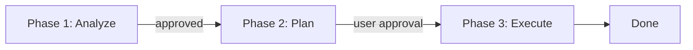

# stageflowwiki

> **面向 AI 编程智能体的「多阶段 + 项目 Wiki 驱动」规则集。**
> 本项目在上游 **workflow3.md**（`geekoe/workflow3`）的三阶段工作流基础上进行二次扩展，**融合项目 Wiki 全功能**（ADR、Mermaid 图表、变更日志、治理规范等）。
>
> 上游模板：`workflow3.md`（geekoe/workflow3）。

- 上游仓库：<https://github.com/geekoe/workflow3>
- 模板文件：<https://github.com/geekoe/workflow3/blob/main/src/templates/workflow3.md>

## 亮点特性

- **三阶段闭环**：Analyze → Plan → Execute（不含“错误处理”阶段）。
- **项目 Wiki 一等公民**：`PROJECTWIKI.md` 作为事实来源，要求与代码**强一致**；长文档可放在仓库 **GitHub Wiki**。
- **Mermaid-first 图表**：系统、时序、ER、类、依赖、状态等图全部使用 Mermaid，文本即图，便于评审与版本控制。
- **工程治理内建**：ADR（架构决策记录）、Conventional Commits + 原子化提交、Keep a Changelog。

## 全局用法（适配大模型）

**方式之一：将本 README 重命名为 `AGENTS.md` 并置于仓库根目录。**
这样，多数 AI 编程大模型即可将其当作**项目级全局提示词**来加载执行（阶段、产出、Do/Don’t 规则）。
如需长文档空间，可开启仓库 **Wiki**。

## 快速开始

1. 复制本仓内容到你的项目；
2. 将本文件重命名为 **`AGENTS.md`**（项目根目录）；
3. 新建 `/adr` 与 `CHANGELOG.md`；
4. （可选）开启 **GitHub Wiki** 存放教程/设计长文。

### 目录建议

```
your-project/
├─ AGENTS.md                 # ← 本规则（供各大模型读取的全局提示词）
├─ PROJECTWIKI.md            # ← 项目 Wiki（与代码同步更新）
├─ adr/                      # ADR-0001.md, ADR-0002.md, ...
├─ CHANGELOG.md              # Keep a Changelog
├─ docs/                     # 其他文档
└─ src/                      # 源码
```

### 阶段总览（产出要求）

- **Phase 1 · Analyze（【分析问题】）**：根因与影响面、待确认决策；禁止改代码。
- **Phase 2 · Plan（【制定方案】）**：**代码变更清单 + Wiki 变更清单（含 Mermaid 图）**、风险与回滚、验收标准（AC/DoD）；**需用户批准**。
- **Phase 3 · Execute（【执行方案】）**：按方案实现；类型/静态检查；**同步更新 `PROJECTWIKI.md`**；建立代码↔文档追溯（优先原子提交）。



## 许可证与署名（**允许商用，但必须注明出处**）

为确保“允许商用 + 必须署名”，本项目采用**双许可证**：

1. **代码** — **Apache License 2.0** © 2025 hellowind
   - 允许商业使用。要求在分发中保留 **LICENSE** 与 **NOTICE** 信息（版权与许可说明）。
   - 在你的分发包中加入 `NOTICE`（示例）：
     ```
     本产品包含 “stageflowwiki”（作者：hellowind），依据 Apache License 2.0 授权。
     ```

2. **文档（README/PROJECTWIKI/图表）** — **CC BY 4.0** © 2025 hellowind
   - 允许商业使用，但**必须署名**；需给出许可链接并标注是否做了修改。
   - 复用文档时建议的署名例句：
     ```
     文本/图表改编自 “stageflowwiki” —— © 2025 hellowind，CC BY 4.0。
     ```

**统一署名建议（代码与文档皆可）**：
```
stageflowwiki — © 2025 hellowind. 代码：Apache-2.0；文档：CC BY 4.0。
```

## 致谢
- 上游：**workflow3.md**（geekoe/workflow3）。
- Mermaid、Conventional Commits、Keep a Changelog、GitHub Wiki 文档与生态。
