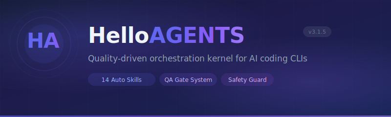
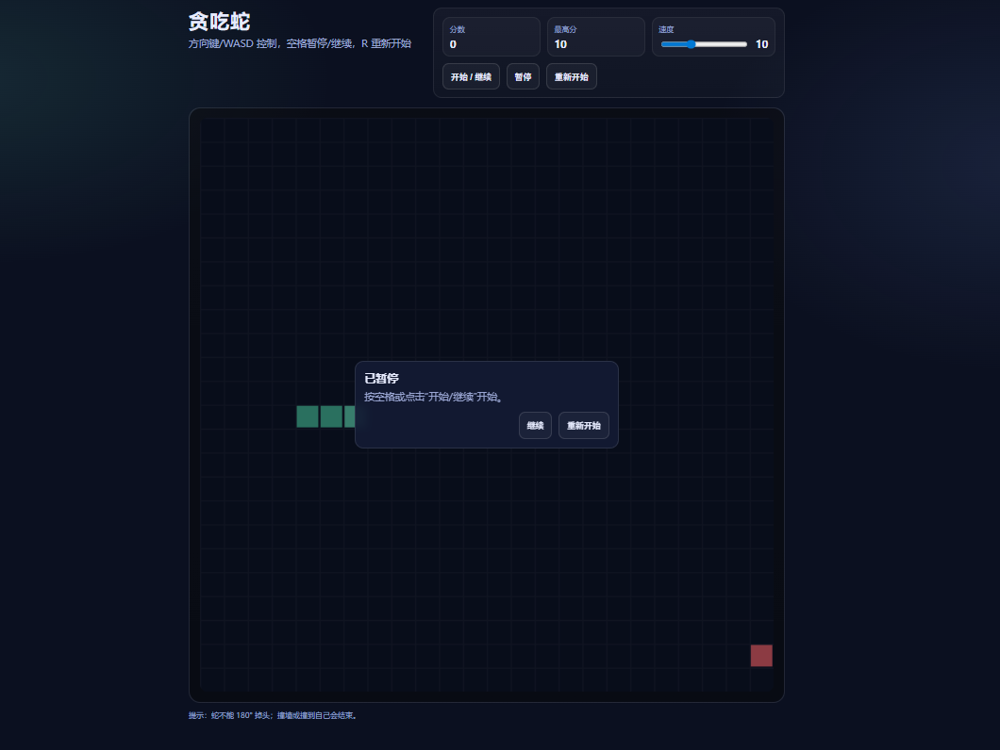
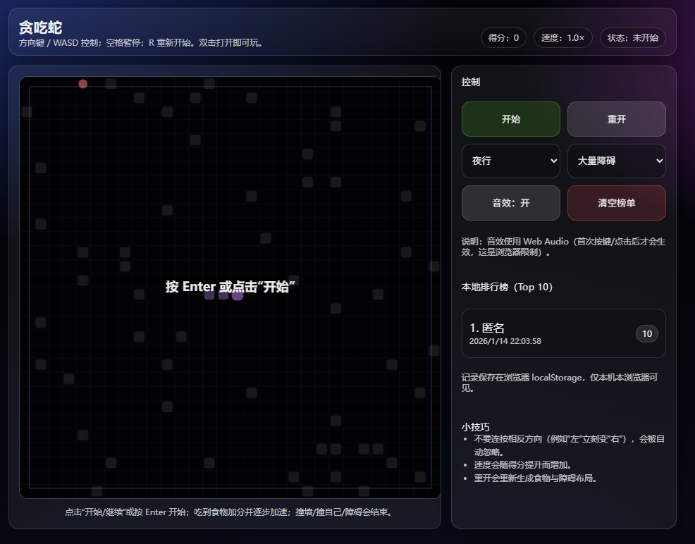

<div align="center">
  
</div>

# HelloAGENTS

<div align="center">

**质量驱动的 AI 编码 CLI 编排内核 — 14 个自动激活技能、流程纪律、检查清单门控。**

[](./package.json)
[](https://www.npmjs.com/package/helloagents)
[](./package.json)
[](./skills)
[](./LICENSE.md)
[](https://github.com/hellowind777/helloagents/issues)

</div>

<p align="center">
  <a href="./README.md"></a>
  <a href="./README_CN.md"></a>
</p>

---

> [!IMPORTANT]
> **找 v2.x？** 旧版 Python 代码库已迁移到独立归档仓库：[helloagents-archive](https://github.com/hellowind777/helloagents-archive)。v3.0.0 是完全重写 — 纯 Node.js/Markdown 架构，无 Python 依赖。

## 📑 目录

<details>
<summary><strong>点击展开</strong></summary>

- [🎯 为什么选择 HelloAGENTS？](#-为什么选择-helloagents)
- [✨ 核心特性](#-核心特性)
- [🚀 快速开始](#-快速开始)
- [🔄 安装链路与文件写入](#-安装链路与文件写入)
- [📖 命令](#-命令)
- [🔧 配置](#-配置)
- [⚙️ 工作原理](#️-工作原理)
- [📚 使用指南](#-使用指南)
- [🧪 验证](#-验证)
- [❓ FAQ](#-faq)
- [🛠️ 故障排除](#️-故障排除)
- [📈 版本历史](#-版本历史)
- [📜 许可证](#-许可证)

</details>

## 🎯 为什么选择 HelloAGENTS？

你有没有遇到过这种情况：AI 编码助手分析了一通，最后来一句"建议你这样做"就结束了？或者写了代码但跳过测试、忽略边界情况，然后说"完成了"？

HelloAGENTS 就是为了解决这个问题。它是一个编排层，装在你的 AI CLI 上面，在每一步都强制执行质量标准。

<table>
<tr>
<td width="50%" valign="top" align="center">

**没有 HelloAGENTS**



</td>
<td width="50%" valign="top" align="center">

**有 HelloAGENTS**



</td>
</tr>
</table>

| 挑战 | 没有 HelloAGENTS | 有 HelloAGENTS |
|------|-----------------|----------------|
| **止步于规划** | 给建议就结束 | 推进到实现和验证 |
| **质量不一致** | 看 prompt 运气 | 14 个技能按任务类型自动激活 |
| **危险操作** | 容易误执行破坏性命令 | Guard 系统拦截危险命令 |
| **没有验证** | "应该能用" | Ralph Loop 完成前自动跑 lint/test/build |
| **知识丢失** | 上下文散落各处 | 项目知识库持久化并持续积累 |

### 💡 最适合
- ✅ **使用 AI CLI 的开发者**，想要一致的、经过验证的输出
- ✅ **团队**，需要 AI 辅助编码的质量护栏
- ✅ **复杂项目**，需要结构化的 设计 → 开发 → 验证 工作流

### ⚠️ 不适合
- ❌ 简单的一次性问题（HelloAGENTS 会增加流程开销）
- ❌ 非编码任务（针对软件工程优化）

## ✨ 核心特性

HelloAGENTS 通过三重机制协同保障质量：

<table>
<tr>
<td width="50%" valign="top">


**🎯 14 个自动激活质量技能**

技能根据你正在做的事情自动激活，无需配置。
- UI、安全、API、架构、性能
- 测试、错误处理、数据、代码审查
- 调试、子代理、文档、验证、反思

**你的收益：** 每个任务都能得到正确的质量检查，不用你记着去要求。

</td>
<td width="50%" valign="top">


**📋 检查清单门控**

编码完成后，HelloAGENTS 收集所有已激活技能的交付检查清单，逐项验证通过才能报告完成。

**你的收益：** 没有真正通过质量检查的东西不会被标记为"完成"。

</td>
</tr>
<tr>
<td width="50%" valign="top">


**🛡️ Guard 系统 + Ralph Loop**

L1 拦截破坏性命令（`rm -rf /`、`git push --force`、`DROP DATABASE`）。L2 扫描硬编码密钥和安全模式。Ralph Loop 在每个任务后自动运行验证命令。

**你的收益：** 零配置的安全防护，每次输出都经过验证。

</td>
<td width="50%" valign="top">


**⚡ 结构化工作流**

简单任务直接执行。复杂任务走完整的 ORIENT → CLARIFY → PLAN → EXECUTE → VALIDATE 五阶段流程，包含交互式设计、方案提议和计划包。

**你的收益：** 按需投入 — 简单任务保持快速，复杂任务获得完整流程。

</td>
</tr>
</table>

## 🚀 快速开始

### 1）先安装

```bash
npm install -g helloagents
```

如果你的系统 `PATH` 里已经存在其他同名 `helloagents` 可执行文件，可以改用内置的稳定别名：

```bash
helloagents-js
```

`postinstall` 脚本自动检测已安装的 CLI 并配置：
- **Claude Code** — 注入规则到 `~/.claude/CLAUDE.md`，配置 hooks 和 `helloagents` 包根目录符号链接
- **Gemini CLI** — 注入规则到 `~/.gemini/GEMINI.md`，配置 hooks 和 `helloagents` 包根目录符号链接
- **Codex CLI** — 配置 `config.toml`、hooks 和 `helloagents` 包根目录符号链接

这是**标准模式**（默认）— 所有项目注入精简规则，在项目中使用 `~init` 激活完整功能。

### 2）选择模式

| 目标 | 执行命令 | 结果 |
|------|----------|------|
| 默认保持轻量 | `npm install -g helloagents` | **标准模式**：自动为已检测到的 CLI 注入精简规则 |
| 所有项目启用完整规则 | `helloagents --global` | 切到 **全局模式**：Claude/Gemini 走原生插件/扩展，Codex 自动安装原生本地插件链路 |
| 本地切分支/改文件后重新同步 | `helloagents --standby` 或 `helloagents --global` | 重新执行当前模式，刷新已注入或已复制的文件，而不是空操作 |

如需所有项目启用完整规则，切换到全局模式：

```bash
helloagents --global
```

然后按需为你的 CLI 安装原生插件/扩展：

```bash
# Claude Code
/plugin marketplace add hellowind777/helloagents

# Gemini CLI
gemini extensions install https://github.com/hellowind777/helloagents
```

Codex CLI 无需手动执行插件命令。`helloagents --global` 会自动走原生本地插件链路，写入：
- `~/.agents/plugins/marketplace.json`
- `~/plugins/helloagents/`
- `~/.codex/plugins/cache/local-plugins/helloagents/local/`
- `~/.codex/config.toml` 中的 `helloagents@local-plugins`

### 3）在对话里验证

```bash
# 在 AI CLI 对话中输入：
~help
```

**预期输出：**
```
💡【HelloAGENTS】- 帮助

可用命令: ~auto, ~design, ~prd, ~loop, ~init, ~test, ~verify, ~review, ~commit, ~clean, ~help

自动激活技能 (14): hello-ui, hello-api, hello-security, hello-test, hello-verify, hello-errors, hello-perf, hello-data, hello-arch, hello-debug, hello-subagent, hello-review, hello-write, hello-reflect
```

### 4）首次使用

```bash
# 简单任务 — 直接执行
"修复 src/utils.ts 第 42 行的拼写错误"

# 复杂任务 — 用 ~auto 走完整流程
~auto "添加基于 JWT 的用户认证"

# 想先看方案？
~design "重构支付模块"
```

## 🔄 安装链路与文件写入

HelloAGENTS 在不同模式下会写入不同文件，但写入/恢复/清理都是可预期的。

### 标准模式（默认）

| CLI | HelloAGENTS 会写入/更新的文件 | 保留什么 | 卸载 / 切模式时会清什么 |
|-----|------------------------------|----------|-------------------------|
| Claude Code | `~/.claude/CLAUDE.md`、`~/.claude/settings.json`、`~/.claude/helloagents -> <包根目录>` | 现有非 HelloAGENTS markdown、settings、permissions、hooks | 删除注入标记块、HelloAGENTS hooks/permissions 和符号链接 |
| Gemini CLI | `~/.gemini/GEMINI.md`、`~/.gemini/settings.json`、`~/.gemini/helloagents -> <包根目录>` | 现有 markdown、hooks 和无关配置 | 删除注入标记块、HelloAGENTS hooks 和符号链接 |
| Codex CLI | `~/.codex/AGENTS.md`、`~/.codex/config.toml`、`~/.codex/config.toml.bak`、`~/.codex/hooks.json`、`~/.codex/helloagents -> <包根目录>` | 通过 backup/restore 保留原有顶层 TOML 配置和无关 section | 删除注入标记块、HelloAGENTS TOML 键、hooks 文件、符号链接和备份 |

### 全局模式

| CLI | 安装方式 | 相关文件 |
|-----|---------|----------|
| Claude Code | 原生插件安装（手动命令） | 由 Claude 插件系统管理 |
| Gemini CLI | 原生扩展安装（手动命令） | 由 Gemini 扩展系统管理 |
| Codex CLI | 原生本地插件链路（自动） | `~/.agents/plugins/marketplace.json`、`~/plugins/helloagents/`、`~/.codex/plugins/cache/local-plugins/helloagents/local/`、`~/.codex/config.toml` |

### 更新 / 重装 / 切分支行为

- **标准模式** 使用 `~/.claude/helloagents`、`~/.gemini/helloagents`、`~/.codex/helloagents` 这三个符号链接，本地文件或分支变化会立即生效。
- **Codex 全局模式** 使用复制后的运行时文件。重新执行 `helloagents --global` 会刷新 `~/plugins/helloagents/` 和 Codex cache 中的副本。
- 重新执行当前模式命令是被支持的：`helloagents --standby` 和 `helloagents --global` 都是 **切换或刷新** 命令。
- 如需确定性的手动清理，先执行 `helloagents cleanup`，再执行 `npm uninstall -g helloagents`。
- `npm uninstall -g helloagents` 会移除包本身；`~/.helloagents/helloagents.json` 会被有意保留。

## 📖 命令

所有命令在 AI 对话中使用 `~` 前缀：

**工作流命令：**

| 命令 | 说明 |
|------|------|
| `~auto` | 全自动工作流 — AI 判断复杂度，自动规划并执行 |
| `~design` | 深度交互式设计 — 需求挖掘 + 方案提议 + 计划包 |
| `~prd` | 完整 PRD — 13 维度头脑风暴式探索，生成产品需求文档 |
| `~loop` | 自主迭代优化 — 设定目标和指标，AI 循环改进直到达标 |

**质量命令：**

| 命令 | 说明 |
|------|------|
| `~test` | 编写完整测试（TDD：Red → Green → Refactor） |
| `~verify` | 运行所有验证命令（lint/test/build/typecheck） |
| `~review` | 代码审查，按严重程度分类 |

**工具命令：**

| 命令 | 说明 |
|------|------|
| `~init` | 初始化项目知识库（`.helloagents/`） |
| `~commit` | 生成规范化提交信息 + 知识库同步 |
| `~clean` | 归档已完成方案，清理临时文件 |
| `~help` | 显示所有命令和当前配置 |

## 🔧 配置

配置文件：`~/.helloagents/helloagents.json`（安装时自动创建）

只需包含你想覆盖的键，缺失的键使用默认值。

```json
{
  "output_language": "",
  "output_format": true,
  "notify_level": 0,
  "ralph_loop_enabled": true,
  "guard_enabled": true,
  "kb_create_mode": 1,
  "commit_attribution": "",
  "install_mode": "standby"
}
```

| 配置项 | 默认值 | 说明 |
|--------|-------|------|
| `output_language` | `""` | 空=跟随用户语言，填写 `zh-CN`、`en` 等指定 |
| `output_format` | `true` | `true`=仅主代理的最终收尾回复可使用 HelloAGENTS 布局；若由 skill 产出停顿/确认/总结，也必须同时是本轮收尾消息；流式/进度/中间输出及所有子代理输出保持自然；`false`=自然输出 |
| `notify_level` | `0` | `0`=关闭，`1`=桌面通知，`2`=声音，`3`=两者 |
| `ralph_loop_enabled` | `true` | 任务完成时自动运行验证 |
| `guard_enabled` | `true` | 拦截危险命令 |
| `kb_create_mode` | `1` | `0`=关闭，`1`=编码任务自动，`2`=始终 |
| `commit_attribution` | `""` | 空=不添加，填写内容则追加到 commit message |
| `install_mode` | `"standby"` | `"standby"`=按项目激活（精简规则），`"global"`=所有项目启用完整规则 |

<details>
<summary>📝 常见配置场景</summary>

**切换到全局模式（所有项目启用完整规则）：**
```bash
helloagents --global
```

**切换回标准模式（默认）：**
```bash
helloagents --standby
```

**纯英文输出：**
```json
{ "output_language": "en" }
```

**关闭知识库自动创建：**
```json
{ "kb_create_mode": 0 }
```

**开启桌面+声音通知：**
```json
{ "notify_level": 3 }
```

**关闭 Guard（不推荐）：**
```json
{ "guard_enabled": false }
```

</details>

## ⚙️ 工作原理

**简单说：** HelloAGENTS 根据任务复杂度选择执行深度。简单任务直接执行，复杂任务走完整五阶段流程，并在每一步验证；当需求和执行方向已明确时，优先直接完成，而不是重复确认。

**五阶段流程：**

1. **ORIENT** — 读取项目上下文（`.helloagents/context.md`、`guidelines.md`、`DESIGN.md`），扫描相关代码
2. **CLARIFY** — 消除歧义。简单任务跳过，复杂任务确认关键决策
3. **PLAN** — 标记需要哪些质量技能，使用 `~design` 或 `~prd` 时生成设计/计划
4. **EXECUTE** — 实现，TDD（写测试 → 写代码 → 重构），每步后验证
5. **VALIDATE** — 运行 Ralph Loop（lint/test/build），收集已激活技能的交付检查清单，逐项验证

**路由规则：**
- 简单任务（单文件、明确修复）→ 直接执行
- 复杂任务（3+ 文件、架构变更、新项目）→ 通过 `~design` 或 `~auto` 走完整流程

**质量技能按任务类型自动激活：**
- 写 UI 代码？→ `hello-ui` 激活（设计 token、无障碍、响应式）
- 涉及 API？→ `hello-api` 激活（REST 规范、校验、错误格式）
- 任何代码变更？→ `hello-test`、`hello-verify`、`hello-review` 激活

### 标准模式 vs 全局模式

HelloAGENTS 支持两种安装模式，采用不同的安装方式：

| 模式 | 安装方式 | 规则 | 技能 | 适用场景 |
|------|---------|------|------|----------|
| **标准模式** (默认) | `npm install -g helloagents` 自动配置所有 CLI（非插件） | `bootstrap-lite.md`（精简规则） | `~command` 按需使用，`~init` 激活完整功能 | 按需使用，不影响其他项目 |
| **全局模式** | Claude/Gemini 手动装插件；Codex 自动装原生本地插件 | `bootstrap.md`（完整规则） | 14 个技能自动激活 | 全面使用 HelloAGENTS |

标准模式直接注入规则到 CLI 配置文件（`~/.claude/CLAUDE.md`、`~/.gemini/GEMINI.md`、`~/.codex/config.toml`），并为每个 CLI 创建 `helloagents` 包根目录符号链接，从而通过字面路径直接暴露 `skills/`、`templates/`、`scripts/`、`assets/`、`hooks/`。全局模式下，Claude Code / Gemini 使用各自原生插件系统；Codex 改为原生本地插件安装链路（marketplace + 本地插件目录 + cache + `config.toml` 插件启用段）。

通过 CLI 切换：`helloagents --global` 或 `helloagents --standby`

重复执行当前模式命令也是合法的。它会在本地切分支、开发调试或手工清理后刷新当前模式下的注入/复制文件。

## 📚 使用指南

### 三种工作流模式

| 模式 | 说明 | 适用场景 |
|------|------|----------|
| `~auto` | 全自动流程：评估 → 设计 → 开发 → 验证 | 需求明确，想要端到端交付 |
| `~design` | 仅交互式设计，生成计划包 | 想先审查方案再编码 |
| `~prd` | 13 维度 PRD 生成 | 需要完整的产品需求文档 |

典型模式：先 `~design` → 审查方案 → 开始编码。或者直接 `~auto` 一步到位。

### 质量验证（Ralph Loop）

每个任务完成后，Ralph Loop 自动运行项目的验证命令：
- 优先级：`.helloagents/verify.yaml` → `package.json` scripts → 自动检测
- 全部通过？→ 收集技能检查清单 → 验证 → 完成
- 有失败？→ 反思 → 修复 → 重跑（3 次连续失败后触发熔断）

### 知识库（`.helloagents/`）

`~init` 创建项目本地知识库。`STATE.md` 是项目级恢复快照，不是所有交互的统一记忆文件。

它会在 `~init`、`~design`、`~auto`、`~prd`、`~loop` 这类项目级连续流程中创建并持续更新；在验证/审查类任务中仅在文件已存在时更新；对 `~help` 这类一次性只读交互则不会创建。

| 文件 | 用途 |
|------|------|
| `STATE.md` | 项目级恢复快照（≤50 行，压缩后存活） |
| `DESIGN.md` | 设计系统（仅 UI 项目） |
| `context.md` | 项目架构、技术栈、约定 |
| `guidelines.md` | 非显而易见的编码规则 |
| `verify.yaml` | 验证命令 |
| `CHANGELOG.md` | 变更历史 |
| `modules/*.md` | 模块文档 + 经验 |
| `plans/` | 活跃计划包 |
| `archive/` | 已完成计划包 |

### 智能提交（~commit）

- 分析 `git diff` 生成 Conventional Commits 格式消息
- 提交前质量检查（代码-文档一致性、测试覆盖）
- 自动排除敏感文件（`.env`、`*.pem`、`*.key`）
- 遵循 `commit_attribution` 配置
- 按 `kb_create_mode` 设置同步知识库

### 自主迭代优化（~loop）

设定目标和指标，让 AI 自主迭代：
1. 审查 → 构思 → 修改 → 提交 → 验证 → 决策 → 记录 → 重复
2. 结果记录在 `.helloagents/loop-results.tsv`
3. 失败实验使用 `git revert` 干净回滚

## 🧪 验证

HelloAGENTS 使用 Node 内置测试运行器：

```bash
npm test
```

测试覆盖：
- 标准/全局模式的安装、重装、刷新、卸载、模式切换
- Claude / Gemini / Codex 配置文件的合并、恢复、清理行为
- Codex 本地插件在本地切分支或文件更新后的刷新链路
- 运行时 inject / route / guard / Ralph Loop 链路
- `~/.codex/` 已不存在时，Codex 全局产物的清理行为

## ❓ FAQ

<details>
<summary><strong>Q：这是 CLI 工具还是 prompt 框架？</strong></summary>

**A：** 两者都是。CLI（`cli.mjs`）负责安装、模式切换和 CLI 配置。实际的工作流来自 `bootstrap.md` / `bootstrap-lite.md` 规则、质量技能和 hook 脚本（`notify.mjs`、`guard.mjs`、`ralph-loop.mjs`）。可以理解为：交付系统 + 智能质量协议。
</details>

<details>
<summary><strong>Q：v2.x 到 v3.0.0 有什么变化？</strong></summary>

**A：** 全部重写了：
- Python 包 → 纯 Node.js/Markdown 架构
- 15 个命令 → 11 个命令 + 14 个自动激活质量技能
- 6 个 CLI 目标 → 3 个（Claude Code + Codex CLI + Gemini CLI）
- 新增：检查清单门控、Guard 系统、~prd、~loop、~verify、设计系统生成
- 详见[版本历史](#-版本历史)。
</details>

<details>
<summary><strong>Q：该用哪个 CLI？</strong></summary>

**A：** Claude Code 体验最好（插件系统、11 个生命周期 hooks、Agent Teams 支持）。Gemini CLI 通过扩展系统支持。Codex CLI 也不错。三者在标准模式下都通过 `npm install -g helloagents` 自动配置，无需手动安装插件。
</details>

<details>
<summary><strong>Q：14 个质量技能是什么？</strong></summary>

**A：** 按任务类型自动激活：
- **hello-ui**：UI 构建（设计 token、无障碍、响应式、动画）
- **hello-api**：API 设计（REST、校验、错误格式、限流）
- **hello-security**：安全（认证、输入校验、XSS/CSRF、密钥管理）
- **hello-test**：测试（TDD 流程、边界用例、AAA 模式）
- **hello-verify**：验证门控（Ralph Loop、熔断器）
- **hello-errors**：错误处理（结构化错误、日志、恢复策略）
- **hello-perf**：性能（N+1、缓存、代码分割、虚拟滚动）
- **hello-data**：数据库（迁移、事务、索引、完整性）
- **hello-arch**：架构（SOLID、边界、代码体积限制）
- **hello-debug**：调试（四阶段流程、卡住时升级）
- **hello-subagent**：子代理编排（分发、协调、审查）
- **hello-review**：代码审查（逻辑、安全、性能、可维护性）
- **hello-write**：文档（金字塔原则、受众感知）
- **hello-reflect**：经验捕获（教训 → 知识库）

子代理只跳过路由、交互流程和输出包装；编码原则、安全约束、失败处理等基础规则仍然持续生效。
</details>

<details>
<summary><strong>Q：标准模式和全局模式有什么区别？</strong></summary>

**A：** 标准模式（默认）采用非插件安装 — `npm install -g helloagents` 自动配置所有检测到的 CLI，注入精简规则。项目需要 `~init` 才能激活完整功能。全局模式使用各 CLI 原生的插件/扩展系统，所有项目自动启用完整规则。通过 `helloagents --global` 或 `helloagents --standby` 切换。
</details>

<details>
<summary><strong>Q：项目知识存在哪里？</strong></summary>

**A：** 项目本地的 `.helloagents/` 目录。由 `~init` 创建，代码变更时自动同步（由 `kb_create_mode` 控制）。其中 `STATE.md` 只作为长流程任务的精简恢复快照，不承担所有交互的统一记忆。
</details>

<details>
<summary><strong>Q：Guard 系统是什么？</strong></summary>

**A：** 两层安全防护：
- **L1 拦截**：执行前阻止破坏性命令（`rm -rf /`、`git push --force`、`DROP DATABASE`、`chmod 777`、`FLUSHALL`）
- **L2 建议**：扫描文件写入中的硬编码密钥、API key、.env 暴露 — 警告但不阻止
</details>

<details>
<summary><strong>Q：开启格式化输出后，底部“下一步”栏表示什么？</strong></summary>

**A：** 它始终显示当前最合适的下一步动作。若存在自然后续动作，HelloAGENTS 会直接给出明确引导；若当前任务已完整结束且没有合理后续，则回落为完成/等待状态，而不是输出空洞套话。
</details>

<details>
<summary><strong>Q：可以关闭不需要的功能吗？</strong></summary>

**A：** 可以。设置 `guard_enabled: false` 关闭 Guard，`ralph_loop_enabled: false` 跳过验证，`kb_create_mode: 0` 关闭知识库。质量技能自动激活但不会给无关任务增加开销。
</details>

<details>
<summary><strong>Q：~prd 是什么？</strong></summary>

**A：** 13 维度 PRD 生成器。逐维度走过：产品概述、用户故事、功能需求、UI/UX 设计、技术架构、非功能需求、国际化、无障碍、内容策略、测试策略、部署运维、法律隐私、时间线 — 头脑风暴式，一次一个维度。
</details>

## 🛠️ 故障排除

### 插件未加载（Claude Code）

**问题：** 安装插件后 `~help` 无法识别

**解决：** 重启 Claude Code。如果仍不行，检查 `/plugin list` 确认安装状态。

---

### 扩展不工作（Gemini CLI）

**问题：** `gemini extensions install` 后 `~help` 无法识别

**解决：** 重启 Gemini CLI。用 `gemini extensions list` 确认安装状态，确保扩展已启用。

---

### 文件写入超出工作区范围

**问题：** Gemini CLI 或 Codex CLI 提示目标文件路径不在允许的工作区内。

**解决：** 将文件写入当前项目工作区内，或写入对应 CLI 的临时工作区目录。做 headless 验证时，优先使用当前仓库下的路径，不要随意写到任意绝对路径。

---

### 命令未找到

**问题：** 安装后 `~help` 无法识别

**解决：**
- 验证安装：`npm list -g helloagents`
- Claude Code：检查 `~/.claude/CLAUDE.md` 是否包含 HelloAGENTS 标记
- Gemini CLI：检查 `~/.gemini/GEMINI.md` 是否包含 HelloAGENTS 标记
- Codex CLI：检查 `~/.codex/config.toml` 中 `model_instructions_file` 是否指向 `bootstrap.md` 或 `bootstrap-lite.md`
- 重启你的 CLI

---

### 本地切分支后 Codex 全局模式仍在用旧文件

**问题：** 你切换了分支，或更新了本地 link 的仓库，但 Codex 全局模式仍然加载旧的复制文件。

**解决：** 重新执行当前模式命令：
- `helloagents --global` → 刷新 `~/plugins/helloagents/` 和 Codex cache 副本
- `helloagents --standby` → 刷新标准模式下注入的文件和符号链接

---

### Guard 拦截了合法命令

**问题：** Guard 拦截了你确实想执行的命令

**解决：** 在 `~/.helloagents/helloagents.json` 中设置 `guard_enabled: false`。或者检查被拦截的命令 — Guard 只拦截真正的破坏性操作如 `rm -rf /` 和 `git push --force`。

---

### Ralph Loop 持续失败

**问题：** 验证循环无法通过

**解决：**
- 检查 `.helloagents/verify.yaml` 中的命令是否正确
- 手动运行验证命令查看实际错误
- 3 次连续失败后熔断器激活 — `hello-debug` 升级介入

---

### CCswitch 替换了 HelloAGENTS 配置

**问题：** 切换 CCswitch 配置后 HelloAGENTS 停止工作

**解决：** 切换配置后重新运行 `/plugin marketplace add hellowind777/helloagents`。CCswitch 会替换整个 CLI 配置目录。

---

### 通知不工作

**问题：** 没有声音或桌面通知

**解决：**
- 检查配置中的 `notify_level`（默认 0=关闭）
- Windows：确保 PowerShell 可以访问 `System.Media.SoundPlayer`
- macOS：确保 `afplay` 可用
- Linux：确保安装了 `aplay` 或 `paplay`

## 📈 版本历史

### v3.0.0（当前版本）🎉

**破坏性变更：**
- 🔴 完全重写：Python 包 → 纯 Node.js/Markdown 架构。`pip`/`uv` 安装方式不再可用
- 🔴 命令重命名/移除：`~plan` → `~design`，移除 `~exec`/`~rollback`/`~rlm`/`~status`/`~validatekb`/`~upgradekb`/`~cleanplan`
- 🔴 配置键从大写改为小写。移除：`BILINGUAL_COMMIT`、`EVAL_MODE`、`UPDATE_CHECK`、`CSV_BATCH_MAX`

**新功能：**
- ✨ 14 个自动激活质量技能：hello-ui、hello-api、hello-security、hello-test、hello-verify、hello-errors、hello-perf、hello-data、hello-arch、hello-debug、hello-subagent、hello-review、hello-write、hello-reflect
- ✨ 3 个支持的 CLI：Claude Code（插件/marketplace）、Gemini CLI（扩展）、Codex CLI（npm）
- ✨ 检查清单门控：所有已激活技能必须通过交付检查清单才能完成任务
- ✨ `~prd` 命令：13 维度头脑风暴式 PRD 框架
- ✨ `~loop` 命令：自主迭代优化，带指标追踪和 git 回滚
- ✨ `~verify` 命令：自动检测并运行所有验证命令
- ✨ Guard 系统（`guard.mjs`）：L1 拦截破坏性命令 + L2 安全模式建议
- ✨ 标准/全局模式：`install_mode` 配置项支持按项目或全局激活
- ✨ 流状态管理（`STATE.md`）：AI 上下文压缩快照（≤50 行）
- ✨ 设计系统生成（`DESIGN.md`）：UI 项目自动创建
- ✨ 计划包系统：`requirements.md` + `design.md` + `tasks.md`

**架构：**
- 📦 统一五阶段执行流程：ORIENT → CLARIFY → PLAN → EXECUTE → VALIDATE
- 📦 简化配置：8 个小写键，合理默认值
- 📦 双模式安装：标准模式（非插件，自动配置 CLI 配置文件）/ 全局模式（插件/扩展）
- 📦 模块化脚本架构：`cli-utils.mjs`（共享工具）、`notify-ui.mjs`（跨平台声音/桌面通知）、`guard.mjs`（安全防护）、`ralph-loop.mjs`（质量验证）
- 📦 Hook 脚本跨平台兼容：事件名动态适配（Claude Code / Gemini CLI / Codex CLI），通过环境变量或 CLI 参数推断
- 📦 Standby 模式路由隔离：新项目检测仅在 global 模式或已激活项目中触发，不干扰未激活项目
- 📦 通知系统跨平台支持（Windows toast、macOS osascript、Linux notify-send）

### v2.3.8

**架构变更：**
- 路由层级整合：移除 R2 简化流和 R3 标准流，统一为 R0/R1/R2 三层路由
- 评估改为维度充分性驱动，替代固定总分阈值
- 末轮提问+确认合并，减少独立确认步骤
- 移除 L0 用户记忆系统和自定义命令扩展
- 配置系统整合：单一 `~/.helloagents/helloagents.json`
- 新增代码体积控制规则：预警 300/40 行，强制拆分 400/60 行

**新功能：**
- ✨ 5 个新工作流命令：`~test`、`~rollback`、`~validatekb`、`~upgradekb`、`~cleanplan`
- ✨ `notify_level` 配置项控制通知行为
- ✨ 独立配置读取模块供 hook 脚本使用

**安全：**
- 修复 `shared_tasks.py` 路径注入漏洞
- 修复 `validate_package.py` 路径遍历防护不完整

### v2.3.7

**Bug 修复：**
- 修复非编码任务在 `KB_CREATE_MODE=2` 时错误创建知识库
- 修复 R2 标准流在方案选择后重定向到归档而非 DEVELOP
- 修复非编码任务错误创建计划包

**改进：**
- 📦 优化上下文压缩后的实施计划状态恢复
- 📦 优化整体设计流程

### v2.3.6

**新功能：**
- ✨ 子代理编排大改：新增 brainstormer 子代理用于并行方案构思
- ✨ 子代理阻塞机制：失败/超时时自动阻塞并回退

**改进：**
- 📦 工具/Shell 约束优化：内置工具失败时允许回退到 Shell
- 📦 Shell 编码约束细化：明确 UTF-8 无 BOM 要求
- 📦 移除 3 个冗余子代理，功能回归主代理和 RLM 角色

### v2.3.5

**新功能：**
- ✨ 声音通知系统，5 种事件音效，跨 Windows/macOS/Linux
- ✨ Claude Code hooks 从 9 个扩展到 11 个生命周期事件类型
- ✨ Hooks 支持扩展到 Gemini CLI 和 Grok CLI
- ✨ 会话启动时配置完整性检查
- ✨ 上下文压缩前自动保存进度快照
- ✨ 用户自定义工具注册和编排

**改进：**
- 📦 全面审计修复（21 个问题：6 HIGH + 9 MEDIUM + 6 LOW）
- 📦 核心架构：新增 dispatcher 模块、Codex 角色、Claude 规则管理
- 📦 安装/更新脚本重构，持久化配置

## 📜 许可证

本项目采用双许可证：代码遵循 [Apache-2.0](./LICENSE.md)，文档遵循 CC BY 4.0。

详见 [LICENSE.md](./LICENSE.md)。

## 🤝 参与贡献

- 🐛 **Bug 报告**：[创建 issue](https://github.com/hellowind777/helloagents/issues)
- 💡 **功能建议**：[发起讨论](https://github.com/hellowind777/helloagents/issues)
- 📖 **文档改进**：欢迎 PR

## 支持的 CLI

| CLI | 标准模式安装（默认） | 全局模式安装（插件） | 卸载 |
|-----|-------------------|-------------------|------|
| Claude Code | `npm install -g helloagents` 自动配置 | `/plugin marketplace add hellowind777/helloagents` | `npm uninstall -g helloagents`（全局模式另需 `/plugin remove helloagents`） |
| Gemini CLI | `npm install -g helloagents` 自动配置 | `gemini extensions install https://github.com/hellowind777/helloagents` | `npm uninstall -g helloagents`（全局模式另需 `gemini extensions uninstall helloagents`） |
| Codex CLI | `npm install -g helloagents` 自动配置 | `npm install -g helloagents` 自动配置 | `npm uninstall -g helloagents` |

---

<div align="center">

如果这个项目对你有帮助，点个 star 就是最好的支持。

感谢 <a href="https://codexzh.com/?ref=EEABC8">codexzh.com</a> / <a href="https://ccodezh.com">ccodezh.com</a> 对本项目的支持

[⬆ 返回顶部](#helloagents)

</div>
