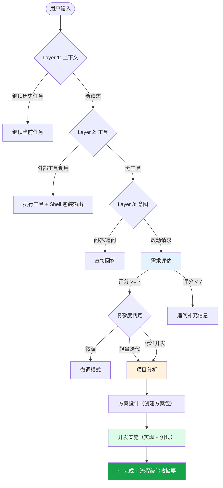

<div align="center">
  
</div>

# HelloAGENTS

<div align="center">

**一个会把事情“做完并验证”的智能工作流系统：评估 → 实现 → 验证。**

[](./Codex%20CLI/AGENTS.md)
[](./Codex%20CLI/skills/helloagents/SKILL.md)
[](./LICENSE)
[](./CONTRIBUTING.md)


</div>

<p align="center">
  <a href="./README.md"></a>
  <a href="./README_CN.md"></a>
</p>

---

## 📑 目录

<details>
<summary><strong>点击展开</strong></summary>

- [🎯 为什么选择 HelloAGENTS？](#why)
- [📊 数据说话](#data)
- [🔁 前后对比](#before-after)
- [✨ 功能特性](#features)
- [🚀 快速开始](#quick-start)
- [🔧 工作原理](#how-it-works)
- [📖 文档](#documentation)
- [❓ FAQ](#faq)
- [🛠️ 故障排除](#troubleshooting)
- [📈 版本历史](#version-history)
- [🔒 安全](#security)
- [🙏 致谢](#acknowledgments)
- [📜 许可证](#license)

</details>

---

<a id="why"></a>

## 🎯 为什么选择 HelloAGENTS？

你应该见过这种情况：助手分析得很好……然后就停了。或者把代码改了，却忘了同步文档。又或者“完成了”，但从没跑过一次测试。

**HelloAGENTS 是一套结构化的工作流系统**（路由 + 阶段 + 验收闸门），目标是把事情推进到一个可验证的终点。

| 挑战 | 没有 HelloAGENTS | 有 HelloAGENTS |
|---|---|---|
| **输出不稳定** | 受提示词质量影响大 | 统一输出壳 + 确定性阶段流程 |
| **过早终止** | “你应该这样做……” | 持续推进：实现 → 测试 → 验证 |
| **缺少质量闸门** | 需要人工兜底 | 阶段 / 关卡 / 流程三级验收 |
| **上下文漂移** | 决策容易丢 | 状态变量 + 方案包 |
| **高风险操作** | 容易误伤 | EHRB 检测 + 风险升级 |

### 💡 最适合

- ✅ **希望“交付=验证通过”的开发者**
- ✅ **需要一致输出与可追溯变更的团队**
- ✅ **把文档也视为交付物的项目**

### ⚠️ 不适合

- ❌ 只要一次性代码片段（普通对话更快）
- ❌ 无法把输出纳入 Git 管理的项目
- ❌ 需要“硬保证”的高风险场景（仍建议人工审查再上生产）

<div align="center">
  
</div>

<a id="data"></a>

## 📊 数据说话

不写“性能提升 50%”这种无法核验的数字，只列出你能在仓库里直接验证的事实：

| 项目 | 数值 | 如何验证 |
|---|---:|---|
| 路由层级 | 3 | `AGENTS.md` / `CLAUDE.md`（上下文 → 工具 → 意图） |
| 工作流阶段 | 4 | Evaluate（需求评估）→ Analyze（项目分析）→ Design（方案设计）→ Develop（开发实施） |
| 执行模式 | 3 | Tweak / Lite / Standard |
| 命令数量 | 12 | `Codex CLI/skills/helloagents/SKILL.md`（或 Claude 版本对应路径） |
| 参考模块 | 23 | `Codex CLI/skills/helloagents/references/`（或 Claude 版本对应路径） |
| 自动化脚本 | 7 | `Codex CLI/skills/helloagents/scripts/`（或 Claude 版本对应路径） |
| 本仓库内置版本 | 2 | `Codex CLI/` 与 `Claude Code/` |

<a id="before-after"></a>

## 🔁 前后对比

有些差异用文字讲很费劲，但我们也可以用一张“前后对照表”把要点讲清楚：

| | 未使用 HelloAGENTS | 使用 HelloAGENTS |
|---|---|---|
| 起步方式 | 往往直接开写 | 先做需求评分，把缺口补齐 |
| 交付推进 | 需要你自己一路盯着 | 工作流持续把事情推到“可验证完成” |
| 文档同步 | 常被忘掉 | 文档是交付物的一部分 |
| 风险控制 | 高风险操作容易漏掉 | EHRB 检测触发风险升级/确认 |
| 可复用性 | 取决于提示词 | 固定阶段 + 固定闸门，更稳定 |

再看一下 **需求评估（Evaluate）** 阶段的真实样子：它会先把“平台/交付形式/控制方式/验收标准”这些关键问题问清楚，再进入实现。

它会输出类似下面这种“追问清单”（为便于阅读做了精简）：

```text
当前需求完整性评分：4/10

请补全下面关键信息（回答编号即可）：
1) 运行平台
2) 交付方式
3) 操作方式
4) 规则/难度偏好
5) 画面与尺寸 / 是否需要分数、音效、障碍物
```

<a id="features"></a>

## ✨ 功能特性

不绕弯子，直接说你能拿到什么。

<table>
<tr>
<td width="50%" valign="top">


**🧭 三层智能路由**

- 支持“同一任务跨轮次续航”
- 能识别外部工具（SKILL/MCP/plugins）vs 内部工作流
- 基于复杂度自动选择 tweak / lite / standard

**你的收益：** 少操心提示词，少反复拉扯

</td>
<td width="50%" valign="top">


**📚 四阶段工作流引擎**

- Evaluate（需求评估）→ Analyze（项目分析）→ Design（方案设计）→ Develop（开发实施）
- 入口/出口闸门清晰
- 以“方案包”沉淀过程与产物

**你的收益：** 交付更可复用，不靠运气

</td>
</tr>
<tr>
<td width="50%" valign="top">


**⚡ 三层验收**

- 阶段内验收
- 阶段间闸门（例如方案包校验）
- 流程级验收摘要

**你的收益：** 结果更可信，返工更少

</td>
<td width="50%" valign="top">


**🛡️ EHRB 高风险行为检测**

- 关键词扫描 + 语义分析
- 触发风险时强制确认/升级流程
- 标注破坏性操作（例如 `rm -rf`、强制推送）

**你的收益：** 少一些“手滑事故”

</td>
</tr>
</table>

<a id="quick-start"></a>

## 🚀 快速开始

本仓库提供**两套可直接复制的版本**：

- `Codex CLI/` → 给 **Codex CLI** 用户（使用 `AGENTS.md`）
- `Claude Code/` → 给 **Claude Code** 用户（使用 `CLAUDE.md`）

### 1) 克隆仓库

```bash
git clone https://github.com/hellowind777/helloagents.git
cd helloagents
```

### 2) 安装对应版本

选择你的 CLI，并复制 **配置文件 + `skills/helloagents/` 目录**（两者都需要）。

#### 选项 A：Codex CLI

**macOS / Linux**

```bash
mkdir -p ~/.codex/skills
cp -f "Codex CLI/AGENTS.md" ~/.codex/AGENTS.md
cp -R "Codex CLI/skills/helloagents" ~/.codex/skills/helloagents
```

**Windows（PowerShell）**

```powershell
New-Item -ItemType Directory -Force "$env:USERPROFILE\\.codex\\skills" | Out-Null
Copy-Item -Force "Codex CLI\\AGENTS.md" "$env:USERPROFILE\\.codex\\AGENTS.md"
Copy-Item -Recurse -Force "Codex CLI\\skills\\helloagents" "$env:USERPROFILE\\.codex\\skills\\helloagents"
```

#### 选项 B：Claude Code

**macOS / Linux**

```bash
mkdir -p ~/.claude/skills
cp -f "Claude Code/CLAUDE.md" ~/.claude/CLAUDE.md
cp -R "Claude Code/skills/helloagents" ~/.claude/skills/helloagents
```

**Windows（PowerShell）**

```powershell
New-Item -ItemType Directory -Force "$env:USERPROFILE\\.claude\\skills" | Out-Null
Copy-Item -Force "Claude Code\\CLAUDE.md" "$env:USERPROFILE\\.claude\\CLAUDE.md"
Copy-Item -Recurse -Force "Claude Code\\skills\\helloagents" "$env:USERPROFILE\\.claude\\skills\\helloagents"
```

### 3) 验证安装

在你的 CLI 中执行：

- `/helloagents` **或** `$helloagents`

预期：看到类似下面开头的欢迎信息：

```
💡【HelloAGENTS】- 技能已激活
```

### 4) 开始使用

- 输入 `~help` 查看全部命令
- 或直接描述需求，由路由器选择合适流程

<a id="how-it-works"></a>

## 🔧 工作原理

<details>
<summary><strong>📊 点击查看架构图</strong></summary>



</details>

你在真实项目里会看到的关键产物：

- `plan/YYYYMMDDHHMM_<feature>/` 方案包（proposal + tasks）
- `helloagents/` 知识库工作区（INDEX/context/CHANGELOG/modules…）

<a id="documentation"></a>

## 📖 文档

这个仓库刻意做成“两套版本共存”：

- **Codex CLI 规则：** `Codex CLI/AGENTS.md`
- **Claude Code 规则：** `Claude Code/CLAUDE.md`

技能包目录在：

- `Codex CLI/skills/helloagents/`
- `Claude Code/skills/helloagents/`

建议从这里开始读（任选一套版本路径即可）：

- `Codex CLI/skills/helloagents/SKILL.md`（命令列表 + 入口行为）
- `Codex CLI/skills/helloagents/references/`（阶段、规则、服务）
- `Codex CLI/skills/helloagents/scripts/`（自动化脚本）

### 你真正需要复制的内容

实际只需要两部分：

- 配置文件：Codex CLI 用 `AGENTS.md`；Claude Code 用 `CLAUDE.md`
- 技能目录：`skills/helloagents/`（包含 `SKILL.md`、`references/`、`scripts/`、`assets/`）

### 配置（最常改的几个开关）

通常只会改动少数几个全局设置：

```yaml
OUTPUT_LANGUAGE: zh-CN
ENCODING: UTF-8
KB_CREATE_MODE: 2
BILINGUAL_COMMIT: 1
```

**KB_CREATE_MODE** 用来控制知识库写入行为：

- `0 (OFF)`：跳过所有 KB 操作
- `1 (ON_DEMAND)`：仅在明确请求时创建 KB
- `2 (ON_DEMAND_AUTO_FOR_CODING)`：编程任务自动创建（默认）
- `3 (ALWAYS)`：始终创建/更新 KB

<a id="faq"></a>

## ❓ FAQ

<details>
<summary><strong>Q：我应该安装哪个版本？</strong></summary>

**A：** 按你使用的 CLI 选择：
- Codex CLI → `Codex CLI/`
- Claude Code → `Claude Code/`
</details>

<details>
<summary><strong>Q：两套都能装吗？</strong></summary>

**A：** 可以。它们分别在不同配置根目录（`~/.codex/` 与 `~/.claude/`）。注意不要把文件混到同一个根目录里。
</details>

<details>
<summary><strong>Q：怎么显式激活 HelloAGENTS？</strong></summary>

**A：** 输入 `/helloagents` 或 `$helloagents`。激活后可以用 `~help`，或直接描述需求。
</details>

<details>
<summary><strong>Q：知识库写到哪里？</strong></summary>

**A：** 会写到你当前正在操作的项目目录下的 `helloagents/`（除非关闭）。工作流把它作为项目知识的唯一集中存储。
</details>

<details>
<summary><strong>Q：怎么关闭知识库写入？</strong></summary>

**A：** 在你安装后的 `AGENTS.md` / `CLAUDE.md` 中设置 `KB_CREATE_MODE: 0`。
</details>

<details>
<summary><strong>Q：我只想做很小的改动怎么办？</strong></summary>

**A：** 对于需求清晰、影响面小的修改，路由器可能会自动走微调模式；你也可以显式说“微调模式 / 最小改动”。
</details>

<details>
<summary><strong>Q：有哪些常用命令？</strong></summary>

**A：** 输入 `~help` 查看。常用的有：`~plan`、`~exec`、`~test`、`~commit`、`~validate`。
</details>

<a id="troubleshooting"></a>

## 🛠️ 故障排除

### 卡在需求评估（评分 &lt; 7）

**处理方式：** 用更具体的信息回答追问（输入/输出、要改哪些文件、验收标准是什么）。

---

### 方案包校验失败

**处理方式：** 确保方案包里至少有：

- `proposal.md`
- `tasks.md`

然后执行 `~validate`（或按工具提示修复）。

---

### 复制后提示找不到技能

**处理方式：**

- 确认你的配置根目录下存在 `skills/helloagents/SKILL.md`（复制完成后）
- 再执行一次 `/helloagents` 或 `$helloagents`

---

### Windows 路径/编码问题

**处理方式：** 保持文件为 UTF-8；复制带空格目录（例如 `Codex CLI/`）时优先使用带引号的路径。

---

### Mermaid 图在你的阅读器里不显示

**处理方式：** GitHub 默认支持 README 的 Mermaid 渲染，但一些本地 Markdown 阅读器不支持。建议在 GitHub 上查看，或使用支持 Mermaid 的阅读器。

<a id="version-history"></a>

## 📈 版本历史

### 最新：v2.0（2026-01）

- 定位：从「AI 编程伙伴」→ **智能工作流系统**
- 工作流：3 阶段 → 4 阶段（新增 **Evaluate（需求评估）**）
- 路由：简单路由 → **三层路由**（上下文 → 工具 → 意图）
- 验收：基础检查 → **阶段 / 关卡 / 流程** 三级验收
- 分发：同时支持 **Codex CLI** 与 **Claude Code** 等CLI工具

🆚 v1 vs v2 快照：

| 方面 | v1（2025-12） | v2（2026-01） |
|---|---|---|
| 定位 | AI 编程伙伴 | 智能工作流系统 |
| 阶段 | 3 阶段 | 4 阶段（+ 评估） |
| 路由 | 简单 | 3 层（上下文 → 工具 → 意图） |
| 验收 | 基础 | 3 层（阶段/关卡/流程） |
| 文件 | 6 个文件 | 44 个文件 |
| 命令 | 4 个命令 | 12 个命令 |

<a id="security"></a>

## 🔒 安全

- EHRB 检测用于在真正执行前拦截破坏性/高风险操作。
- 即便如此，涉及重要系统时仍建议**人工审查命令与 diff**。

如果你认为发现了安全问题，优先使用 GitHub 的私密报告（Security Advisories，若仓库已开启）。否则，请通过维护者的 GitHub 主页联系。

<a id="acknowledgments"></a>

## 🙏 致谢

- AI CLI 生态（Codex CLI、Claude Code 等）
- Keep a Changelog 约定（工作流知识库使用）
- MCP 与更广泛的工具集成社区

<a id="license"></a>

## 📜 许可证

本项目采用**双许可证**：

- **代码：** Apache-2.0
- **文档：** CC BY 4.0

详情见 `LICENSE`。
