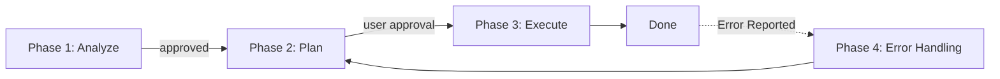

# helloagents

> **Multi‑stage + Project‑Wiki–driven rules for AI coding agents.**
> This project builds on **workflow3.md** (by `geekoe/workflow3`) and **extends** the three‑stage flow with a full **Project Wiki** operating model (ADRs, Mermaid diagrams, changelog, governance), **adding an error handling stage**.

- Upstream repo: <https://github.com/geekoe/workflow3>
- Template: <https://github.com/geekoe/workflow3/blob/main/src/templates/workflow3.md>

## Highlights

- **Multi‑phase loop**: Analyze → Plan → Execute → Error Handling (on‑demand)
- **Wiki as first‑class**: `PROJECTWIKI.md` is the source of truth and stays **in lockstep** with code; use the repo's **GitHub Wiki** for long‑form content.
- **Mermaid‑first diagrams** for architecture, sequence, ER, class, dependency, and state; text‑first, reviewable, versionable.
- **Built‑in governance**: ADRs, Conventional Commits + atomic commits, Keep a Changelog.
- **Security boundaries**: No unauthorized service execution or production resource access; unified secret management.

## Global usage (LLM‑friendly)

**One simple pattern is to rename this file to `AGENTS.md`** at the repo root so multiple AI coding models can treat it as your **project‑level system prompt** (phases, outputs, and do/don't rules). For longer guides, enable the repo **Wiki**.

## Quickstart

1. Copy the rules into your project.
2. Rename this file to **`AGENTS.md`** (repo root).
3. Add `/adr` and `CHANGELOG.md`.
4. (Optional) turn on the repo **Wiki** for long‑form docs.

### Suggested layout

```
your-project/
├─ AGENTS.md                 # ← this spec (global rules for agents)
├─ PROJECTWIKI.md            # ← first‑class project wiki (kept in sync with code)
├─ adr/                      # ADR-0001.md, ADR-0002.md, ...
├─ CHANGELOG.md              # Keep a Changelog
├─ docs/                     # additional docs
└─ src/                      # source code
```

### Phase overview (expected outputs)

- **Phase 1 · Analyze** (`【分析问题】`): root cause & blast radius; open decisions; no code changes.
- **Phase 2 · Plan** (`【制定方案】`): **code change list + wiki change list (with Mermaid diagrams)**, risks & rollback, AC/DoD; **requires explicit approval**.
- **Phase 3 · Execute** (`【执行方案】`): implement per plan; type/static checks; **update `PROJECTWIKI.md`**; ensure code↔docs traceability (prefer atomic commits).
- **Phase 4 · Error Handling** (`【错误处理】`): triggered on‑demand when errors are reported; includes reproduction, fix, and documentation updates.



## License & attribution (**commercial use allowed with credit**)

To make "commercial use with attribution" explicit, this project adopts a **dual‑license**:

1. **Code** — **Apache License 2.0** © 2025 hellowind
   - Commercial use permitted. Keep **LICENSE**/**NOTICE** in distributions (copyright & license info).
   - Add a `NOTICE` line in your product, e.g.:
     ```
     This product includes "helloagents" by hellowind, licensed under the Apache License 2.0.
     ```

2. **Docs (README/PROJECTWIKI/diagrams)** — **CC BY 4.0** © 2025 hellowind
   - Commercial use permitted **with attribution**; include a license link and indicate changes.
   - Suggested attribution:
     ```
     Text/diagrams adapted from "helloagents" — © 2025 hellowind, CC BY 4.0.
     ```

**Preferred combined credit:**
```
helloagents — © 2025 hellowind. Code: Apache‑2.0. Docs: CC BY 4.0.
```

## Credits
- Upstream: **workflow3.md** (geekoe/workflow3).
- Mermaid, Conventional Commits, Keep a Changelog, GitHub Wiki docs & ecosystem.