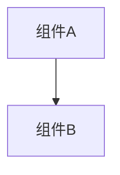

# 变更提案: {feature}

## 元信息
```yaml
类型: 新功能/修复/重构/优化
方案类型: {pkg_type}
优先级: P0/P1/P2/P3
状态: 草稿
创建: {YYYY-MM-DD}
```

---

## 1. 需求

### 背景
{为什么需要这个变更}

### 目标
{要达成什么目标}

### 约束条件
```yaml
时间约束: {如有}
性能约束: {如有}
兼容性约束: {如有}
业务约束: {如有}
```

### 验收标准
- [ ] {标准1}
- [ ] {标准2}

---

## 2. 方案

### 技术方案
{简要描述实现方式}

### 影响范围
```yaml
涉及模块:
  - {模块1}: {影响说明}
预计变更文件: {数量}
```

### 风险评估
| 风险 | 等级 | 应对 |
|------|------|------|
| {风险} | 高/中/低 | {措施} |

---

## 3. 技术设计（可选）

> 涉及架构变更、API设计、数据模型变更时填写

### 架构设计


### API设计
#### {METHOD} {路径}
- **请求**: {结构}
- **响应**: {结构}

### 数据模型
| 字段 | 类型 | 说明 |
|------|------|------|
| {字段} | {类型} | {说明} |

---

## 4. 核心场景

> 执行完成后同步到对应模块文档

### 场景: {场景名称}
**模块**: {所属模块}
**条件**: {前置条件}
**行为**: {操作描述}
**结果**: {预期结果}

---

## 5. 技术决策

> 本方案涉及的技术决策，归档后成为决策的唯一完整记录

### {feature}#D001: {决策标题}
**日期**: {YYYY-MM-DD}
**状态**: ✅采纳 / ❌废弃 / ⏸搁置
**背景**: {为什么需要这个决策}
**选项分析**:
| 选项 | 优点 | 缺点 |
|------|------|------|
| A: {方案A} | {优点} | {缺点} |
| B: {方案B} | {优点} | {缺点} |
**决策**: 选择方案{X}
**理由**: {详细理由}
**影响**: {对哪些模块有影响}

---

## 6. 质量期望

> DESIGN Phase2 填充。步骤9 需求验收逐项核验。不适用项标注"N/A"。

### 设计体系
框架引用: {跟随项目现有/Material Design/Tailwind/Ant Design/项目自定义变量系统/N/A}
变量系统: {跟随项目现有/色彩变量+间距变量+字体变量定义方式，如"CSS Custom Properties"/"Tailwind config"/"SwiftUI Asset Catalog"/"Android Theme"/N/A}

### 排版体系
字阶阶梯: {跟随项目现有/至少3级，如"标题 24px/正文 16px(Web)/17pt(iOS)/16sp(Android)/辅助 12px"/N/A}
行高范围: {跟随项目现有/正文 1.4-1.8 倍字号，标题 1.2-1.4 倍字号/N/A}
字重限制: {跟随项目现有/最多3种，如"400/500/700"/N/A}

### 间距系统
基础网格: {跟随项目现有/4px/8px/N/A}
间距分级: {跟随项目现有/组件内/组件间/区域间间距定义，如"8-16-24-32px 四级递进"/N/A}

### 色彩规范
配色方案: {跟随项目现有配色/主色+辅色+强调色+背景色+文字色，如"深蓝#1A1A2E背景+亮蓝#0EA5E9按钮+暖红#E94560强调+白#F8FAFC文字"/N/A}
对比度: {文字与背景对比度 ≥ 4.5:1 WCAG AA/N/A}
色盲安全: {不仅依赖颜色传达信息，辅以图标/文字/形状/N/A}

### 布局与响应式
布局规格: {布局模式+主内容区定位+控件分组策略，如"全屏居中布局，游戏区为视觉主体，控件栏底部水平排列"/N/A}
响应式策略: {Web: 断点定义+移动端适配方式，如"≤768px 单列堆叠"; 原生: 屏幕尺寸类别适配（compact/regular）/全适配/N/A}
参考设计: {URL/截图/文字描述/无}

### 交互规范
状态反馈: {按框架默认/Web: hover/active/focus/disabled; 原生: pressed/highlighted/selected/disabled 状态定义/N/A}
加载态: {骨架屏/spinner/进度条/N/A}
错误态: {输入校验反馈+操作失败+空状态的视觉处理/N/A}

### 可访问性（按技术栈适配）
结构语义化: {Web: 正确标签层级 h1-h6/nav/main; 原生: accessibility trait/role/N/A}
导航: {键盘 Tab/Enter/Escape 或手势导航可操作/N/A}
辅助功能标注: {图片/图标有替代文本（Web: alt/aria; 原生: accessibility label）/N/A}
动效安全: {尊重系统减少动效偏好/N/A}

### 组件风格
组件基调: {跟随项目现有组件库/圆角/阴影/间距/密度，如"大圆角8px+浅阴影+宽松间距"/N/A}

### 质量底线
错误处理: {优雅降级/严格报错}
测试覆盖: {跟随项目现有标准/期望覆盖率}
